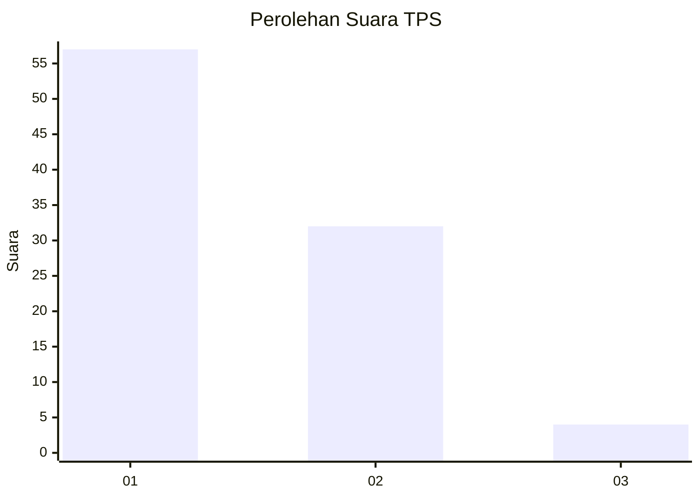
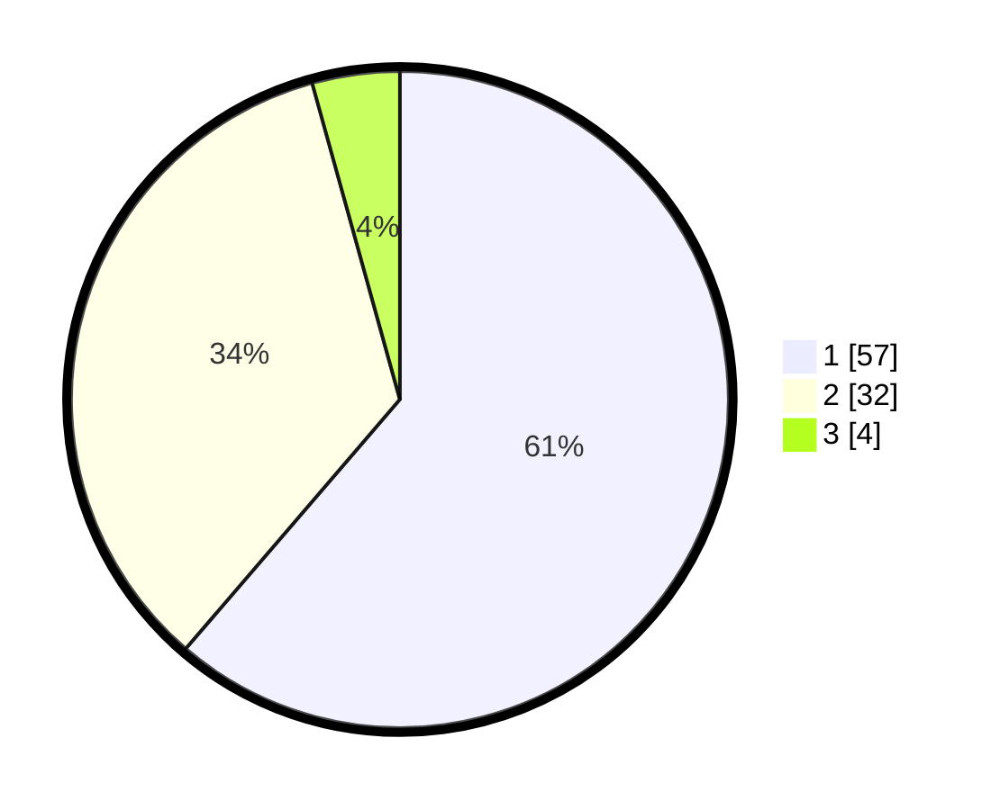

# Hasil

## Grafik

## Tabel

| No. | Nama Paslon    | Suara | Suara (raw) | Persentase |
|:--- |:-------------- | -----:| -----------:| ----------:|
| 1   | ANIES MUHAIMIN | 57    | [57][p-1]   | 61,29      |
| 2   | PRABOWO GIBRAN | 32    | [32][p-2]   | 34,41      |
| 3   | GANJAR MAHFUD  | 4     | [4][p-3]    | 4,30       |

[p-1]: https://github.com/gigit-pemilu/pemilu-2024-13-sumatera-barat/blob/main/pilpres/hitung-suara/sub/13-sumatera-barat/sub/06-agam/sub/08-baso/sub/2004-simarasok/sub/007-tps/sub/paslon-1.txt
[p-2]: https://github.com/gigit-pemilu/pemilu-2024-13-sumatera-barat/blob/main/pilpres/hitung-suara/sub/13-sumatera-barat/sub/06-agam/sub/08-baso/sub/2004-simarasok/sub/007-tps/sub/paslon-2.txt
[p-3]: https://github.com/gigit-pemilu/pemilu-2024-13-sumatera-barat/blob/main/pilpres/hitung-suara/sub/13-sumatera-barat/sub/06-agam/sub/08-baso/sub/2004-simarasok/sub/007-tps/sub/paslon-3.txt

## Foto C Plano

https://sirekap-obj-formc.kpu.go.id/aa51/pemilu/ppwp/13/06/08/20/04/1306082004007-20240220-171901--d69b4ee4-6542-4734-a92f-1d3893b5c085.jpg

https://sirekap-obj-formc.kpu.go.id/aa51/pemilu/ppwp/13/06/08/20/04/1306082004007-20240220-172018--bc3a3b3a-81a5-4277-9dd4-c22f4558ab88.jpg

https://sirekap-obj-formc.kpu.go.id/aa51/pemilu/ppwp/13/06/08/20/04/1306082004007-20240220-172041--add17141-8394-4c90-a664-297f98c9a82c.jpg

## Metadata

| Key        | Value               |
| ---------- | ------------------- |
| Time Stamp | 2024-02-25 14:00:00 |

