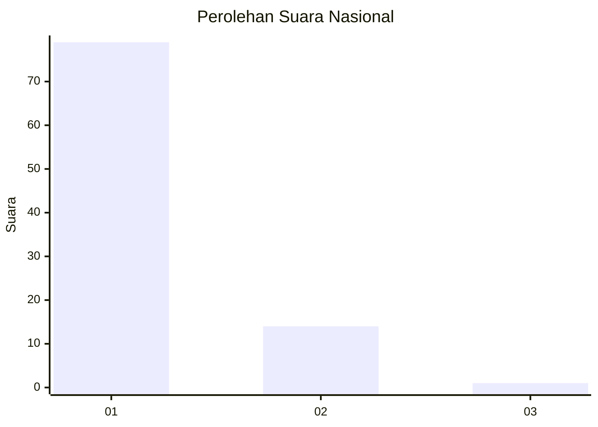
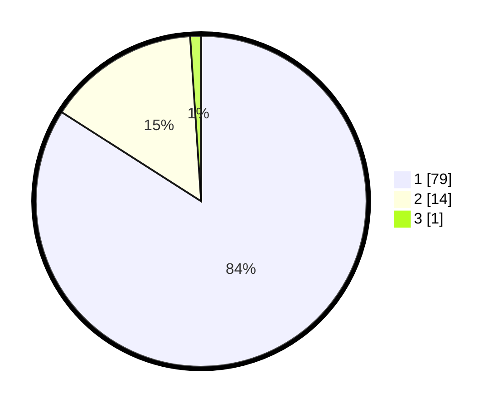

# Hasil

## Grafik

## Tabel

| No. | Nama Paslon    | Suara | Suara (raw) | Persentase |
|:--- |:-------------- | -----:| -----------:| ----------:|
| 1   | ANIES MUHAIMIN | 79    | [79][p-1]   | 84,04      |
| 2   | PRABOWO GIBRAN | 14    | [14][p-2]   | 14,89      |
| 3   | GANJAR MAHFUD  | 1     | [1][p-3]    | 1,06       |

[p-1]: https://github.com/gigit-pemilu/pemilu-2024/blob/main/pilpres/hitung-suara/sub/13-sumatera-barat/sub/06-agam/sub/08-baso/sub/2004-simarasok/sub/008-tps/sub/paslon-1.txt
[p-2]: https://github.com/gigit-pemilu/pemilu-2024/blob/main/pilpres/hitung-suara/sub/13-sumatera-barat/sub/06-agam/sub/08-baso/sub/2004-simarasok/sub/008-tps/sub/paslon-2.txt
[p-3]: https://github.com/gigit-pemilu/pemilu-2024/blob/main/pilpres/hitung-suara/sub/13-sumatera-barat/sub/06-agam/sub/08-baso/sub/2004-simarasok/sub/008-tps/sub/paslon-3.txt

## Foto C Plano

https://sirekap-obj-formc.kpu.go.id/2d94/pemilu/ppwp/13/06/08/20/04/1306082004008-20240214-214351--9cb5b434-8d3e-4574-9721-1d4b1968abbb.jpg

https://sirekap-obj-formc.kpu.go.id/2d94/pemilu/ppwp/13/06/08/20/04/1306082004008-20240220-201823--dccb4c5e-b367-40e5-82ef-0266b7419d5a.jpg

https://sirekap-obj-formc.kpu.go.id/2d94/pemilu/ppwp/13/06/08/20/04/1306082004008-20240220-201849--43042ef4-2c32-4411-8778-2150bf18cf0d.jpg

## Metadata

| Key        | Value               |
| ---------- | ------------------- |
| Time Stamp | 2024-02-24 22:31:28 |

