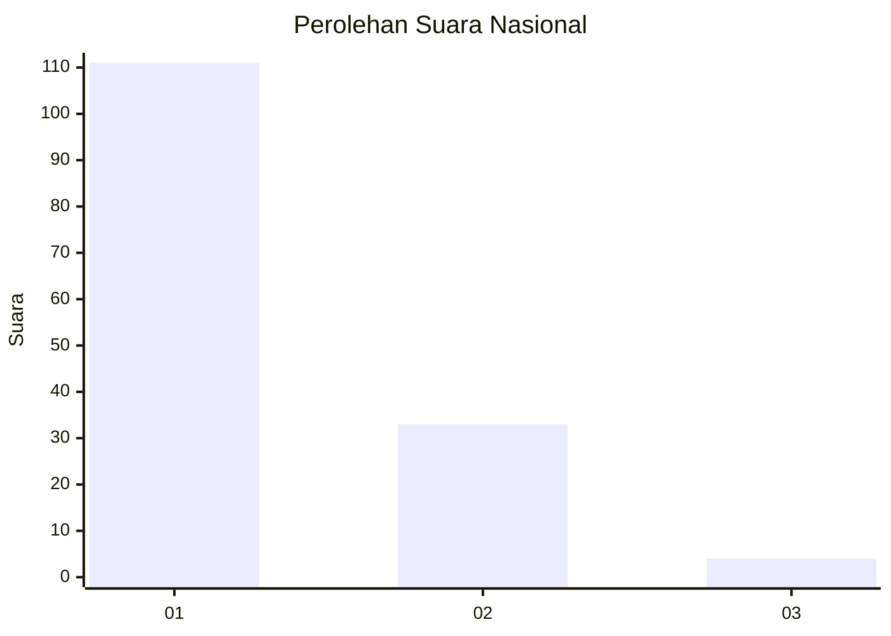
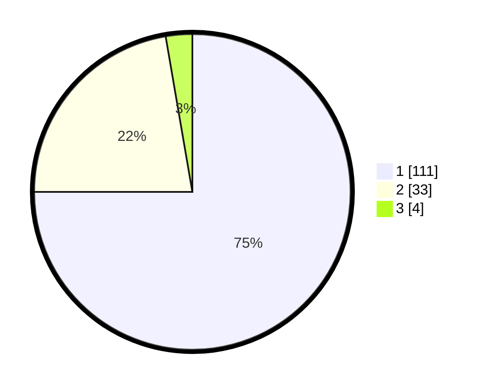

# Hasil

## Grafik

## Tabel

| No. | Nama Paslon    | Suara | Suara (raw) | Persentase |
|:--- |:-------------- | -----:| -----------:| ----------:|
| 1   | ANIES MUHAIMIN | 111   | [111][p-1]  | 75,00      |
| 2   | PRABOWO GIBRAN | 33    | [33][p-2]   | 22,30      |
| 3   | GANJAR MAHFUD  | 4     | [4][p-3]    | 2,70       |

[p-1]: https://github.com/gigit-pemilu/pemilu-2024/blob/main/pilpres/hitung-suara/sub/13-sumatera-barat/sub/06-agam/sub/08-baso/sub/2004-simarasok/sub/010-tps/sub/paslon-1.txt
[p-2]: https://github.com/gigit-pemilu/pemilu-2024/blob/main/pilpres/hitung-suara/sub/13-sumatera-barat/sub/06-agam/sub/08-baso/sub/2004-simarasok/sub/010-tps/sub/paslon-2.txt
[p-3]: https://github.com/gigit-pemilu/pemilu-2024/blob/main/pilpres/hitung-suara/sub/13-sumatera-barat/sub/06-agam/sub/08-baso/sub/2004-simarasok/sub/010-tps/sub/paslon-3.txt

## Foto C Plano

https://sirekap-obj-formc.kpu.go.id/5389/pemilu/ppwp/13/06/08/20/04/1306082004010-20240221-101125--04e62cea-57a5-4d01-95a1-175dfe8609c9.jpg

https://sirekap-obj-formc.kpu.go.id/5389/pemilu/ppwp/13/06/08/20/04/1306082004010-20240221-101207--243384b5-66f7-432a-8ea6-ed4bf7a01897.jpg

https://sirekap-obj-formc.kpu.go.id/5389/pemilu/ppwp/13/06/08/20/04/1306082004010-20240221-101247--d9fcc961-4161-4137-a84b-3873d8157b90.jpg

## Metadata

| Key        | Value               |
| ---------- | ------------------- |
| Time Stamp | 2024-02-24 22:31:28 |

