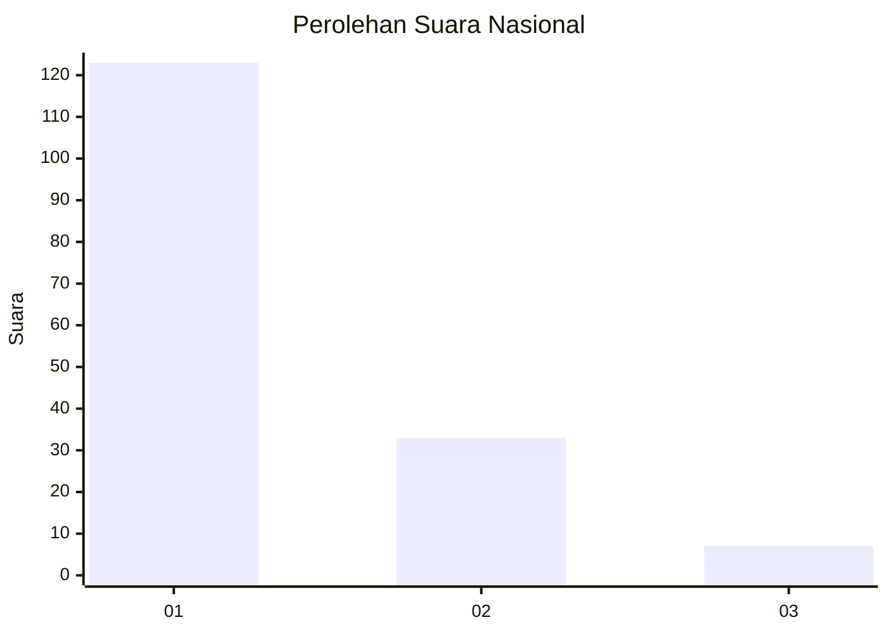
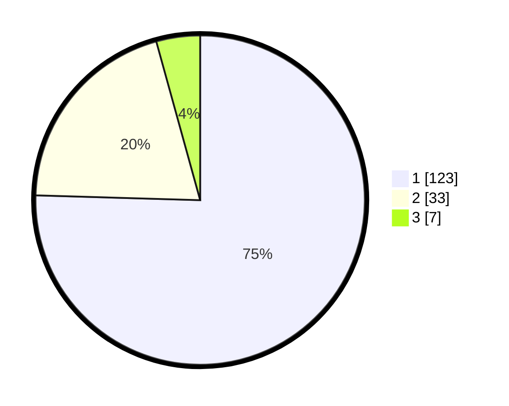

# Hasil

## Grafik

## Tabel

| No. | Nama Paslon    | Suara | Suara (raw) | Persentase |
|:--- |:-------------- | -----:| -----------:| ----------:|
| 1   | ANIES MUHAIMIN | 123   | [123][p-1]  | 75,46      |
| 2   | PRABOWO GIBRAN | 33    | [33][p-2]   | 20,25      |
| 3   | GANJAR MAHFUD  | 7     | [7][p-3]    | 4,29       |

[p-1]: https://github.com/gigit-pemilu/pemilu-2024/blob/main/pilpres/hitung-suara/sub/13-sumatera-barat/sub/06-agam/sub/08-baso/sub/2004-simarasok/sub/011-tps/sub/paslon-1.txt
[p-2]: https://github.com/gigit-pemilu/pemilu-2024/blob/main/pilpres/hitung-suara/sub/13-sumatera-barat/sub/06-agam/sub/08-baso/sub/2004-simarasok/sub/011-tps/sub/paslon-2.txt
[p-3]: https://github.com/gigit-pemilu/pemilu-2024/blob/main/pilpres/hitung-suara/sub/13-sumatera-barat/sub/06-agam/sub/08-baso/sub/2004-simarasok/sub/011-tps/sub/paslon-3.txt

## Foto C Plano

https://sirekap-obj-formc.kpu.go.id/c7b2/pemilu/ppwp/13/06/08/20/04/1306082004011-20240221-110410--122d4766-a302-423e-ba7a-04ee4b0f9eff.jpg

https://sirekap-obj-formc.kpu.go.id/c7b2/pemilu/ppwp/13/06/08/20/04/1306082004011-20240221-110450--4d1ee66a-01ad-4758-ac0c-b64914a4a093.jpg

https://sirekap-obj-formc.kpu.go.id/c7b2/pemilu/ppwp/13/06/08/20/04/1306082004011-20240221-110516--ad3855bd-b6a2-4009-b7bf-33c3b008daa0.jpg

## Metadata

| Key        | Value               |
| ---------- | ------------------- |
| Time Stamp | 2024-02-25 23:00:00 |

