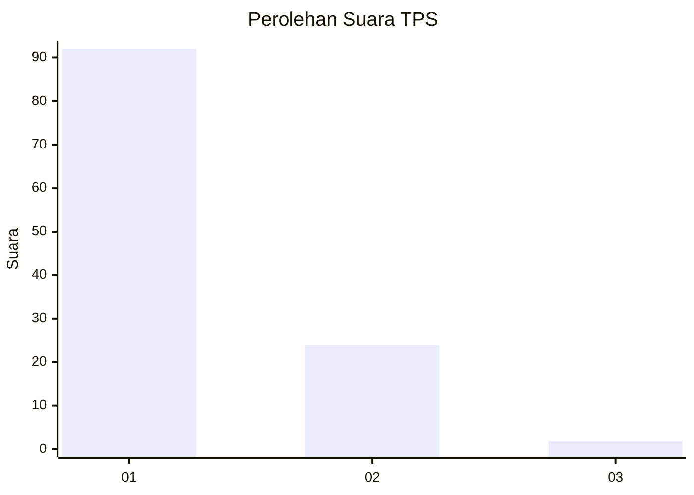
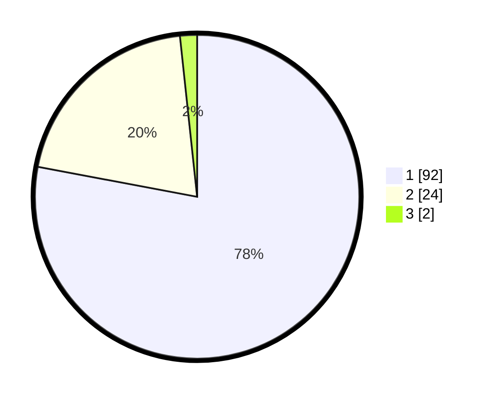

# Hasil

## Grafik

## Tabel

| No. | Nama Paslon    | Suara | Suara (raw) | Persentase |
|:--- |:-------------- | -----:| -----------:| ----------:|
| 1   | ANIES MUHAIMIN | 92    | [92][p-1]   | 77,97      |
| 2   | PRABOWO GIBRAN | 24    | [24][p-2]   | 20,34      |
| 3   | GANJAR MAHFUD  | 2     | [2][p-3]    | 1,69       |

[p-1]: https://github.com/gigit-pemilu/pemilu-2024-13-sumatera-barat/blob/main/pilpres/hitung-suara/sub/13-sumatera-barat/sub/06-agam/sub/08-baso/sub/2004-simarasok/sub/013-tps/sub/paslon-1.txt
[p-2]: https://github.com/gigit-pemilu/pemilu-2024-13-sumatera-barat/blob/main/pilpres/hitung-suara/sub/13-sumatera-barat/sub/06-agam/sub/08-baso/sub/2004-simarasok/sub/013-tps/sub/paslon-2.txt
[p-3]: https://github.com/gigit-pemilu/pemilu-2024-13-sumatera-barat/blob/main/pilpres/hitung-suara/sub/13-sumatera-barat/sub/06-agam/sub/08-baso/sub/2004-simarasok/sub/013-tps/sub/paslon-3.txt

## Foto C Plano

https://sirekap-obj-formc.kpu.go.id/d91d/pemilu/ppwp/13/06/08/20/04/1306082004013-20240221-134404--9c94d0f6-aa13-49b3-adbe-be7b21e4efdb.jpg

https://sirekap-obj-formc.kpu.go.id/d91d/pemilu/ppwp/13/06/08/20/04/1306082004013-20240221-134437--9cb35ab0-4e3b-4460-b196-5e16ac4db6b2.jpg

https://sirekap-obj-formc.kpu.go.id/d91d/pemilu/ppwp/13/06/08/20/04/1306082004013-20240221-134518--9535affe-e683-47bc-9f90-cdf13f878d18.jpg

## Metadata

| Key        | Value               |
| ---------- | ------------------- |
| Time Stamp | 2024-02-25 21:00:00 |

