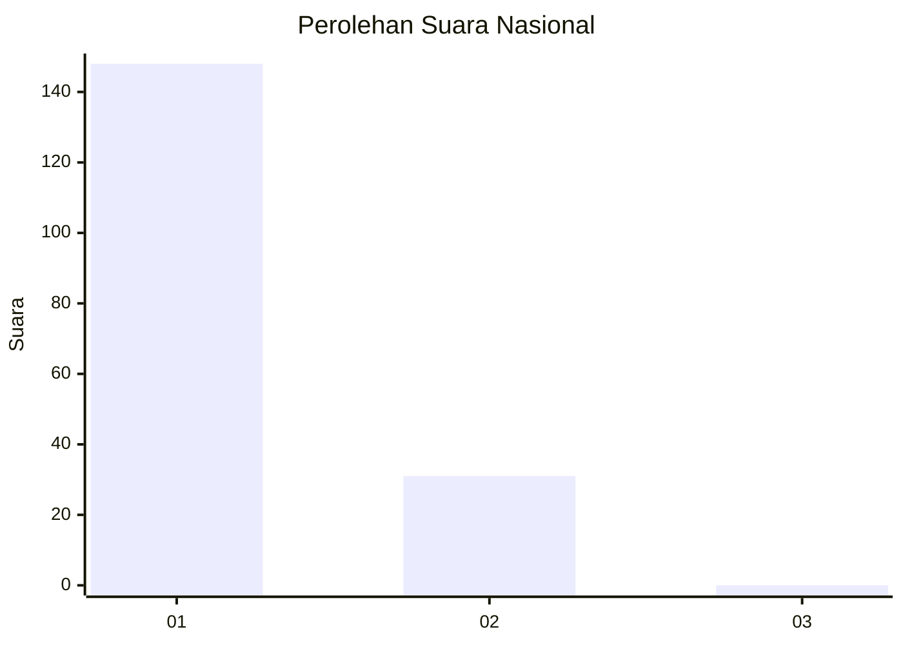
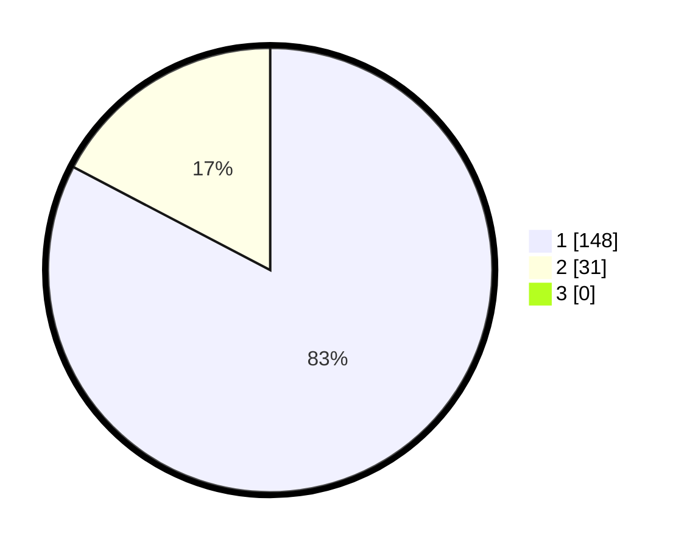

# Hasil

## Grafik

## Tabel

| No. | Nama Paslon    | Suara | Suara (raw) | Persentase |
|:--- |:-------------- | -----:| -----------:| ----------:|
| 1   | ANIES MUHAIMIN | 148   | [148][p-1]  | 82,68      |
| 2   | PRABOWO GIBRAN | 31    | [31][p-2]   | 17,32      |
| 3   | GANJAR MAHFUD  | 0     | [0][p-3]    | 0,00       |

[p-1]: https://github.com/gigit-pemilu/pemilu-2024/blob/main/pilpres/hitung-suara/sub/13-sumatera-barat/sub/06-agam/sub/08-baso/sub/2004-simarasok/sub/014-tps/sub/paslon-1.txt
[p-2]: https://github.com/gigit-pemilu/pemilu-2024/blob/main/pilpres/hitung-suara/sub/13-sumatera-barat/sub/06-agam/sub/08-baso/sub/2004-simarasok/sub/014-tps/sub/paslon-2.txt
[p-3]: https://github.com/gigit-pemilu/pemilu-2024/blob/main/pilpres/hitung-suara/sub/13-sumatera-barat/sub/06-agam/sub/08-baso/sub/2004-simarasok/sub/014-tps/sub/paslon-3.txt

## Foto C Plano

https://sirekap-obj-formc.kpu.go.id/f9e3/pemilu/ppwp/13/06/08/20/04/1306082004014-20240221-142540--1528116f-d091-4d7f-a4fe-c370ea144bb7.jpg

https://sirekap-obj-formc.kpu.go.id/f9e3/pemilu/ppwp/13/06/08/20/04/1306082004014-20240221-142637--56c69944-b2fb-44e1-b9f8-cb298d5450e6.jpg

https://sirekap-obj-formc.kpu.go.id/f9e3/pemilu/ppwp/13/06/08/20/04/1306082004014-20240221-142659--8178066c-b8c4-4f0b-ad69-1e5de3a7675a.jpg

## Metadata

| Key        | Value               |
| ---------- | ------------------- |
| Time Stamp | 2024-02-24 22:31:28 |

