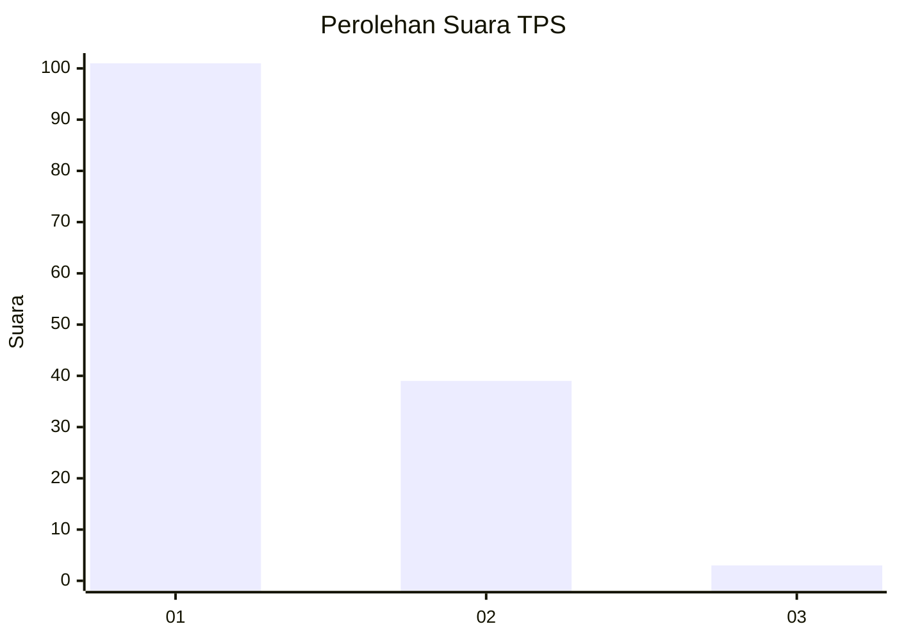
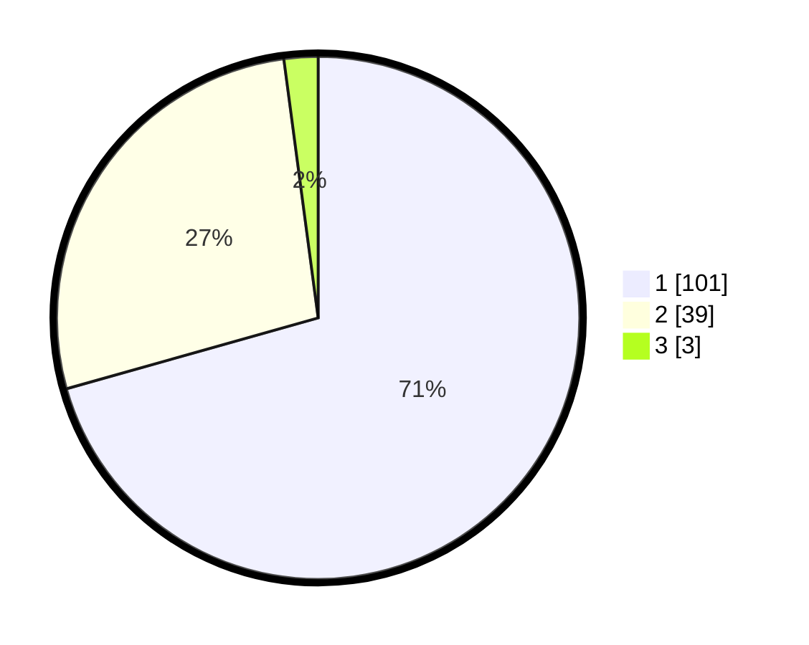

# Hasil

## Grafik

## Tabel

| No. | Nama Paslon    | Suara | Suara (raw) | Persentase |
|:--- |:-------------- | -----:| -----------:| ----------:|
| 1   | ANIES MUHAIMIN | 101   | [101][p-1]  | 70,63      |
| 2   | PRABOWO GIBRAN | 39    | [39][p-2]   | 27,27      |
| 3   | GANJAR MAHFUD  | 3     | [3][p-3]    | 2,10       |

[p-1]: https://github.com/gigit-pemilu/pemilu-2024-13-sumatera-barat/blob/main/pilpres/hitung-suara/sub/13-sumatera-barat/sub/06-agam/sub/08-baso/sub/2004-simarasok/sub/017-tps/sub/paslon-1.txt
[p-2]: https://github.com/gigit-pemilu/pemilu-2024-13-sumatera-barat/blob/main/pilpres/hitung-suara/sub/13-sumatera-barat/sub/06-agam/sub/08-baso/sub/2004-simarasok/sub/017-tps/sub/paslon-2.txt
[p-3]: https://github.com/gigit-pemilu/pemilu-2024-13-sumatera-barat/blob/main/pilpres/hitung-suara/sub/13-sumatera-barat/sub/06-agam/sub/08-baso/sub/2004-simarasok/sub/017-tps/sub/paslon-3.txt

## Foto C Plano

https://sirekap-obj-formc.kpu.go.id/46a2/pemilu/ppwp/13/06/08/20/04/1306082004017-20240221-171158--139011b5-fae1-489a-810f-6568fc137bde.jpg

https://sirekap-obj-formc.kpu.go.id/46a2/pemilu/ppwp/13/06/08/20/04/1306082004017-20240221-171312--4b4835cd-fce2-4f62-a0f1-d53aa452efc3.jpg

https://sirekap-obj-formc.kpu.go.id/46a2/pemilu/ppwp/13/06/08/20/04/1306082004017-20240221-171342--c2168ea0-c7e8-490e-96cd-18decab243c5.jpg

## Metadata

| Key        | Value               |
| ---------- | ------------------- |
| Time Stamp | 2024-02-24 22:31:28 |

