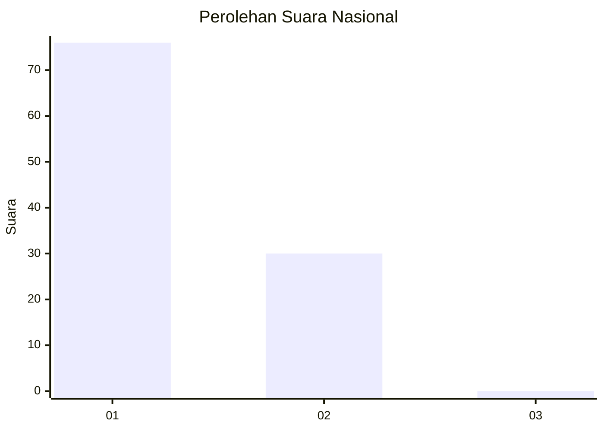
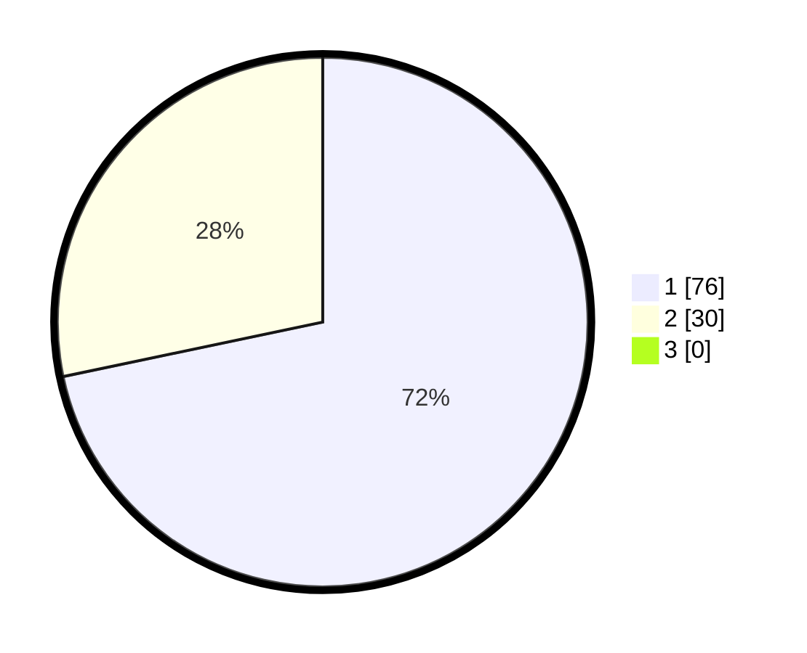

# Hasil

## Grafik

## Tabel

| No. | Nama Paslon    | Suara | Suara (raw) | Persentase |
|:--- |:-------------- | -----:| -----------:| ----------:|
| 1   | ANIES MUHAIMIN | 76    | [76][p-1]   | 71,70      |
| 2   | PRABOWO GIBRAN | 30    | [30][p-2]   | 28,30      |
| 3   | GANJAR MAHFUD  | 0     | [0][p-3]    | 0,00       |

[p-1]: https://github.com/gigit-pemilu/pemilu-2024/blob/main/pilpres/hitung-suara/sub/13-sumatera-barat/sub/06-agam/sub/08-baso/sub/2004-simarasok/sub/018-tps/sub/paslon-1.txt
[p-2]: https://github.com/gigit-pemilu/pemilu-2024/blob/main/pilpres/hitung-suara/sub/13-sumatera-barat/sub/06-agam/sub/08-baso/sub/2004-simarasok/sub/018-tps/sub/paslon-2.txt
[p-3]: https://github.com/gigit-pemilu/pemilu-2024/blob/main/pilpres/hitung-suara/sub/13-sumatera-barat/sub/06-agam/sub/08-baso/sub/2004-simarasok/sub/018-tps/sub/paslon-3.txt

## Foto C Plano

https://sirekap-obj-formc.kpu.go.id/5b61/pemilu/ppwp/13/06/08/20/04/1306082004018-20240221-174445--b269b834-5597-4878-8c41-cdc9b0a78d11.jpg

https://sirekap-obj-formc.kpu.go.id/5b61/pemilu/ppwp/13/06/08/20/04/1306082004018-20240221-174520--d825855c-134d-4d54-9209-edc04bdda8dc.jpg

https://sirekap-obj-formc.kpu.go.id/5b61/pemilu/ppwp/13/06/08/20/04/1306082004018-20240221-174545--f3c4ab37-bf36-4f94-835e-9a60365d7536.jpg

## Metadata

| Key        | Value               |
| ---------- | ------------------- |
| Time Stamp | 2024-02-25 11:00:00 |

