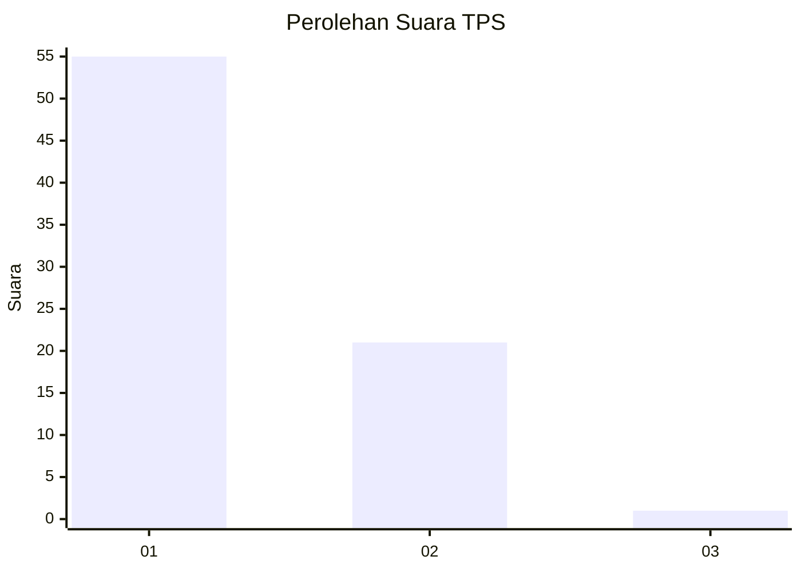
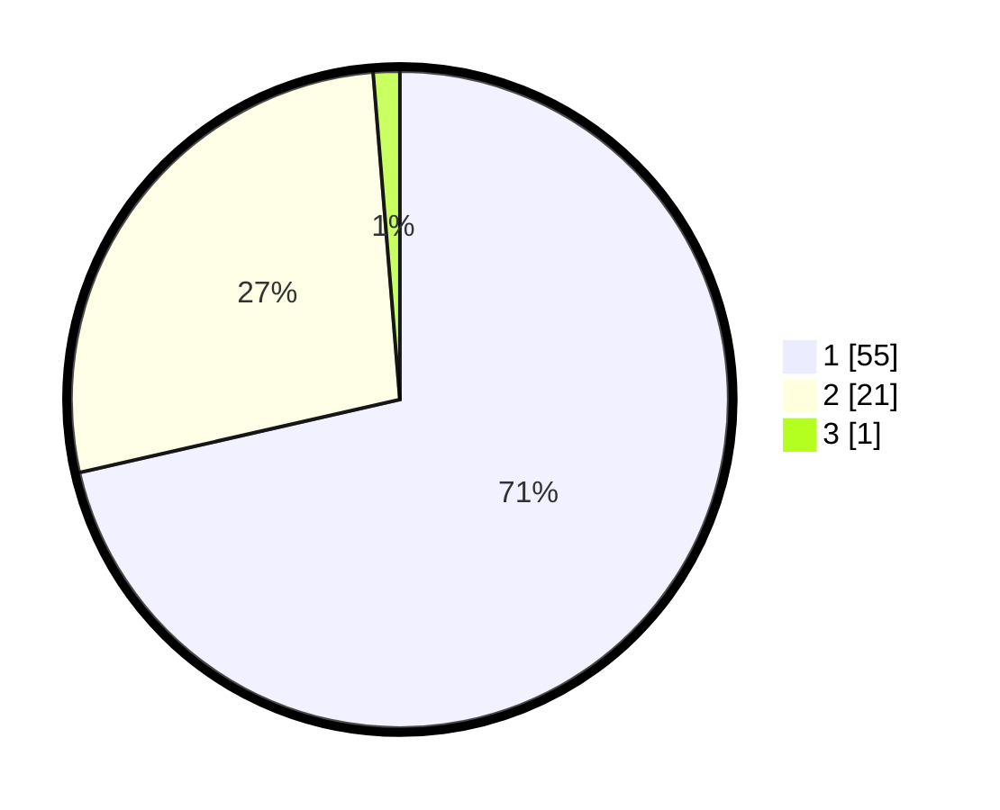

# Hasil

## Grafik

## Tabel

| No. | Nama Paslon    | Suara | Suara (raw) | Persentase |
|:--- |:-------------- | -----:| -----------:| ----------:|
| 1   | ANIES MUHAIMIN | 55    | [55][p-1]   | 71,43      |
| 2   | PRABOWO GIBRAN | 21    | [21][p-2]   | 27,27      |
| 3   | GANJAR MAHFUD  | 1     | [1][p-3]    | 1,30       |

[p-1]: https://github.com/gigit-pemilu/pemilu-2024-13-sumatera-barat/blob/main/pilpres/hitung-suara/sub/13-sumatera-barat/sub/06-agam/sub/08-baso/sub/2004-simarasok/sub/019-tps/sub/paslon-1.txt
[p-2]: https://github.com/gigit-pemilu/pemilu-2024-13-sumatera-barat/blob/main/pilpres/hitung-suara/sub/13-sumatera-barat/sub/06-agam/sub/08-baso/sub/2004-simarasok/sub/019-tps/sub/paslon-2.txt
[p-3]: https://github.com/gigit-pemilu/pemilu-2024-13-sumatera-barat/blob/main/pilpres/hitung-suara/sub/13-sumatera-barat/sub/06-agam/sub/08-baso/sub/2004-simarasok/sub/019-tps/sub/paslon-3.txt

## Foto C Plano

https://sirekap-obj-formc.kpu.go.id/55dd/pemilu/ppwp/13/06/08/20/04/1306082004019-20240221-195445--3bae19be-1bec-4685-b6fe-28ab81f49deb.jpg

https://sirekap-obj-formc.kpu.go.id/55dd/pemilu/ppwp/13/06/08/20/04/1306082004019-20240221-195603--09fb57ef-f678-42b7-a9ee-c1eef6de12a8.jpg

https://sirekap-obj-formc.kpu.go.id/55dd/pemilu/ppwp/13/06/08/20/04/1306082004019-20240221-195624--cc0a16a2-f5b2-4a69-ba96-f410275230dd.jpg

## Metadata

| Key        | Value               |
| ---------- | ------------------- |
| Time Stamp | 2024-02-24 22:31:28 |

