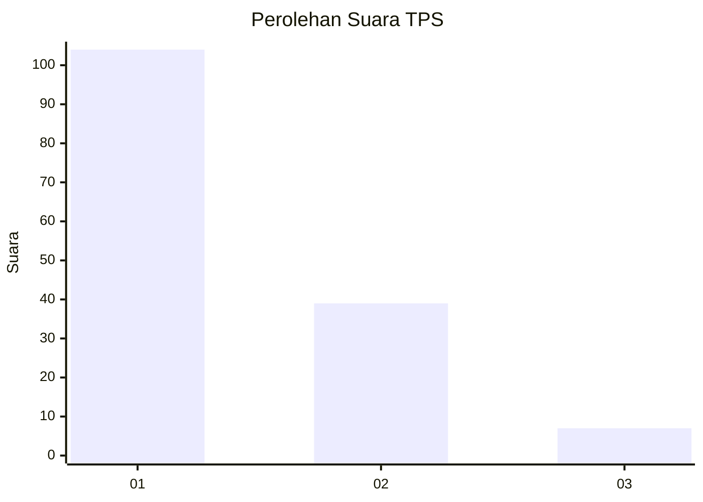
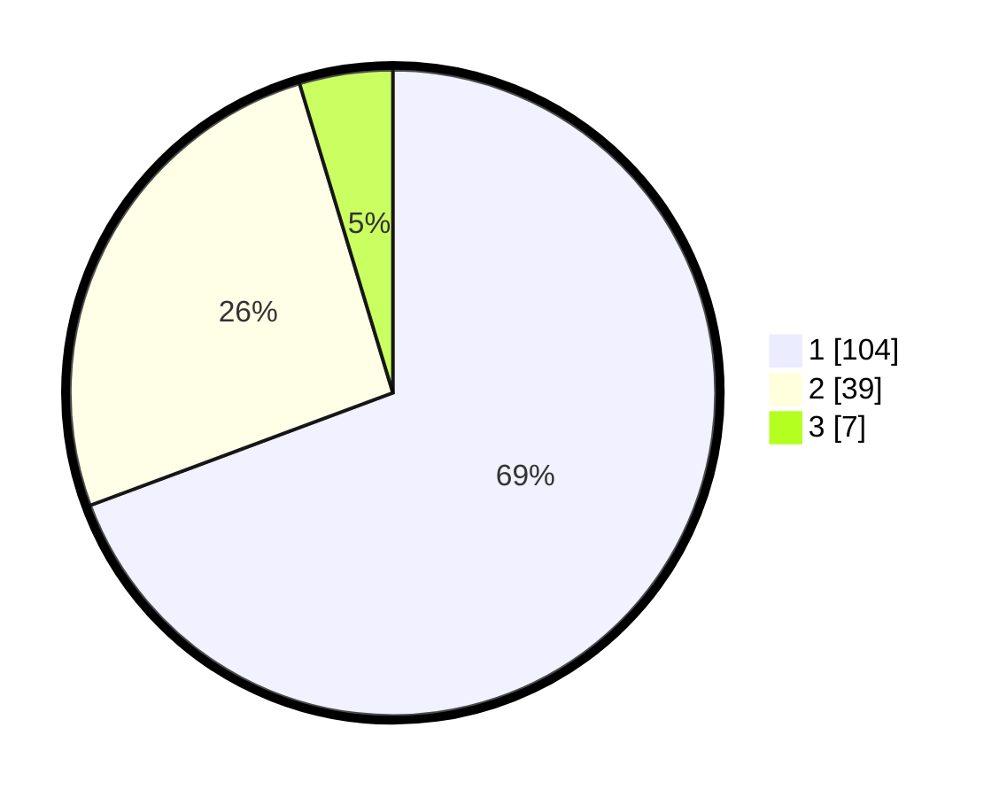

# Hasil

## Grafik

## Tabel

| No. | Nama Paslon    | Suara | Suara (raw) | Persentase |
|:--- |:-------------- | -----:| -----------:| ----------:|
| 1   | ANIES MUHAIMIN | 104   | [104][p-1]  | 69,33      |
| 2   | PRABOWO GIBRAN | 39    | [39][p-2]   | 26,00      |
| 3   | GANJAR MAHFUD  | 7     | [7][p-3]    | 4,67       |

[p-1]: https://github.com/gigit-pemilu/pemilu-2024-13-sumatera-barat/blob/main/pilpres/hitung-suara/sub/13-sumatera-barat/sub/06-agam/sub/08-baso/sub/2004-simarasok/sub/023-tps/sub/paslon-1.txt
[p-2]: https://github.com/gigit-pemilu/pemilu-2024-13-sumatera-barat/blob/main/pilpres/hitung-suara/sub/13-sumatera-barat/sub/06-agam/sub/08-baso/sub/2004-simarasok/sub/023-tps/sub/paslon-2.txt
[p-3]: https://github.com/gigit-pemilu/pemilu-2024-13-sumatera-barat/blob/main/pilpres/hitung-suara/sub/13-sumatera-barat/sub/06-agam/sub/08-baso/sub/2004-simarasok/sub/023-tps/sub/paslon-3.txt

## Foto C Plano

https://sirekap-obj-formc.kpu.go.id/8a11/pemilu/ppwp/13/06/08/20/04/1306082004023-20240215-035121--23f6f4dd-b99c-4ac8-afbf-b3a661813b43.jpg

https://sirekap-obj-formc.kpu.go.id/8a11/pemilu/ppwp/13/06/08/20/04/1306082004023-20240215-035342--c04f0b8d-c98c-4c7f-b592-03274a6f383b.jpg

https://sirekap-obj-formc.kpu.go.id/8a11/pemilu/ppwp/13/06/08/20/04/1306082004023-20240215-035557--9aeff92b-7326-431a-b57e-2e398dfaf66e.jpg

## Metadata

| Key        | Value               |
| ---------- | ------------------- |
| Time Stamp | 2024-02-24 22:31:28 |

