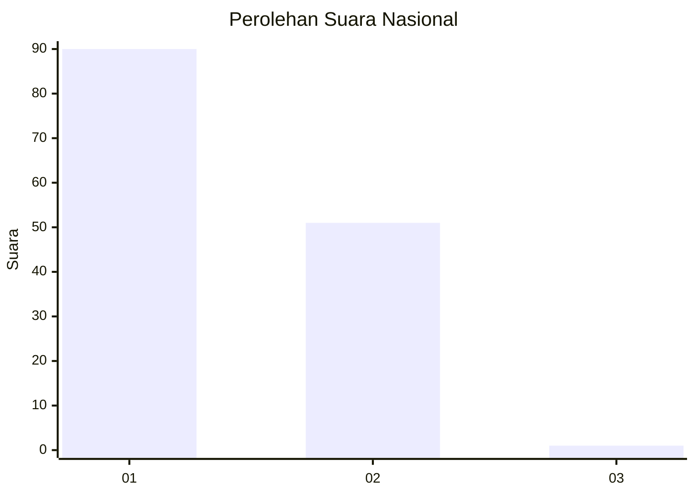
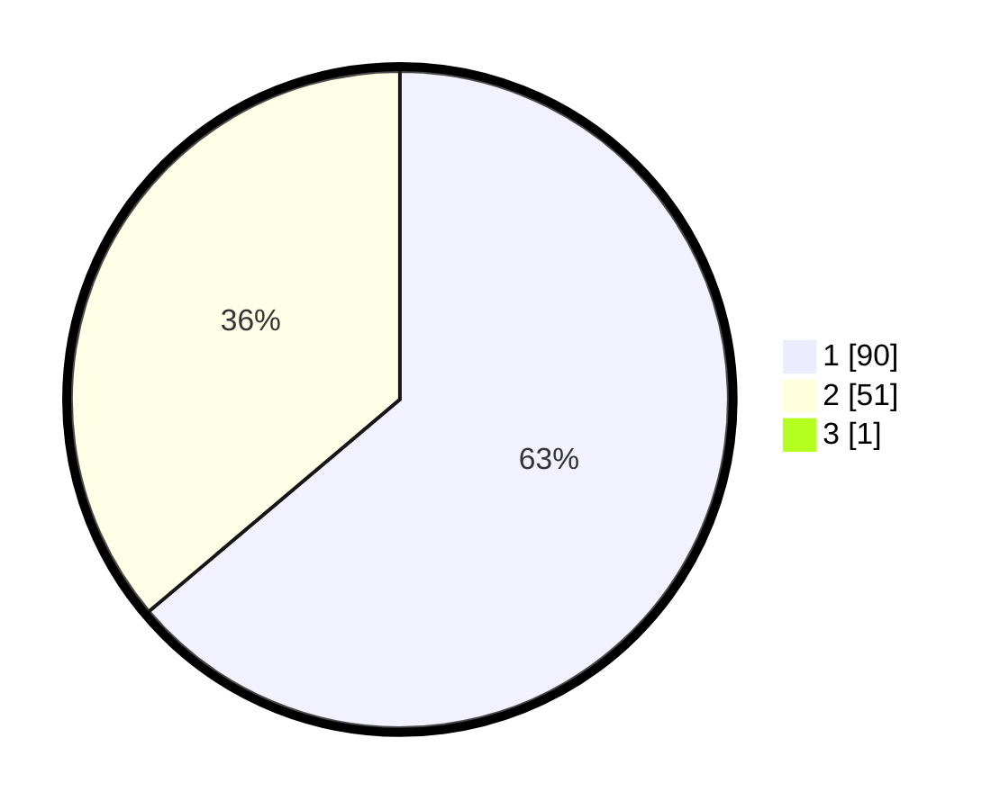

# Hasil

## Grafik

## Tabel

| No. | Nama Paslon    | Suara | Suara (raw) | Persentase |
|:--- |:-------------- | -----:| -----------:| ----------:|
| 1   | ANIES MUHAIMIN | 90    | [90][p-1]   | 63,38      |
| 2   | PRABOWO GIBRAN | 51    | [51][p-2]   | 35,92      |
| 3   | GANJAR MAHFUD  | 1     | [1][p-3]    | 0,70       |

[p-1]: https://github.com/gigit-pemilu/pemilu-2024/blob/main/pilpres/hitung-suara/sub/13-sumatera-barat/sub/06-agam/sub/08-baso/sub/2005-padang-tarok/sub/004-tps/sub/paslon-1.txt
[p-2]: https://github.com/gigit-pemilu/pemilu-2024/blob/main/pilpres/hitung-suara/sub/13-sumatera-barat/sub/06-agam/sub/08-baso/sub/2005-padang-tarok/sub/004-tps/sub/paslon-2.txt
[p-3]: https://github.com/gigit-pemilu/pemilu-2024/blob/main/pilpres/hitung-suara/sub/13-sumatera-barat/sub/06-agam/sub/08-baso/sub/2005-padang-tarok/sub/004-tps/sub/paslon-3.txt

## Foto C Plano

https://sirekap-obj-formc.kpu.go.id/401c/pemilu/ppwp/13/06/08/20/05/1306082005004-20240218-171737--a6e7f697-1213-4d2d-a762-89d4f93e8a65.jpg

https://sirekap-obj-formc.kpu.go.id/401c/pemilu/ppwp/13/06/08/20/05/1306082005004-20240218-175959--a9147bfc-5a3a-4d99-89e0-eef2d9c4f9e4.jpg

https://sirekap-obj-formc.kpu.go.id/401c/pemilu/ppwp/13/06/08/20/05/1306082005004-20240218-180549--a8a10b86-d4d1-4f04-a72d-b05ec1ab0335.jpg

## Metadata

| Key        | Value               |
| ---------- | ------------------- |
| Time Stamp | 2024-02-21 23:00:00 |

