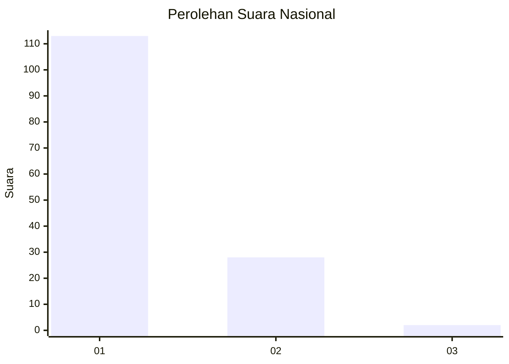
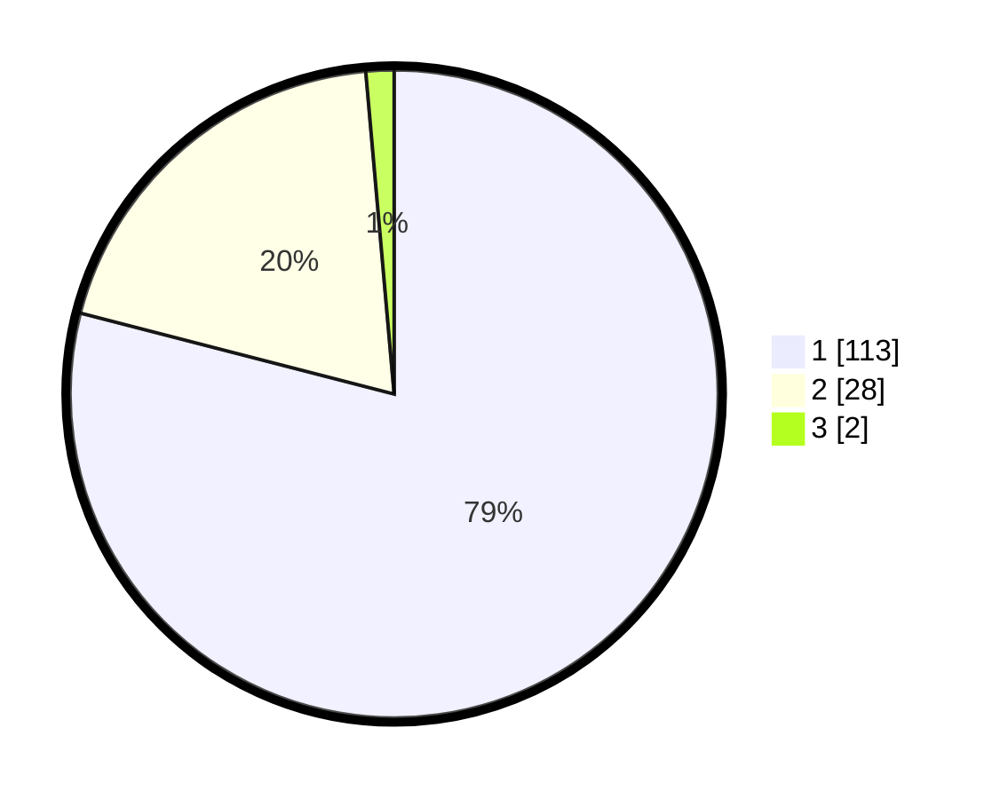

# Hasil

## Grafik

## Tabel

| No. | Nama Paslon    | Suara | Suara (raw) | Persentase |
|:--- |:-------------- | -----:| -----------:| ----------:|
| 1   | ANIES MUHAIMIN | 113   | [113][p-1]  | 79,02      |
| 2   | PRABOWO GIBRAN | 28    | [28][p-2]   | 19,58      |
| 3   | GANJAR MAHFUD  | 2     | [2][p-3]    | 1,40       |

[p-1]: https://github.com/gigit-pemilu/pemilu-2024/blob/main/pilpres/hitung-suara/sub/13-sumatera-barat/sub/06-agam/sub/08-baso/sub/2005-padang-tarok/sub/007-tps/sub/paslon-1.txt
[p-2]: https://github.com/gigit-pemilu/pemilu-2024/blob/main/pilpres/hitung-suara/sub/13-sumatera-barat/sub/06-agam/sub/08-baso/sub/2005-padang-tarok/sub/007-tps/sub/paslon-2.txt
[p-3]: https://github.com/gigit-pemilu/pemilu-2024/blob/main/pilpres/hitung-suara/sub/13-sumatera-barat/sub/06-agam/sub/08-baso/sub/2005-padang-tarok/sub/007-tps/sub/paslon-3.txt

## Foto C Plano

https://sirekap-obj-formc.kpu.go.id/6096/pemilu/ppwp/13/06/08/20/05/1306082005007-20240219-182148--db72bf90-0f17-4ee3-bfef-78cb1053d547.jpg

https://sirekap-obj-formc.kpu.go.id/6096/pemilu/ppwp/13/06/08/20/05/1306082005007-20240219-182242--18dad879-665b-4578-911d-42a01198dd33.jpg

https://sirekap-obj-formc.kpu.go.id/6096/pemilu/ppwp/13/06/08/20/05/1306082005007-20240219-182322--cb41933e-a2a6-4d08-a705-b79574294d76.jpg

## Metadata

| Key        | Value               |
| ---------- | ------------------- |
| Time Stamp | 2024-02-25 15:00:00 |

