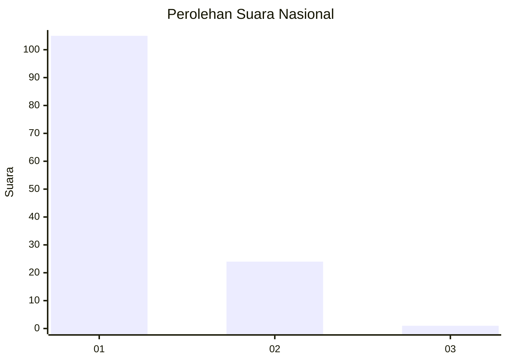
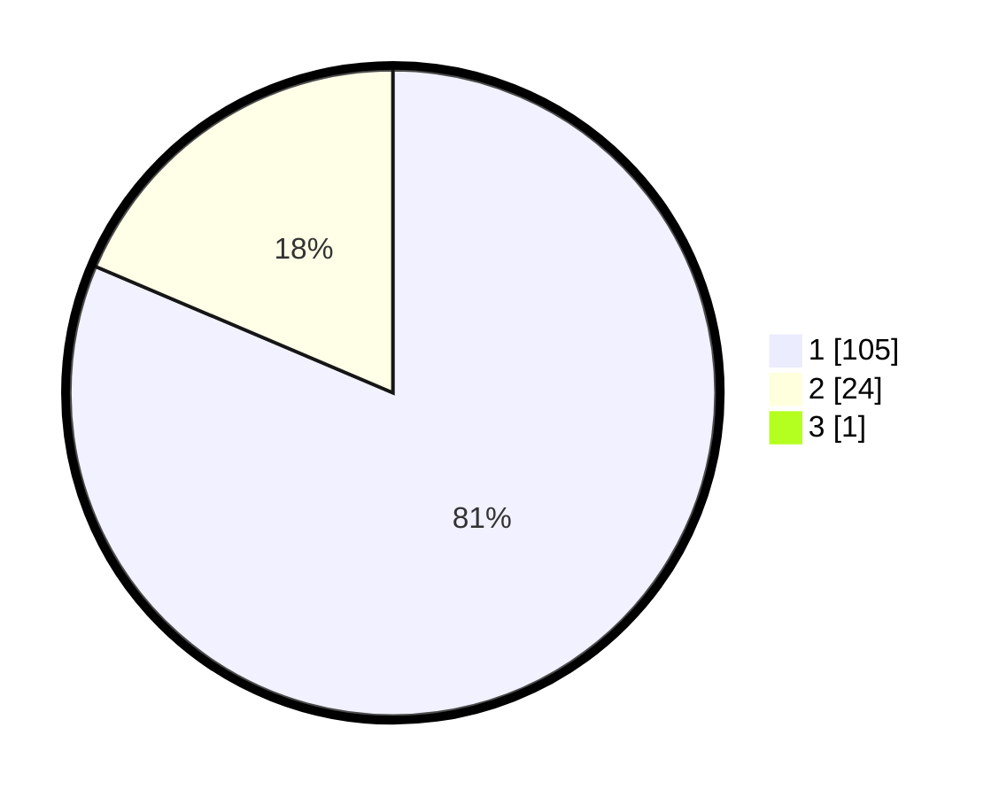

# Hasil

## Grafik

## Tabel

| No. | Nama Paslon    | Suara | Suara (raw) | Persentase |
|:--- |:-------------- | -----:| -----------:| ----------:|
| 1   | ANIES MUHAIMIN | 105   | [105][p-1]  | 80,77      |
| 2   | PRABOWO GIBRAN | 24    | [24][p-2]   | 18,46      |
| 3   | GANJAR MAHFUD  | 1     | [1][p-3]    | 0,77       |

[p-1]: https://github.com/gigit-pemilu/pemilu-2024/blob/main/pilpres/hitung-suara/sub/13-sumatera-barat/sub/06-agam/sub/08-baso/sub/2005-padang-tarok/sub/024-tps/sub/paslon-1.txt
[p-2]: https://github.com/gigit-pemilu/pemilu-2024/blob/main/pilpres/hitung-suara/sub/13-sumatera-barat/sub/06-agam/sub/08-baso/sub/2005-padang-tarok/sub/024-tps/sub/paslon-2.txt
[p-3]: https://github.com/gigit-pemilu/pemilu-2024/blob/main/pilpres/hitung-suara/sub/13-sumatera-barat/sub/06-agam/sub/08-baso/sub/2005-padang-tarok/sub/024-tps/sub/paslon-3.txt

## Foto C Plano

https://sirekap-obj-formc.kpu.go.id/af19/pemilu/ppwp/13/06/08/20/05/1306082005024-20240219-135255--74ca901e-e85e-47fc-a2bc-771a39ded900.jpg

https://sirekap-obj-formc.kpu.go.id/af19/pemilu/ppwp/13/06/08/20/05/1306082005024-20240219-135526--9ea400b9-a8f5-4994-b5f3-87024a836b16.jpg

https://sirekap-obj-formc.kpu.go.id/af19/pemilu/ppwp/13/06/08/20/05/1306082005024-20240219-131251--6faa6eec-389e-4c5c-87ee-12fede97f7a7.jpg

## Metadata

| Key        | Value               |
| ---------- | ------------------- |
| Time Stamp | 2024-02-25 10:00:00 |

