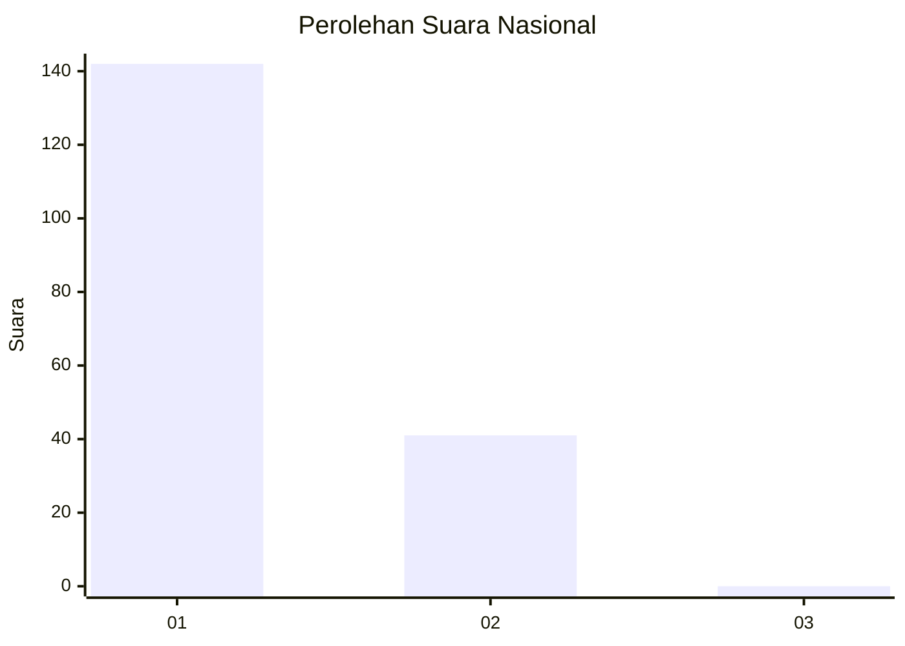
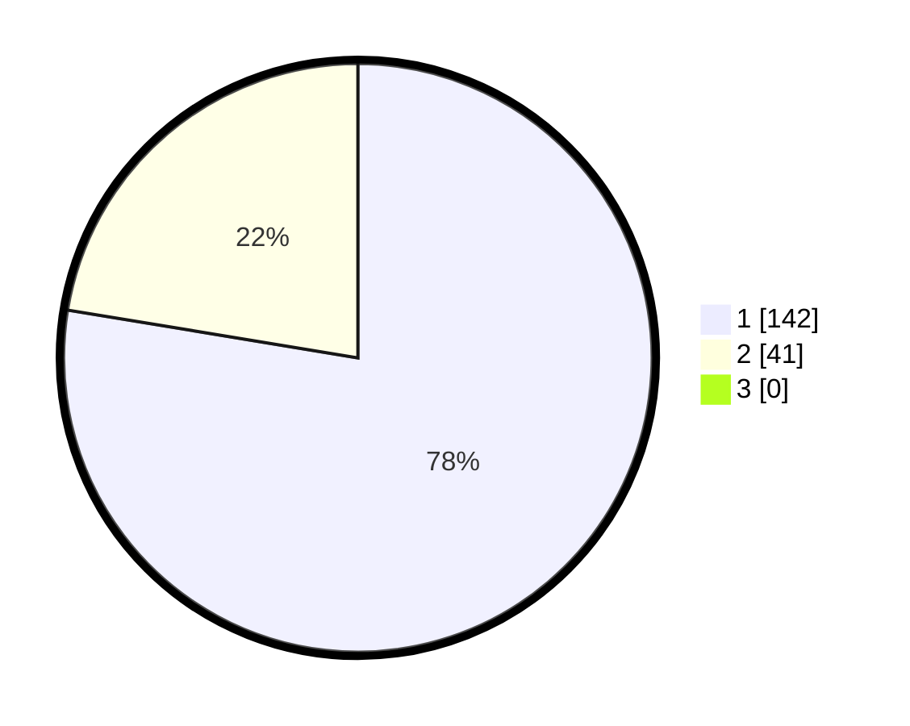

# Hasil

## Grafik

## Tabel

| No. | Nama Paslon    | Suara | Suara (raw) | Persentase |
|:--- |:-------------- | -----:| -----------:| ----------:|
| 1   | ANIES MUHAIMIN | 142   | [142][p-1]  | 77,60      |
| 2   | PRABOWO GIBRAN | 41    | [41][p-2]   | 22,40      |
| 3   | GANJAR MAHFUD  | 0     | [0][p-3]    | 0,00       |

[p-1]: https://github.com/gigit-pemilu/pemilu-2024/blob/main/pilpres/hitung-suara/sub/13-sumatera-barat/sub/06-agam/sub/08-baso/sub/2007-koto-baru/sub/001-tps/sub/paslon-1.txt
[p-2]: https://github.com/gigit-pemilu/pemilu-2024/blob/main/pilpres/hitung-suara/sub/13-sumatera-barat/sub/06-agam/sub/08-baso/sub/2007-koto-baru/sub/001-tps/sub/paslon-2.txt
[p-3]: https://github.com/gigit-pemilu/pemilu-2024/blob/main/pilpres/hitung-suara/sub/13-sumatera-barat/sub/06-agam/sub/08-baso/sub/2007-koto-baru/sub/001-tps/sub/paslon-3.txt

## Foto C Plano

https://sirekap-obj-formc.kpu.go.id/cf65/pemilu/ppwp/13/06/08/20/07/1306082007001-20240220-134729--96e6da0a-43e6-482f-84c1-a26fce03d54e.jpg

https://sirekap-obj-formc.kpu.go.id/cf65/pemilu/ppwp/13/06/08/20/07/1306082007001-20240218-205831--9ed4bd1f-0330-4e45-a25c-0b7d9060a765.jpg

https://sirekap-obj-formc.kpu.go.id/cf65/pemilu/ppwp/13/06/08/20/07/1306082007001-20240218-205809--832f7c70-0676-46f0-a273-d7499cf815c6.jpg

## Metadata

| Key        | Value               |
| ---------- | ------------------- |
| Time Stamp | 2024-02-25 21:00:00 |

