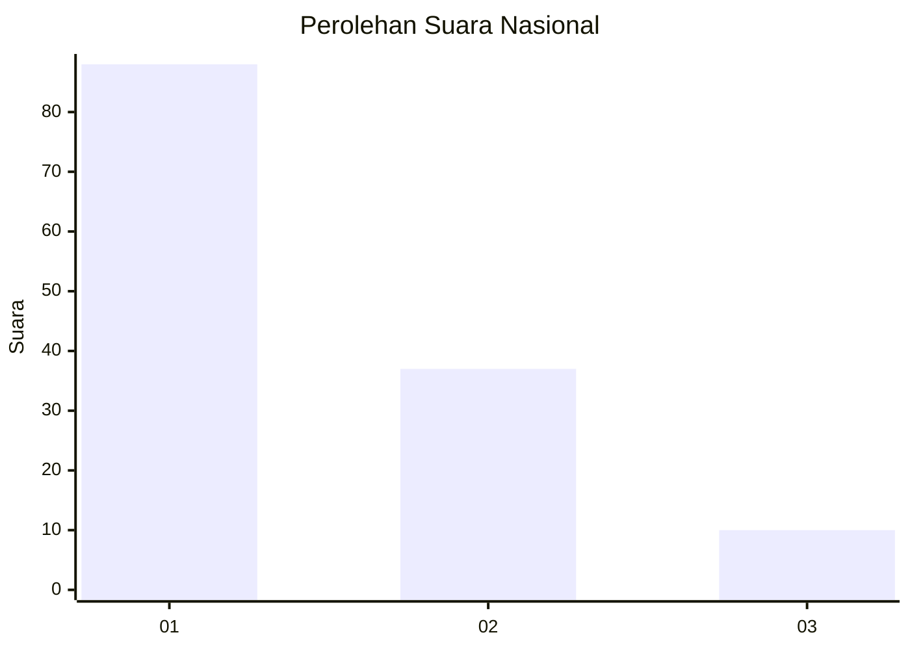
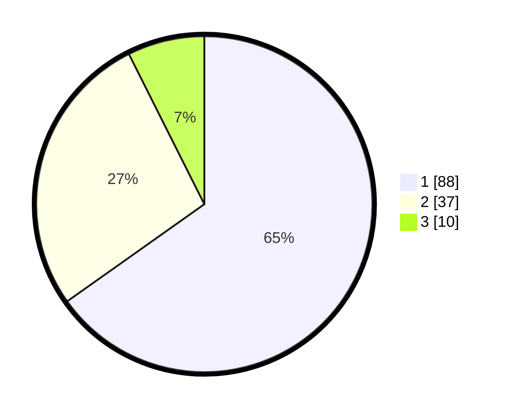

# Hasil

## Grafik

## Tabel

| No. | Nama Paslon    | Suara | Suara (raw) | Persentase |
|:--- |:-------------- | -----:| -----------:| ----------:|
| 1   | ANIES MUHAIMIN | 88    | [88][p-1]   | 65,19      |
| 2   | PRABOWO GIBRAN | 37    | [37][p-2]   | 27,41      |
| 3   | GANJAR MAHFUD  | 10    | [10][p-3]   | 7,41       |

[p-1]: https://github.com/gigit-pemilu/pemilu-2024/blob/main/pilpres/hitung-suara/sub/13-sumatera-barat/sub/06-agam/sub/09-tilatang-kamang/sub/2001-koto-tangah/sub/013-tps/sub/paslon-1.txt
[p-2]: https://github.com/gigit-pemilu/pemilu-2024/blob/main/pilpres/hitung-suara/sub/13-sumatera-barat/sub/06-agam/sub/09-tilatang-kamang/sub/2001-koto-tangah/sub/013-tps/sub/paslon-2.txt
[p-3]: https://github.com/gigit-pemilu/pemilu-2024/blob/main/pilpres/hitung-suara/sub/13-sumatera-barat/sub/06-agam/sub/09-tilatang-kamang/sub/2001-koto-tangah/sub/013-tps/sub/paslon-3.txt

## Foto C Plano

https://sirekap-obj-formc.kpu.go.id/f4f9/pemilu/ppwp/13/06/09/20/01/1306092001013-20240215-021116--6353c8a8-af50-4538-bdf4-f9ad90aff06c.jpg

https://sirekap-obj-formc.kpu.go.id/f4f9/pemilu/ppwp/13/06/09/20/01/1306092001013-20240215-020942--5dd7df20-700a-426d-aa05-faa9c108c2f9.jpg

https://sirekap-obj-formc.kpu.go.id/f4f9/pemilu/ppwp/13/06/09/20/01/1306092001013-20240215-020920--45925280-1a5f-4dec-a74c-fe99ad0a5057.jpg

## Metadata

| Key        | Value               |
| ---------- | ------------------- |
| Time Stamp | 2024-02-25 12:00:00 |

