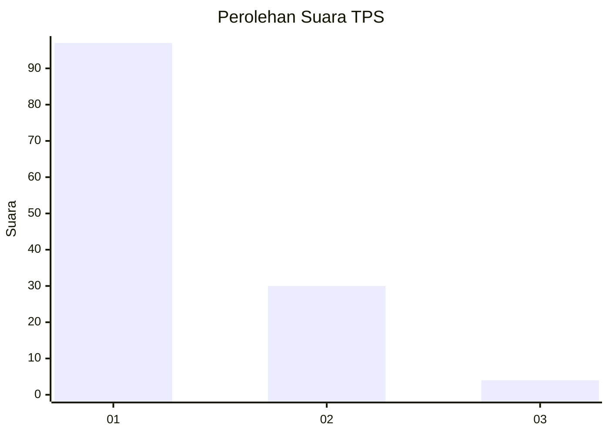
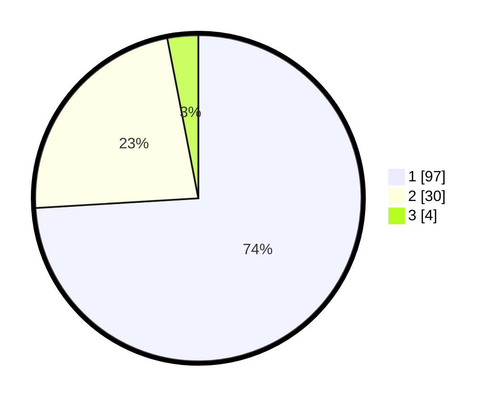

# Hasil

## Grafik

## Tabel

| No. | Nama Paslon    | Suara | Suara (raw) | Persentase |
|:--- |:-------------- | -----:| -----------:| ----------:|
| 1   | ANIES MUHAIMIN | 97    | [97][p-1]   | 74,05      |
| 2   | PRABOWO GIBRAN | 30    | [30][p-2]   | 22,90      |
| 3   | GANJAR MAHFUD  | 4     | [4][p-3]    | 3,05       |

[p-1]: https://github.com/gigit-pemilu/pemilu-2024-13-sumatera-barat/blob/main/pilpres/hitung-suara/sub/13-sumatera-barat/sub/06-agam/sub/09-tilatang-kamang/sub/2001-koto-tangah/sub/032-tps/sub/paslon-1.txt
[p-2]: https://github.com/gigit-pemilu/pemilu-2024-13-sumatera-barat/blob/main/pilpres/hitung-suara/sub/13-sumatera-barat/sub/06-agam/sub/09-tilatang-kamang/sub/2001-koto-tangah/sub/032-tps/sub/paslon-2.txt
[p-3]: https://github.com/gigit-pemilu/pemilu-2024-13-sumatera-barat/blob/main/pilpres/hitung-suara/sub/13-sumatera-barat/sub/06-agam/sub/09-tilatang-kamang/sub/2001-koto-tangah/sub/032-tps/sub/paslon-3.txt

## Foto C Plano

https://sirekap-obj-formc.kpu.go.id/9eff/pemilu/ppwp/13/06/09/20/01/1306092001032-20240214-231116--3a698a56-3d76-4b20-8618-afdbd43b7548.jpg

https://sirekap-obj-formc.kpu.go.id/9eff/pemilu/ppwp/13/06/09/20/01/1306092001032-20240214-231420--c23636d4-e5dd-4744-a6f7-ed75ac1c53a6.jpg

https://sirekap-obj-formc.kpu.go.id/9eff/pemilu/ppwp/13/06/09/20/01/1306092001032-20240214-231510--8a946c0d-4382-4a03-80e6-9923a5d2605e.jpg

## Metadata

| Key        | Value               |
| ---------- | ------------------- |
| Time Stamp | 2024-02-24 22:31:28 |

