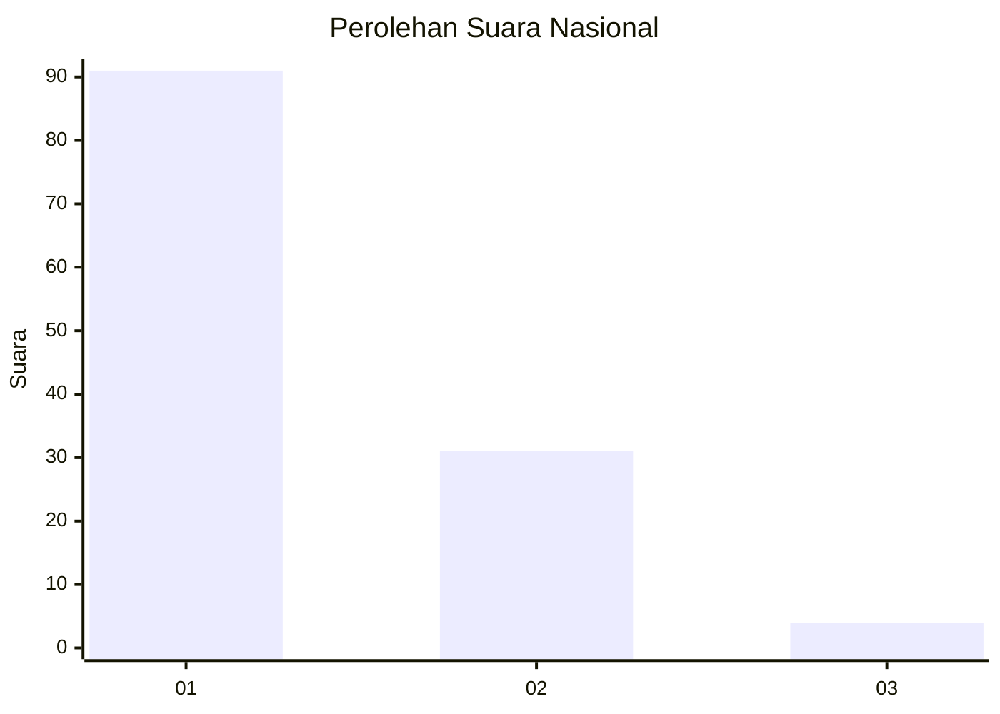
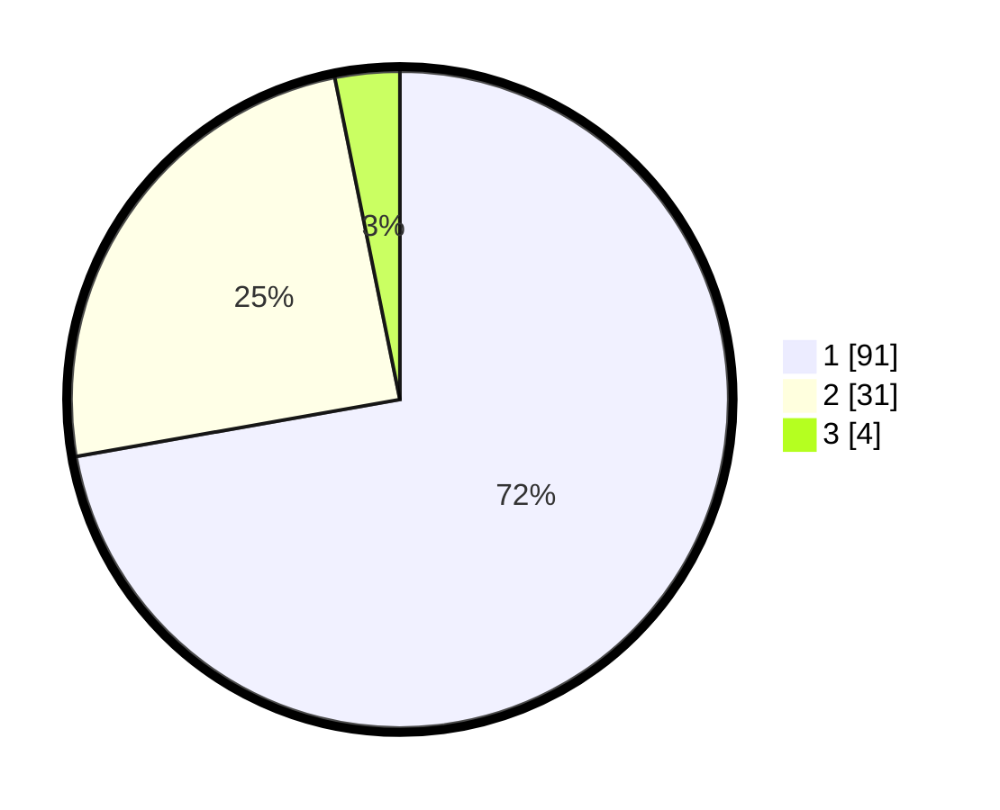

# Hasil

## Grafik

## Tabel

| No. | Nama Paslon    | Suara | Suara (raw) | Persentase |
|:--- |:-------------- | -----:| -----------:| ----------:|
| 1   | ANIES MUHAIMIN | 91    | [91][p-1]   | 72,22      |
| 2   | PRABOWO GIBRAN | 31    | [31][p-2]   | 24,60      |
| 3   | GANJAR MAHFUD  | 4     | [4][p-3]    | 3,17       |

[p-1]: https://github.com/gigit-pemilu/pemilu-2024/blob/main/pilpres/hitung-suara/sub/13-sumatera-barat/sub/06-agam/sub/09-tilatang-kamang/sub/2001-koto-tangah/sub/037-tps/sub/paslon-1.txt
[p-2]: https://github.com/gigit-pemilu/pemilu-2024/blob/main/pilpres/hitung-suara/sub/13-sumatera-barat/sub/06-agam/sub/09-tilatang-kamang/sub/2001-koto-tangah/sub/037-tps/sub/paslon-2.txt
[p-3]: https://github.com/gigit-pemilu/pemilu-2024/blob/main/pilpres/hitung-suara/sub/13-sumatera-barat/sub/06-agam/sub/09-tilatang-kamang/sub/2001-koto-tangah/sub/037-tps/sub/paslon-3.txt

## Foto C Plano

https://sirekap-obj-formc.kpu.go.id/0b36/pemilu/ppwp/13/06/09/20/01/1306092001037-20240214-223826--c7701444-149d-48bc-8598-38a7e3731fc1.jpg

https://sirekap-obj-formc.kpu.go.id/0b36/pemilu/ppwp/13/06/09/20/01/1306092001037-20240215-191934--1c6be74a-1f32-4829-95bd-877e06480ef5.jpg

https://sirekap-obj-formc.kpu.go.id/0b36/pemilu/ppwp/13/06/09/20/01/1306092001037-20240215-004818--b97576ff-6e9b-4962-b4ca-0970ca2dcc5d.jpg

## Metadata

| Key        | Value               |
| ---------- | ------------------- |
| Time Stamp | 2024-02-26 14:00:00 |

