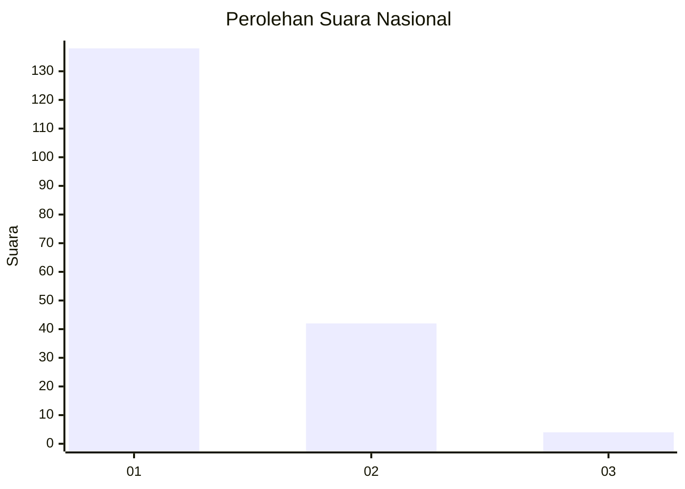
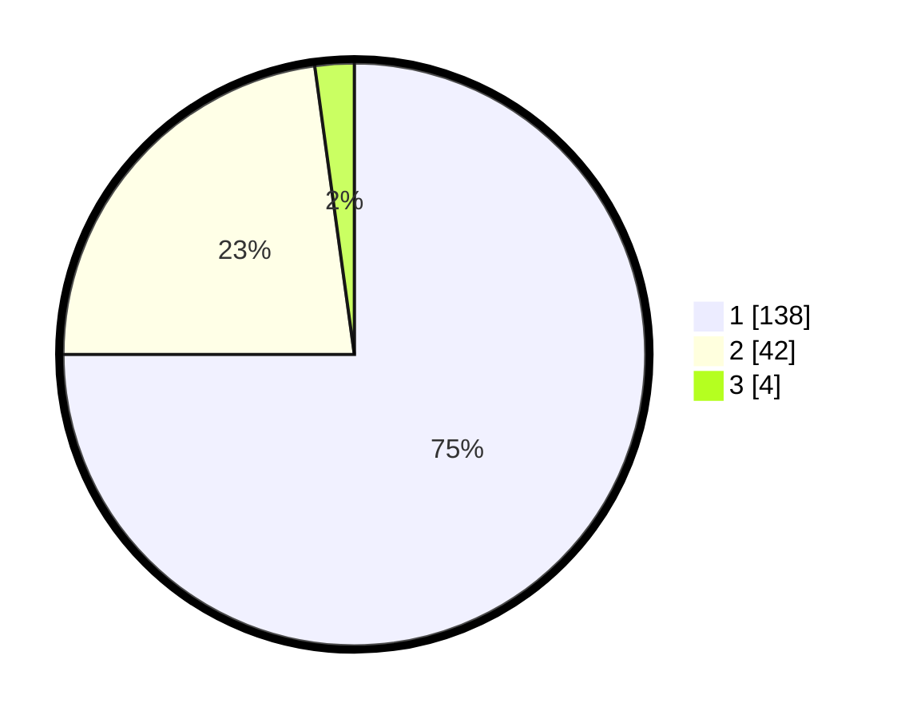

# Hasil

## Grafik

## Tabel

| No. | Nama Paslon    | Suara | Suara (raw) | Persentase |
|:--- |:-------------- | -----:| -----------:| ----------:|
| 1   | ANIES MUHAIMIN | 138   | [138][p-1]  | 75,00      |
| 2   | PRABOWO GIBRAN | 42    | [42][p-2]   | 22,83      |
| 3   | GANJAR MAHFUD  | 4     | [4][p-3]    | 2,17       |

[p-1]: https://github.com/gigit-pemilu/pemilu-2024/blob/main/pilpres/hitung-suara/sub/13-sumatera-barat/sub/06-agam/sub/09-tilatang-kamang/sub/2003-gadut/sub/030-tps/sub/paslon-1.txt
[p-2]: https://github.com/gigit-pemilu/pemilu-2024/blob/main/pilpres/hitung-suara/sub/13-sumatera-barat/sub/06-agam/sub/09-tilatang-kamang/sub/2003-gadut/sub/030-tps/sub/paslon-2.txt
[p-3]: https://github.com/gigit-pemilu/pemilu-2024/blob/main/pilpres/hitung-suara/sub/13-sumatera-barat/sub/06-agam/sub/09-tilatang-kamang/sub/2003-gadut/sub/030-tps/sub/paslon-3.txt

## Foto C Plano

https://sirekap-obj-formc.kpu.go.id/3765/pemilu/ppwp/13/06/09/20/03/1306092003030-20240214-233217--099dbd8c-80c6-4e79-867d-1378d4439992.jpg

https://sirekap-obj-formc.kpu.go.id/3765/pemilu/ppwp/13/06/09/20/03/1306092003030-20240214-233402--cef95245-049c-4067-bc38-d2973082fd26.jpg

https://sirekap-obj-formc.kpu.go.id/3765/pemilu/ppwp/13/06/09/20/03/1306092003030-20240214-233508--5d3fa21d-f62d-48cc-8f19-83c268eede8b.jpg

## Metadata

| Key        | Value               |
| ---------- | ------------------- |
| Time Stamp | 2024-02-24 23:00:00 |

