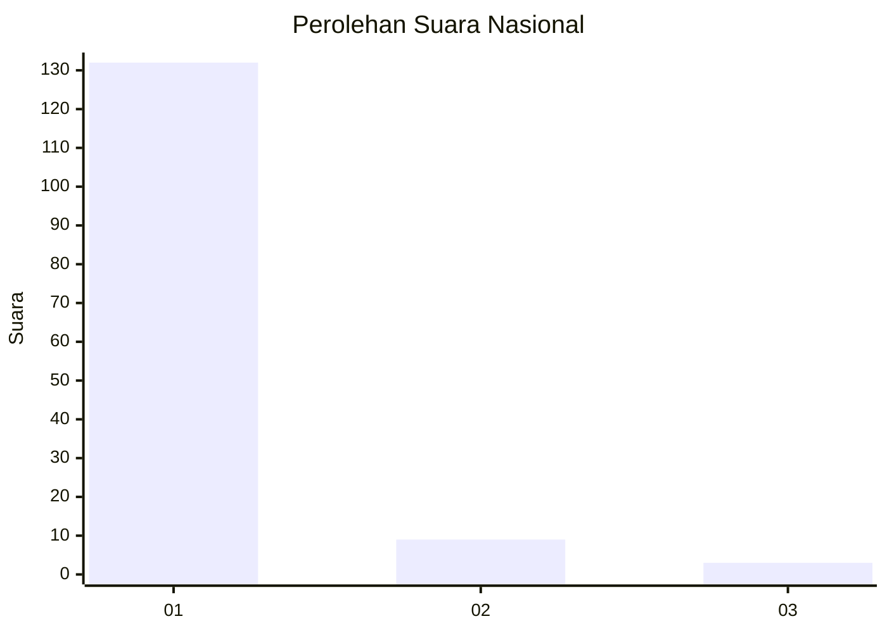
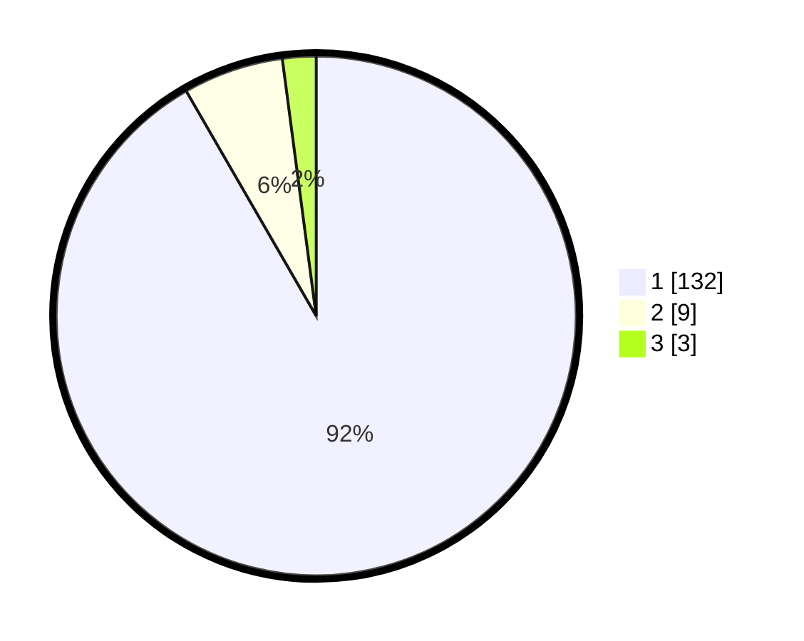

# Hasil

## Grafik

## Tabel

| No. | Nama Paslon    | Suara | Suara (raw) | Persentase |
|:--- |:-------------- | -----:| -----------:| ----------:|
| 1   | ANIES MUHAIMIN | 132   | [132][p-1]  | 91,67      |
| 2   | PRABOWO GIBRAN | 9     | [9][p-2]    | 6,25       |
| 3   | GANJAR MAHFUD  | 3     | [3][p-3]    | 2,08       |

[p-1]: https://github.com/gigit-pemilu/pemilu-2024/blob/main/pilpres/hitung-suara/sub/13-sumatera-barat/sub/06-agam/sub/11-palembayan/sub/2001-baringin/sub/008-tps/sub/paslon-1.txt
[p-2]: https://github.com/gigit-pemilu/pemilu-2024/blob/main/pilpres/hitung-suara/sub/13-sumatera-barat/sub/06-agam/sub/11-palembayan/sub/2001-baringin/sub/008-tps/sub/paslon-2.txt
[p-3]: https://github.com/gigit-pemilu/pemilu-2024/blob/main/pilpres/hitung-suara/sub/13-sumatera-barat/sub/06-agam/sub/11-palembayan/sub/2001-baringin/sub/008-tps/sub/paslon-3.txt

## Foto C Plano

https://sirekap-obj-formc.kpu.go.id/528c/pemilu/ppwp/13/06/11/20/01/1306112001008-20240215-033112--7c386e0f-8200-4023-8662-32d5eff45ea9.jpg

https://sirekap-obj-formc.kpu.go.id/528c/pemilu/ppwp/13/06/11/20/01/1306112001008-20240215-033150--e946dea4-f595-472b-8aa9-db58eb3d2ebb.jpg

## Metadata

| Key        | Value               |
| ---------- | ------------------- |
| Time Stamp | 2024-02-25 12:00:00 |

