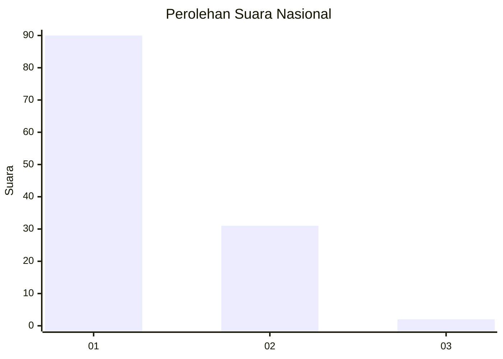
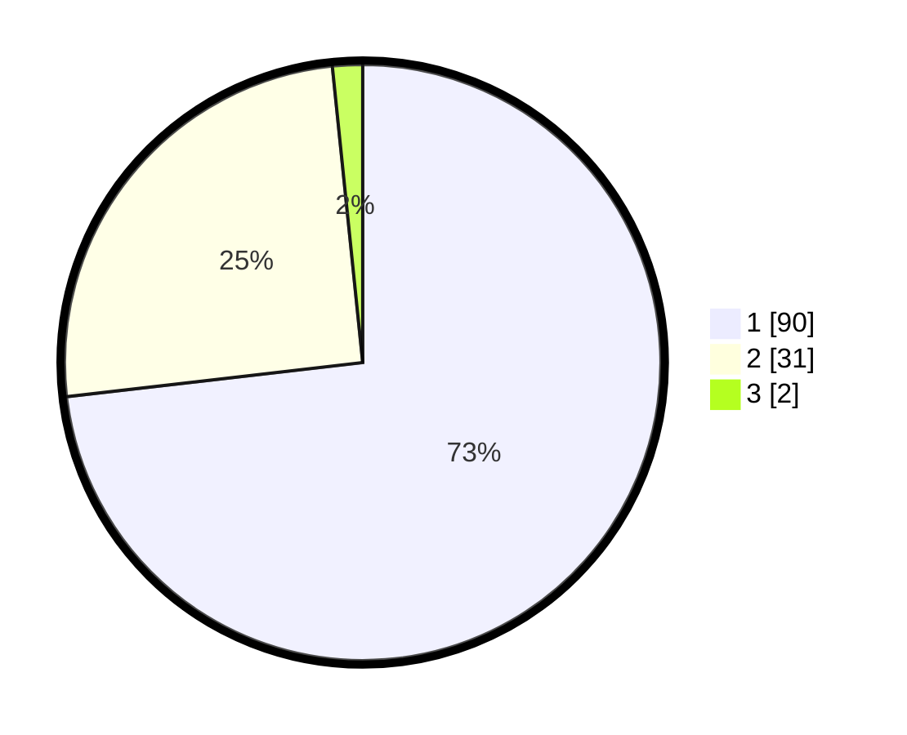

# Hasil

## Grafik

## Tabel

| No. | Nama Paslon    | Suara | Suara (raw) | Persentase |
|:--- |:-------------- | -----:| -----------:| ----------:|
| 1   | ANIES MUHAIMIN | 90    | [90][p-1]   | 73,17      |
| 2   | PRABOWO GIBRAN | 31    | [31][p-2]   | 25,20      |
| 3   | GANJAR MAHFUD  | 2     | [2][p-3]    | 1,63       |

[p-1]: https://github.com/gigit-pemilu/pemilu-2024/blob/main/pilpres/hitung-suara/sub/13-sumatera-barat/sub/06-agam/sub/12-sungai-pua/sub/2002-sungai-pua/sub/019-tps/sub/paslon-1.txt
[p-2]: https://github.com/gigit-pemilu/pemilu-2024/blob/main/pilpres/hitung-suara/sub/13-sumatera-barat/sub/06-agam/sub/12-sungai-pua/sub/2002-sungai-pua/sub/019-tps/sub/paslon-2.txt
[p-3]: https://github.com/gigit-pemilu/pemilu-2024/blob/main/pilpres/hitung-suara/sub/13-sumatera-barat/sub/06-agam/sub/12-sungai-pua/sub/2002-sungai-pua/sub/019-tps/sub/paslon-3.txt

## Foto C Plano

https://sirekap-obj-formc.kpu.go.id/26d7/pemilu/ppwp/13/06/12/20/02/1306122002019-20240215-010518--ef94671a-e8a3-4c89-b47f-498ee3d29f98.jpg

https://sirekap-obj-formc.kpu.go.id/26d7/pemilu/ppwp/13/06/12/20/02/1306122002019-20240215-010327--669ed2c0-06de-4b17-b365-cd4249e1bb8e.jpg

https://sirekap-obj-formc.kpu.go.id/26d7/pemilu/ppwp/13/06/12/20/02/1306122002019-20240215-010825--837f8c31-c1a8-4d14-a0c1-c705c5bd952e.jpg

## Metadata

| Key        | Value               |
| ---------- | ------------------- |
| Time Stamp | 2024-02-21 23:00:00 |

