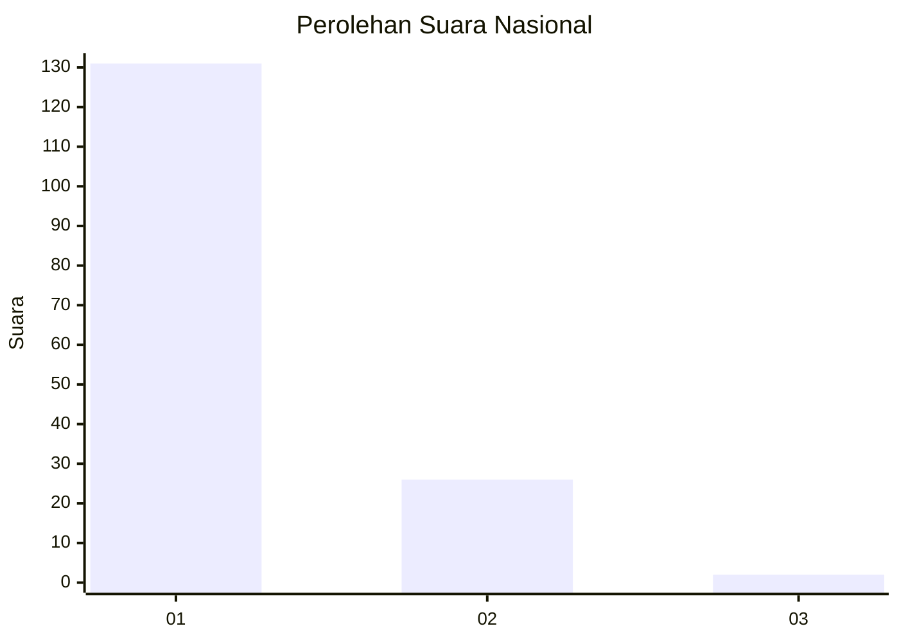
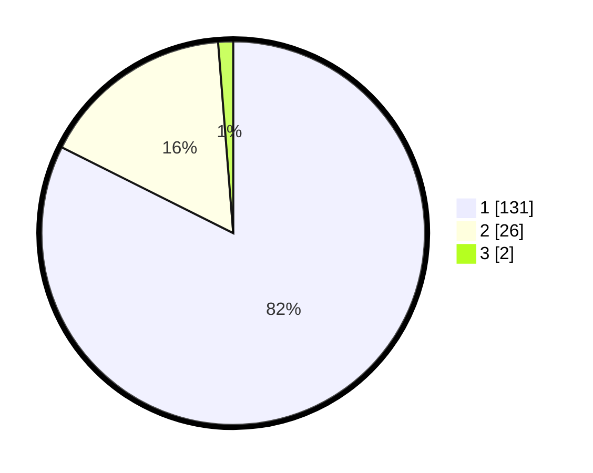

# Hasil

## Grafik

## Tabel

| No. | Nama Paslon    | Suara | Suara (raw) | Persentase |
|:--- |:-------------- | -----:| -----------:| ----------:|
| 1   | ANIES MUHAIMIN | 131   | [131][p-1]  | 82,39      |
| 2   | PRABOWO GIBRAN | 26    | [26][p-2]   | 16,35      |
| 3   | GANJAR MAHFUD  | 2     | [2][p-3]    | 1,26       |

[p-1]: https://github.com/gigit-pemilu/pemilu-2024/blob/main/pilpres/hitung-suara/sub/13-sumatera-barat/sub/06-agam/sub/12-sungai-pua/sub/2002-sungai-pua/sub/038-tps/sub/paslon-1.txt
[p-2]: https://github.com/gigit-pemilu/pemilu-2024/blob/main/pilpres/hitung-suara/sub/13-sumatera-barat/sub/06-agam/sub/12-sungai-pua/sub/2002-sungai-pua/sub/038-tps/sub/paslon-2.txt
[p-3]: https://github.com/gigit-pemilu/pemilu-2024/blob/main/pilpres/hitung-suara/sub/13-sumatera-barat/sub/06-agam/sub/12-sungai-pua/sub/2002-sungai-pua/sub/038-tps/sub/paslon-3.txt

## Foto C Plano

https://sirekap-obj-formc.kpu.go.id/db4f/pemilu/ppwp/13/06/12/20/02/1306122002038-20240215-000828--3ceedd41-4b7c-4384-9810-9253b5c25e83.jpg

https://sirekap-obj-formc.kpu.go.id/db4f/pemilu/ppwp/13/06/12/20/02/1306122002038-20240215-000959--f8095e80-f431-4237-aaa4-03fd314ce40f.jpg

https://sirekap-obj-formc.kpu.go.id/db4f/pemilu/ppwp/13/06/12/20/02/1306122002038-20240215-001226--496f3647-35b5-4538-979a-c170e588903e.jpg

## Metadata

| Key        | Value               |
| ---------- | ------------------- |
| Time Stamp | 2024-02-25 12:00:00 |

