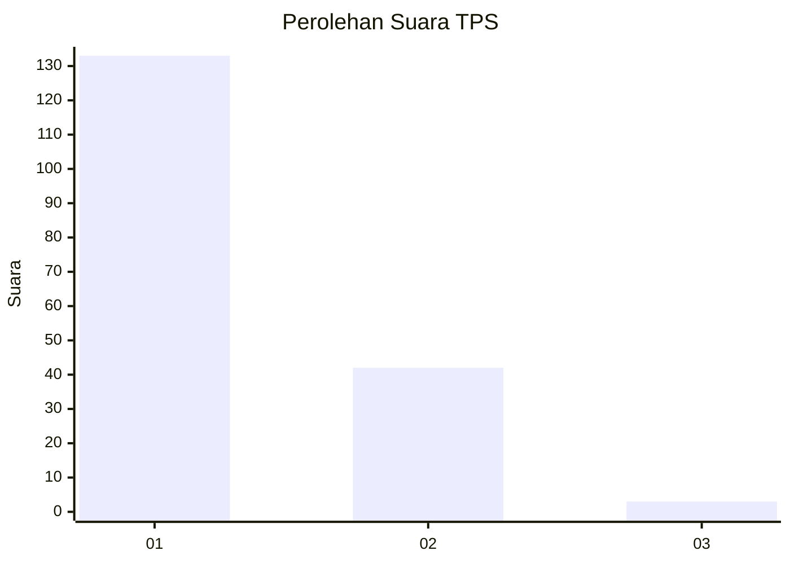
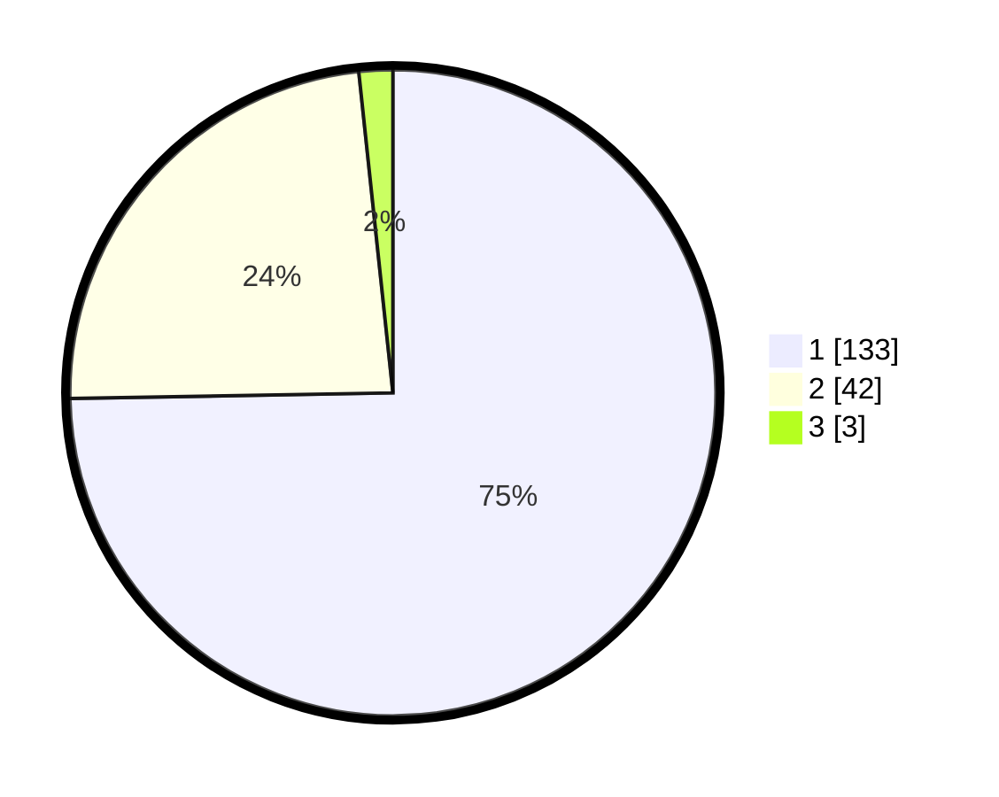

# Hasil

## Grafik

## Tabel

| No. | Nama Paslon    | Suara | Suara (raw) | Persentase |
|:--- |:-------------- | -----:| -----------:| ----------:|
| 1   | ANIES MUHAIMIN | 133   | [133][p-1]  | 74,72      |
| 2   | PRABOWO GIBRAN | 42    | [42][p-2]   | 23,60      |
| 3   | GANJAR MAHFUD  | 3     | [3][p-3]    | 1,69       |

[p-1]: https://github.com/gigit-pemilu/pemilu-2024-13-sumatera-barat/blob/main/pilpres/hitung-suara/sub/13-sumatera-barat/sub/06-agam/sub/12-sungai-pua/sub/2003-batagak/sub/011-tps/sub/paslon-1.txt
[p-2]: https://github.com/gigit-pemilu/pemilu-2024-13-sumatera-barat/blob/main/pilpres/hitung-suara/sub/13-sumatera-barat/sub/06-agam/sub/12-sungai-pua/sub/2003-batagak/sub/011-tps/sub/paslon-2.txt
[p-3]: https://github.com/gigit-pemilu/pemilu-2024-13-sumatera-barat/blob/main/pilpres/hitung-suara/sub/13-sumatera-barat/sub/06-agam/sub/12-sungai-pua/sub/2003-batagak/sub/011-tps/sub/paslon-3.txt

## Foto C Plano

https://sirekap-obj-formc.kpu.go.id/0724/pemilu/ppwp/13/06/12/20/03/1306122003011-20240215-001959--4ec9e9fa-cc18-40be-92fc-eb92727723f2.jpg

https://sirekap-obj-formc.kpu.go.id/0724/pemilu/ppwp/13/06/12/20/03/1306122003011-20240215-002228--67626ef5-1e31-4892-a569-eda811ef67ae.jpg

https://sirekap-obj-formc.kpu.go.id/0724/pemilu/ppwp/13/06/12/20/03/1306122003011-20240215-002416--89f8aa0b-5f20-4fff-9d09-f79ea79aff3a.jpg

## Metadata

| Key        | Value               |
| ---------- | ------------------- |
| Time Stamp | 2024-02-25 11:00:00 |

