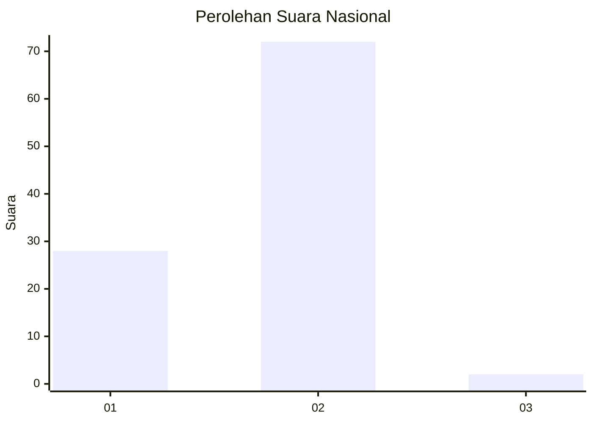
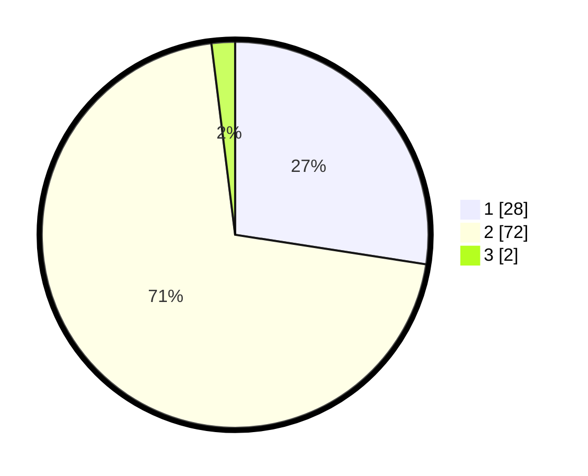

# Hasil

## Grafik

## Tabel

| No. | Nama Paslon    | Suara | Suara (raw) | Persentase |
|:--- |:-------------- | -----:| -----------:| ----------:|
| 1   | ANIES MUHAIMIN | 28    | [28][p-1]   | 27,45      |
| 2   | PRABOWO GIBRAN | 72    | [72][p-2]   | 70,59      |
| 3   | GANJAR MAHFUD  | 2     | [2][p-3]    | 1,96       |

[p-1]: https://github.com/gigit-pemilu/pemilu-2024/blob/main/pilpres/hitung-suara/sub/13-sumatera-barat/sub/06-agam/sub/12-sungai-pua/sub/2004-batu-palano/sub/008-tps/sub/paslon-1.txt
[p-2]: https://github.com/gigit-pemilu/pemilu-2024/blob/main/pilpres/hitung-suara/sub/13-sumatera-barat/sub/06-agam/sub/12-sungai-pua/sub/2004-batu-palano/sub/008-tps/sub/paslon-2.txt
[p-3]: https://github.com/gigit-pemilu/pemilu-2024/blob/main/pilpres/hitung-suara/sub/13-sumatera-barat/sub/06-agam/sub/12-sungai-pua/sub/2004-batu-palano/sub/008-tps/sub/paslon-3.txt

## Foto C Plano

https://sirekap-obj-formc.kpu.go.id/e307/pemilu/ppwp/13/06/12/20/04/1306122004008-20240215-074301--8f2c01b5-3dfd-4410-9b9a-415349069fd9.jpg

https://sirekap-obj-formc.kpu.go.id/e307/pemilu/ppwp/13/06/12/20/04/1306122004008-20240215-074415--40babc66-bdf3-412c-930f-0fc58ea3ba48.jpg

https://sirekap-obj-formc.kpu.go.id/e307/pemilu/ppwp/13/06/12/20/04/1306122004008-20240215-074502--399f32fc-98fb-4414-b89f-4f811a860004.jpg

## Metadata

| Key        | Value               |
| ---------- | ------------------- |
| Time Stamp | 2024-02-16 16:25:10 |

