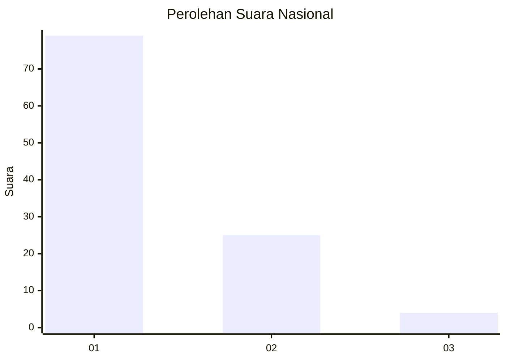
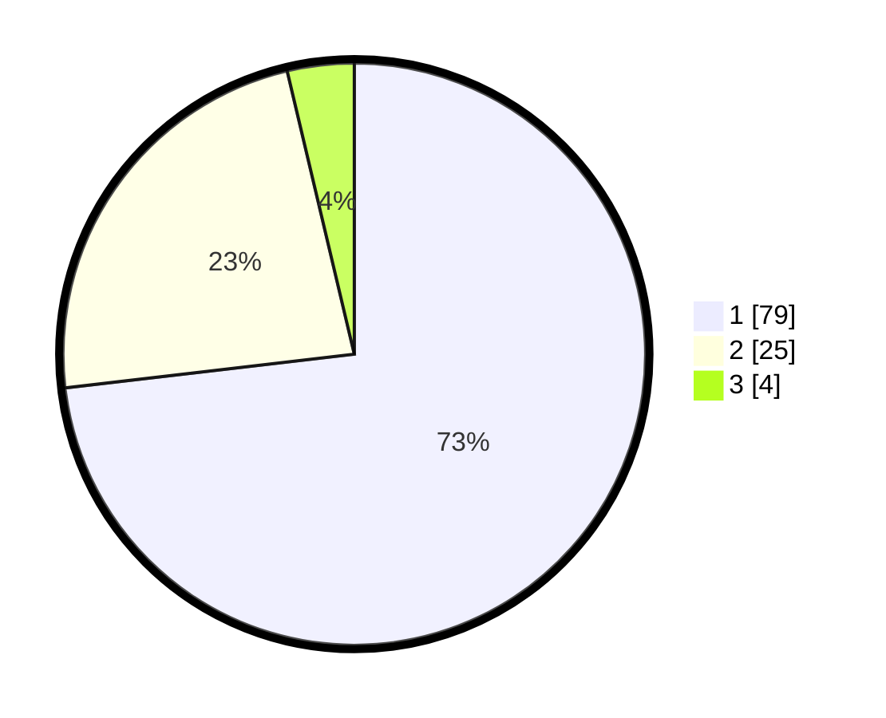

# Hasil

## Grafik

## Tabel

| No. | Nama Paslon    | Suara | Suara (raw) | Persentase |
|:--- |:-------------- | -----:| -----------:| ----------:|
| 1   | ANIES MUHAIMIN | 79    | [79][p-1]   | 73,15      |
| 2   | PRABOWO GIBRAN | 25    | [25][p-2]   | 23,15      |
| 3   | GANJAR MAHFUD  | 4     | [4][p-3]    | 3,70       |

[p-1]: https://github.com/gigit-pemilu/pemilu-2024/blob/main/pilpres/hitung-suara/sub/13-sumatera-barat/sub/06-agam/sub/14-candung/sub/2001-canduang-koto-laweh/sub/003-tps/sub/paslon-1.txt
[p-2]: https://github.com/gigit-pemilu/pemilu-2024/blob/main/pilpres/hitung-suara/sub/13-sumatera-barat/sub/06-agam/sub/14-candung/sub/2001-canduang-koto-laweh/sub/003-tps/sub/paslon-2.txt
[p-3]: https://github.com/gigit-pemilu/pemilu-2024/blob/main/pilpres/hitung-suara/sub/13-sumatera-barat/sub/06-agam/sub/14-candung/sub/2001-canduang-koto-laweh/sub/003-tps/sub/paslon-3.txt

## Foto C Plano

https://sirekap-obj-formc.kpu.go.id/a97a/pemilu/ppwp/13/06/14/20/01/1306142001003-20240217-155912--3454d6dd-ebd5-41fe-9f97-f01ddef4ca8b.jpg

https://sirekap-obj-formc.kpu.go.id/a97a/pemilu/ppwp/13/06/14/20/01/1306142001003-20240217-160035--2c1953ba-ec36-4239-b888-bd9d276a1e15.jpg

https://sirekap-obj-formc.kpu.go.id/a97a/pemilu/ppwp/13/06/14/20/01/1306142001003-20240217-160139--76209ac9-10cf-449a-b042-2e3e35f2db08.jpg

## Metadata

| Key        | Value               |
| ---------- | ------------------- |
| Time Stamp | 2024-02-25 22:00:00 |

