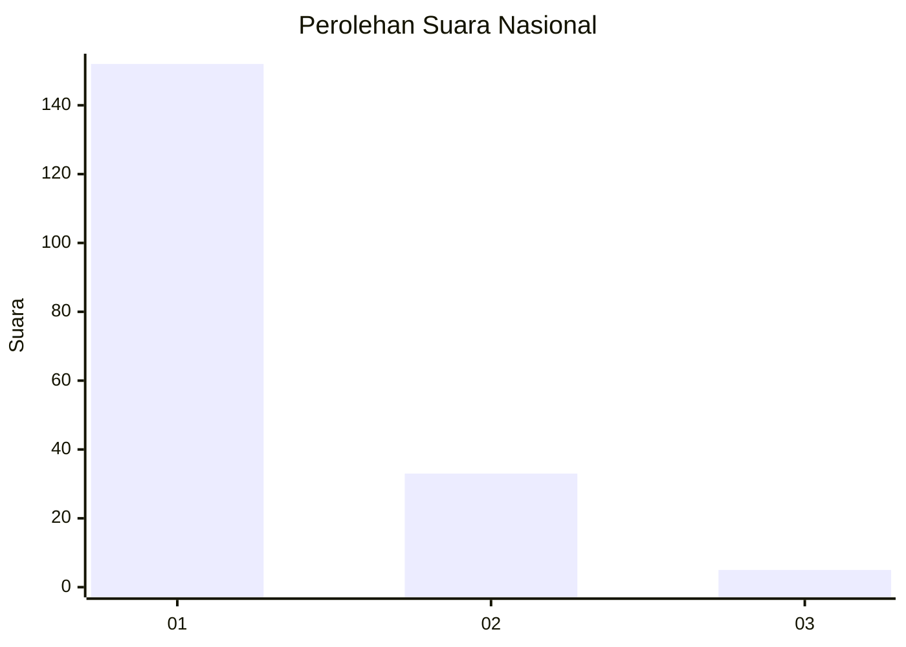
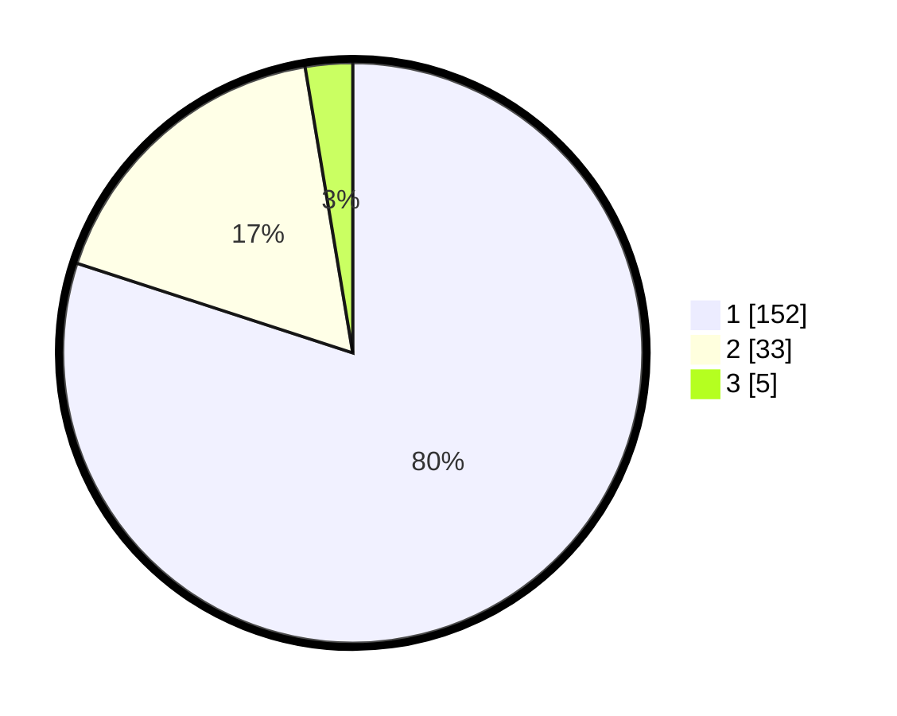

# Hasil

## Grafik

## Tabel

| No. | Nama Paslon    | Suara | Suara (raw) | Persentase |
|:--- |:-------------- | -----:| -----------:| ----------:|
| 1   | ANIES MUHAIMIN | 152   | [152][p-1]  | 80,00      |
| 2   | PRABOWO GIBRAN | 33    | [33][p-2]   | 17,37      |
| 3   | GANJAR MAHFUD  | 5     | [5][p-3]    | 2,63       |

[p-1]: https://github.com/gigit-pemilu/pemilu-2024/blob/main/pilpres/hitung-suara/sub/13-sumatera-barat/sub/06-agam/sub/14-candung/sub/2001-canduang-koto-laweh/sub/005-tps/sub/paslon-1.txt
[p-2]: https://github.com/gigit-pemilu/pemilu-2024/blob/main/pilpres/hitung-suara/sub/13-sumatera-barat/sub/06-agam/sub/14-candung/sub/2001-canduang-koto-laweh/sub/005-tps/sub/paslon-2.txt
[p-3]: https://github.com/gigit-pemilu/pemilu-2024/blob/main/pilpres/hitung-suara/sub/13-sumatera-barat/sub/06-agam/sub/14-candung/sub/2001-canduang-koto-laweh/sub/005-tps/sub/paslon-3.txt

## Foto C Plano

https://sirekap-obj-formc.kpu.go.id/738b/pemilu/ppwp/13/06/14/20/01/1306142001005-20240217-170411--7aa4c9c0-bd32-4191-9a64-292f3be18c6d.jpg

https://sirekap-obj-formc.kpu.go.id/738b/pemilu/ppwp/13/06/14/20/01/1306142001005-20240217-170511--d2e22f81-3f6e-46ae-ac8d-cb7cbd4316f8.jpg

https://sirekap-obj-formc.kpu.go.id/738b/pemilu/ppwp/13/06/14/20/01/1306142001005-20240217-170610--4ef948df-b3b9-4704-9735-3ab0b728c5a8.jpg

## Metadata

| Key        | Value               |
| ---------- | ------------------- |
| Time Stamp | 2024-02-25 12:00:00 |

