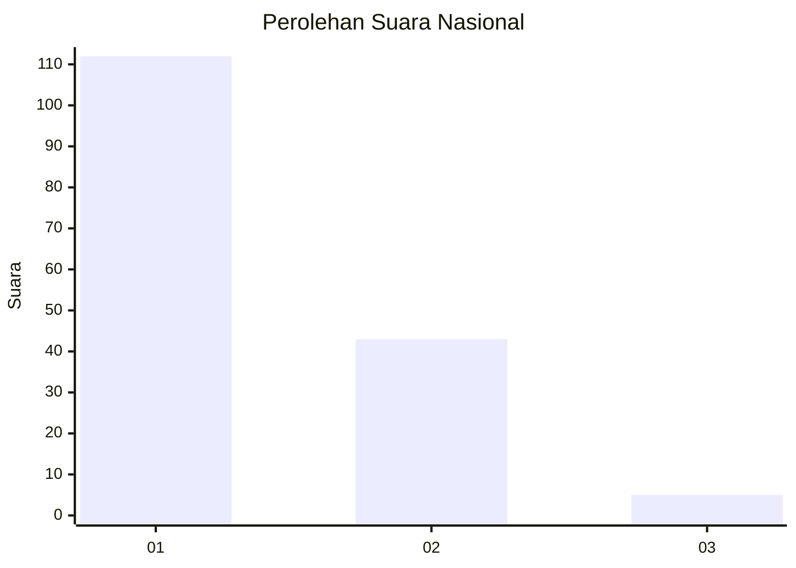
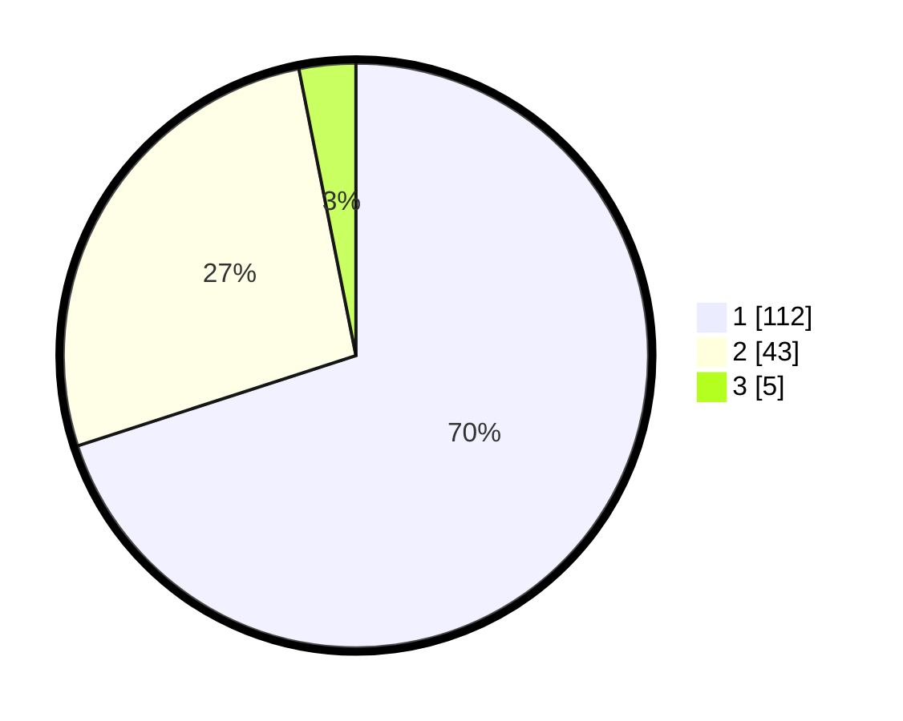

# Hasil

## Grafik

## Tabel

| No. | Nama Paslon    | Suara | Suara (raw) | Persentase |
|:--- |:-------------- | -----:| -----------:| ----------:|
| 1   | ANIES MUHAIMIN | 112   | [112][p-1]  | 70,00      |
| 2   | PRABOWO GIBRAN | 43    | [43][p-2]   | 26,88      |
| 3   | GANJAR MAHFUD  | 5     | [5][p-3]    | 3,13       |

[p-1]: https://github.com/gigit-pemilu/pemilu-2024/blob/main/pilpres/hitung-suara/sub/13-sumatera-barat/sub/06-agam/sub/14-candung/sub/2001-canduang-koto-laweh/sub/012-tps/sub/paslon-1.txt
[p-2]: https://github.com/gigit-pemilu/pemilu-2024/blob/main/pilpres/hitung-suara/sub/13-sumatera-barat/sub/06-agam/sub/14-candung/sub/2001-canduang-koto-laweh/sub/012-tps/sub/paslon-2.txt
[p-3]: https://github.com/gigit-pemilu/pemilu-2024/blob/main/pilpres/hitung-suara/sub/13-sumatera-barat/sub/06-agam/sub/14-candung/sub/2001-canduang-koto-laweh/sub/012-tps/sub/paslon-3.txt

## Foto C Plano

https://sirekap-obj-formc.kpu.go.id/3bc2/pemilu/ppwp/13/06/14/20/01/1306142001012-20240214-230859--f09ad4e1-7a3b-4201-869e-c68279786b39.jpg

https://sirekap-obj-formc.kpu.go.id/3bc2/pemilu/ppwp/13/06/14/20/01/1306142001012-20240214-231029--dc66364a-80c1-4d00-83af-4db40862e952.jpg

https://sirekap-obj-formc.kpu.go.id/3bc2/pemilu/ppwp/13/06/14/20/01/1306142001012-20240214-231202--26d3b892-74dd-4480-b379-d45905799987.jpg

## Metadata

| Key        | Value               |
| ---------- | ------------------- |
| Time Stamp | 2024-02-24 23:00:00 |

