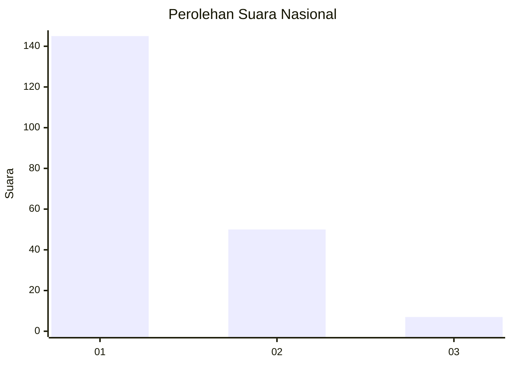
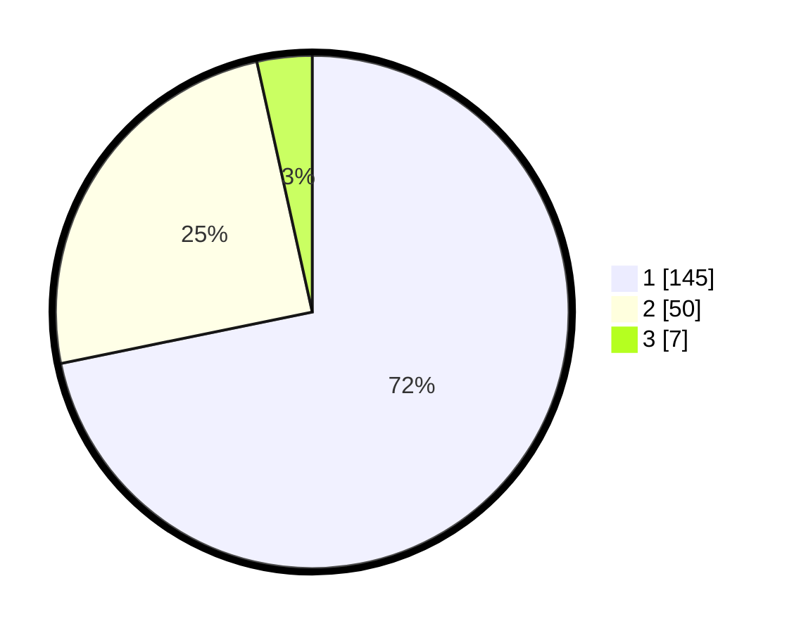

# Hasil

## Grafik

## Tabel

| No. | Nama Paslon    | Suara | Suara (raw) | Persentase |
|:--- |:-------------- | -----:| -----------:| ----------:|
| 1   | ANIES MUHAIMIN | 145   | [145][p-1]  | 71,78      |
| 2   | PRABOWO GIBRAN | 50    | [50][p-2]   | 24,75      |
| 3   | GANJAR MAHFUD  | 7     | [7][p-3]    | 3,47       |

[p-1]: https://github.com/gigit-pemilu/pemilu-2024/blob/main/pilpres/hitung-suara/sub/13-sumatera-barat/sub/06-agam/sub/14-candung/sub/2002-lasi/sub/001-tps/sub/paslon-1.txt
[p-2]: https://github.com/gigit-pemilu/pemilu-2024/blob/main/pilpres/hitung-suara/sub/13-sumatera-barat/sub/06-agam/sub/14-candung/sub/2002-lasi/sub/001-tps/sub/paslon-2.txt
[p-3]: https://github.com/gigit-pemilu/pemilu-2024/blob/main/pilpres/hitung-suara/sub/13-sumatera-barat/sub/06-agam/sub/14-candung/sub/2002-lasi/sub/001-tps/sub/paslon-3.txt

## Foto C Plano

https://sirekap-obj-formc.kpu.go.id/282e/pemilu/ppwp/13/06/14/20/02/1306142002001-20240217-141912--d3ecbc79-f3ba-4c1d-bf23-37d9466e50e2.jpg

https://sirekap-obj-formc.kpu.go.id/282e/pemilu/ppwp/13/06/14/20/02/1306142002001-20240217-142737--944bc89b-d2e5-4f11-b0cd-12c46e7a804d.jpg

https://sirekap-obj-formc.kpu.go.id/282e/pemilu/ppwp/13/06/14/20/02/1306142002001-20240217-142929--8cdf01b0-c485-41fa-bafa-f188233ae56a.jpg

## Metadata

| Key        | Value               |
| ---------- | ------------------- |
| Time Stamp | 2024-02-25 15:00:00 |

