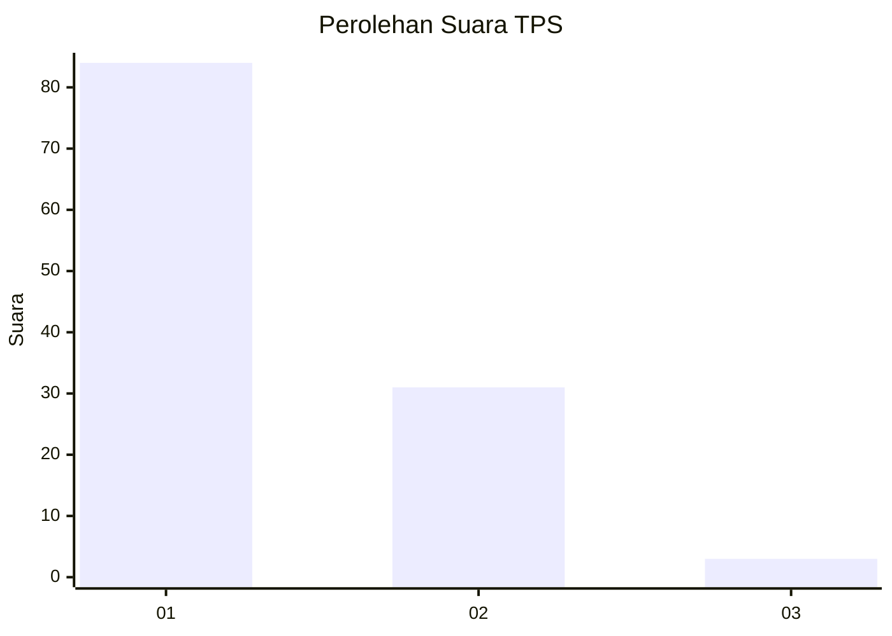
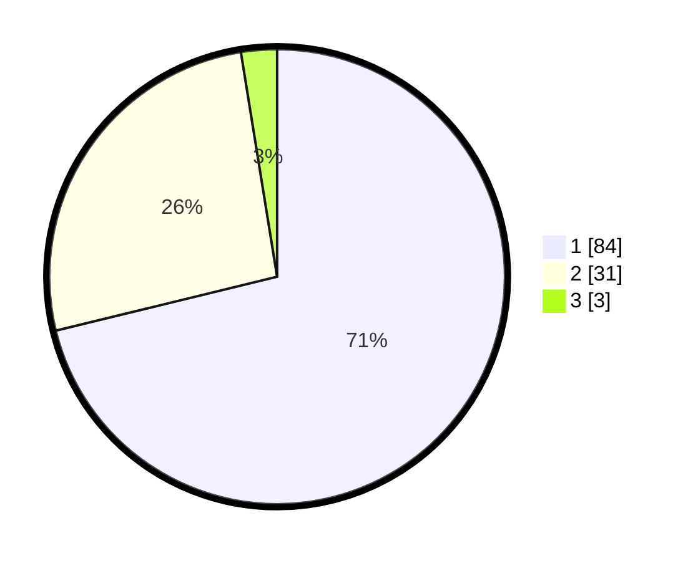

# Hasil

## Grafik

## Tabel

| No. | Nama Paslon    | Suara | Suara (raw) | Persentase |
|:--- |:-------------- | -----:| -----------:| ----------:|
| 1   | ANIES MUHAIMIN | 84    | [84][p-1]   | 71,19      |
| 2   | PRABOWO GIBRAN | 31    | [31][p-2]   | 26,27      |
| 3   | GANJAR MAHFUD  | 3     | [3][p-3]    | 2,54       |

[p-1]: https://github.com/gigit-pemilu/pemilu-2024-13-sumatera-barat/blob/main/pilpres/hitung-suara/sub/13-sumatera-barat/sub/06-agam/sub/14-candung/sub/2002-lasi/sub/002-tps/sub/paslon-1.txt
[p-2]: https://github.com/gigit-pemilu/pemilu-2024-13-sumatera-barat/blob/main/pilpres/hitung-suara/sub/13-sumatera-barat/sub/06-agam/sub/14-candung/sub/2002-lasi/sub/002-tps/sub/paslon-2.txt
[p-3]: https://github.com/gigit-pemilu/pemilu-2024-13-sumatera-barat/blob/main/pilpres/hitung-suara/sub/13-sumatera-barat/sub/06-agam/sub/14-candung/sub/2002-lasi/sub/002-tps/sub/paslon-3.txt

## Foto C Plano

https://sirekap-obj-formc.kpu.go.id/c126/pemilu/ppwp/13/06/14/20/02/1306142002002-20240217-161455--58494703-6bf5-42ae-bf06-7e5ee285e294.jpg

https://sirekap-obj-formc.kpu.go.id/c126/pemilu/ppwp/13/06/14/20/02/1306142002002-20240217-161513--2bb583f9-3d04-482c-bb1e-124adf25699d.jpg

https://sirekap-obj-formc.kpu.go.id/c126/pemilu/ppwp/13/06/14/20/02/1306142002002-20240217-161533--03214738-9e60-4ea9-a9f6-c5c08a1d5ce4.jpg

## Metadata

| Key        | Value               |
| ---------- | ------------------- |
| Time Stamp | 2024-02-25 11:00:00 |

