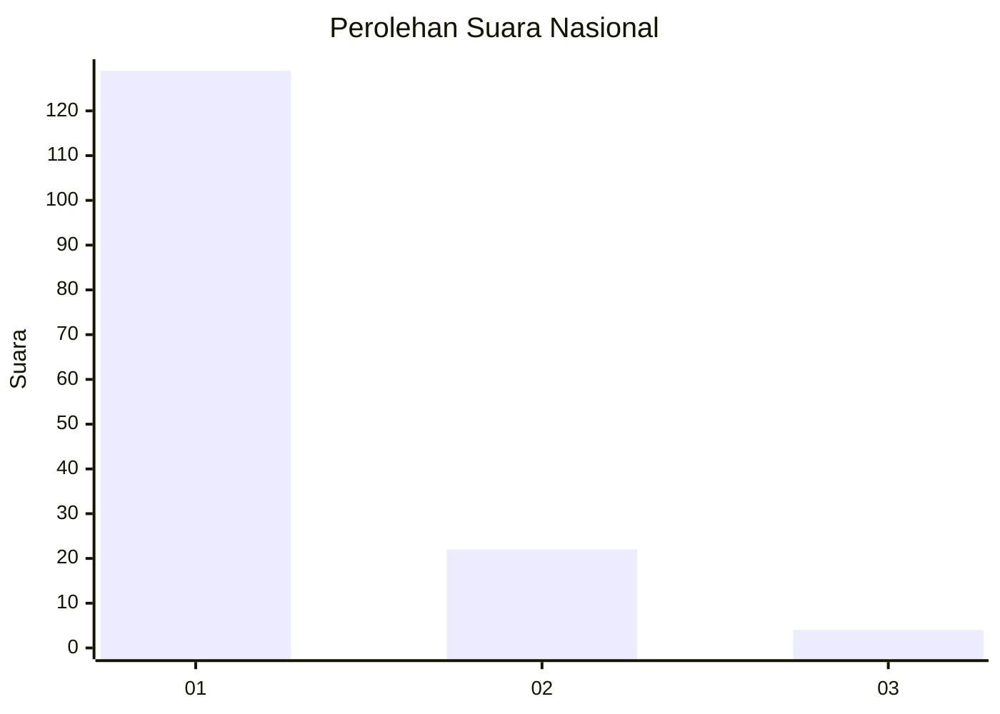
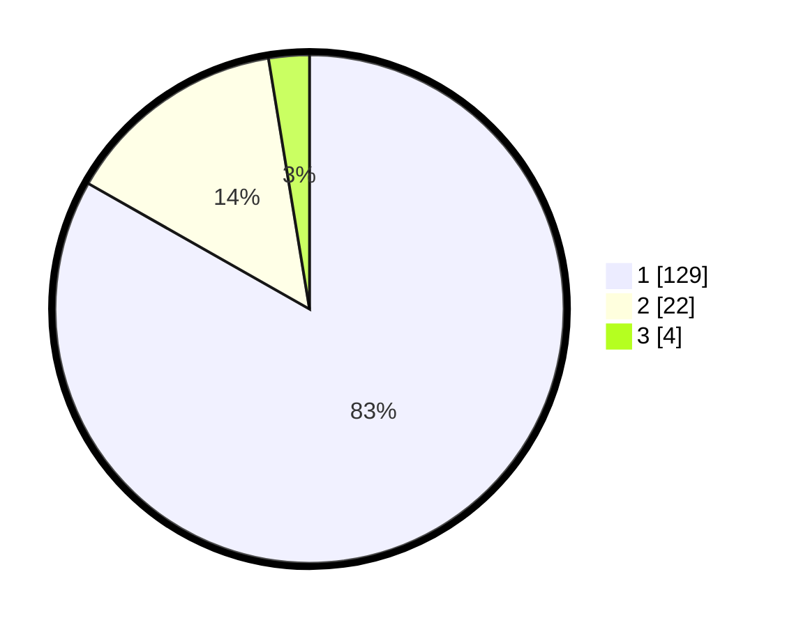

# Hasil

## Grafik

## Tabel

| No. | Nama Paslon    | Suara | Suara (raw) | Persentase |
|:--- |:-------------- | -----:| -----------:| ----------:|
| 1   | ANIES MUHAIMIN | 129   | [129][p-1]  | 83,23      |
| 2   | PRABOWO GIBRAN | 22    | [22][p-2]   | 14,19      |
| 3   | GANJAR MAHFUD  | 4     | [4][p-3]    | 2,58       |

[p-1]: https://github.com/gigit-pemilu/pemilu-2024/blob/main/pilpres/hitung-suara/sub/13-sumatera-barat/sub/06-agam/sub/14-candung/sub/2002-lasi/sub/004-tps/sub/paslon-1.txt
[p-2]: https://github.com/gigit-pemilu/pemilu-2024/blob/main/pilpres/hitung-suara/sub/13-sumatera-barat/sub/06-agam/sub/14-candung/sub/2002-lasi/sub/004-tps/sub/paslon-2.txt
[p-3]: https://github.com/gigit-pemilu/pemilu-2024/blob/main/pilpres/hitung-suara/sub/13-sumatera-barat/sub/06-agam/sub/14-candung/sub/2002-lasi/sub/004-tps/sub/paslon-3.txt

## Foto C Plano

https://sirekap-obj-formc.kpu.go.id/b2f3/pemilu/ppwp/13/06/14/20/02/1306142002004-20240217-215902--08f195cf-a65b-4a8f-a179-af281274d122.jpg

https://sirekap-obj-formc.kpu.go.id/b2f3/pemilu/ppwp/13/06/14/20/02/1306142002004-20240217-220038--24df2b96-a592-4354-82fd-f1a639f62417.jpg

https://sirekap-obj-formc.kpu.go.id/b2f3/pemilu/ppwp/13/06/14/20/02/1306142002004-20240217-220157--25bb4171-c6a5-4716-b3c6-4f092809fe9c.jpg

## Metadata

| Key        | Value               |
| ---------- | ------------------- |
| Time Stamp | 2024-02-24 22:31:28 |

