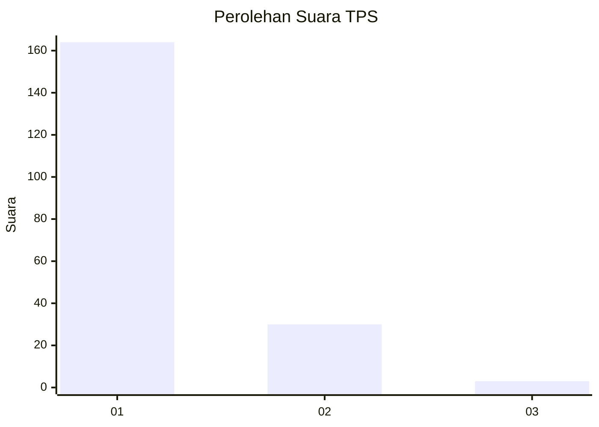
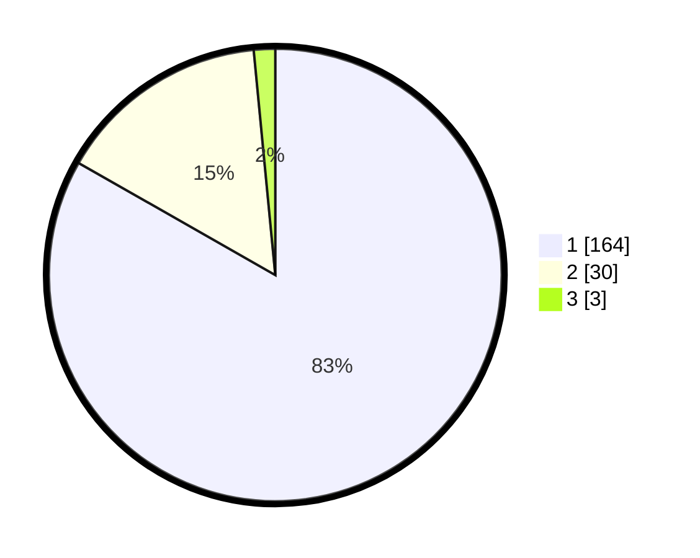

# Hasil

## Grafik

## Tabel

| No. | Nama Paslon    | Suara | Suara (raw) | Persentase |
|:--- |:-------------- | -----:| -----------:| ----------:|
| 1   | ANIES MUHAIMIN | 164   | [164][p-1]  | 83,25      |
| 2   | PRABOWO GIBRAN | 30    | [30][p-2]   | 15,23      |
| 3   | GANJAR MAHFUD  | 3     | [3][p-3]    | 1,52       |

[p-1]: https://github.com/gigit-pemilu/pemilu-2024-13-sumatera-barat/blob/main/pilpres/hitung-suara/sub/13-sumatera-barat/sub/06-agam/sub/14-candung/sub/2002-lasi/sub/005-tps/sub/paslon-1.txt
[p-2]: https://github.com/gigit-pemilu/pemilu-2024-13-sumatera-barat/blob/main/pilpres/hitung-suara/sub/13-sumatera-barat/sub/06-agam/sub/14-candung/sub/2002-lasi/sub/005-tps/sub/paslon-2.txt
[p-3]: https://github.com/gigit-pemilu/pemilu-2024-13-sumatera-barat/blob/main/pilpres/hitung-suara/sub/13-sumatera-barat/sub/06-agam/sub/14-candung/sub/2002-lasi/sub/005-tps/sub/paslon-3.txt

## Foto C Plano

https://sirekap-obj-formc.kpu.go.id/f291/pemilu/ppwp/13/06/14/20/02/1306142002005-20240217-154825--36833ec1-ea1e-4986-aa61-19148399963e.jpg

https://sirekap-obj-formc.kpu.go.id/f291/pemilu/ppwp/13/06/14/20/02/1306142002005-20240217-154911--f65adaa7-247d-4f7d-a3cb-f2103e672932.jpg

https://sirekap-obj-formc.kpu.go.id/f291/pemilu/ppwp/13/06/14/20/02/1306142002005-20240217-154957--5b22fb15-5971-4856-baff-613be37ad5eb.jpg

## Metadata

| Key        | Value               |
| ---------- | ------------------- |
| Time Stamp | 2024-02-25 13:00:00 |

