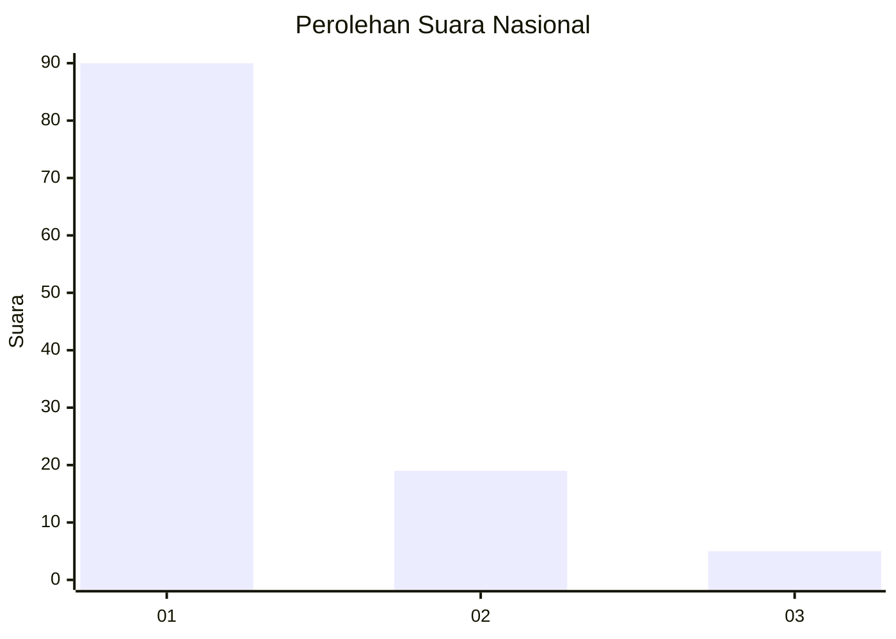
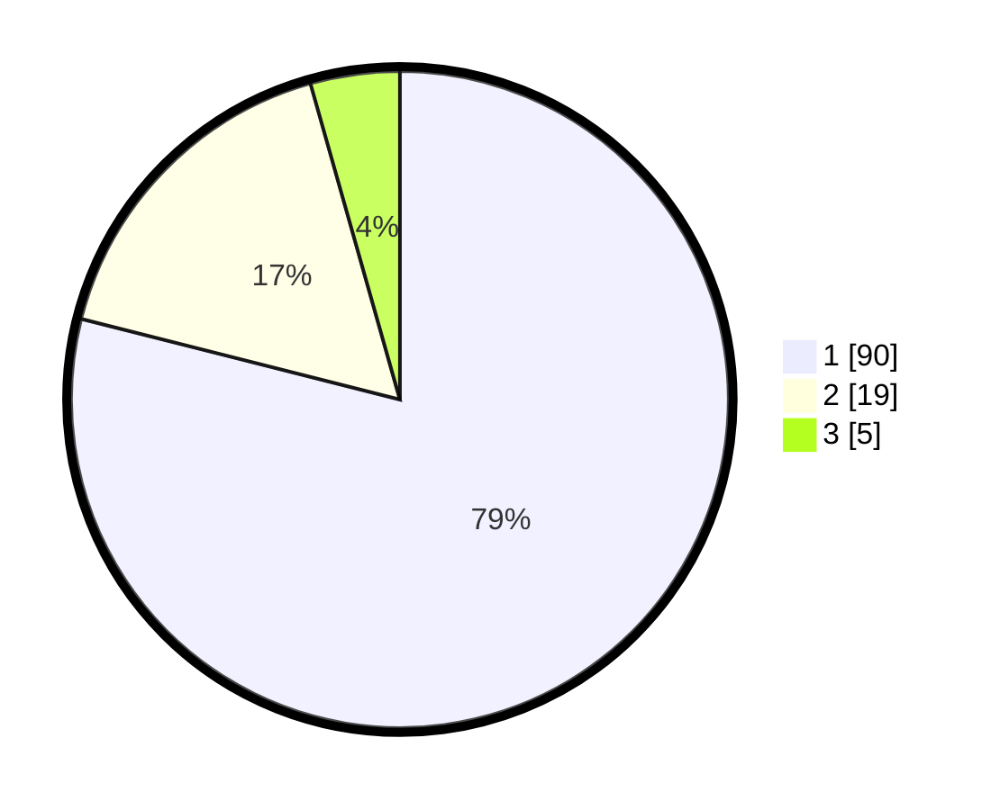

# Hasil

## Grafik

## Tabel

| No. | Nama Paslon    | Suara | Suara (raw) | Persentase |
|:--- |:-------------- | -----:| -----------:| ----------:|
| 1   | ANIES MUHAIMIN | 90    | [90][p-1]   | 78,95      |
| 2   | PRABOWO GIBRAN | 19    | [19][p-2]   | 16,67      |
| 3   | GANJAR MAHFUD  | 5     | [5][p-3]    | 4,39       |

[p-1]: https://github.com/gigit-pemilu/pemilu-2024/blob/main/pilpres/hitung-suara/sub/13-sumatera-barat/sub/06-agam/sub/14-candung/sub/2002-lasi/sub/017-tps/sub/paslon-1.txt
[p-2]: https://github.com/gigit-pemilu/pemilu-2024/blob/main/pilpres/hitung-suara/sub/13-sumatera-barat/sub/06-agam/sub/14-candung/sub/2002-lasi/sub/017-tps/sub/paslon-2.txt
[p-3]: https://github.com/gigit-pemilu/pemilu-2024/blob/main/pilpres/hitung-suara/sub/13-sumatera-barat/sub/06-agam/sub/14-candung/sub/2002-lasi/sub/017-tps/sub/paslon-3.txt

## Foto C Plano

https://sirekap-obj-formc.kpu.go.id/871f/pemilu/ppwp/13/06/14/20/02/1306142002017-20240218-121313--d5cd395c-5a86-4c66-9385-623e83aefb3f.jpg

https://sirekap-obj-formc.kpu.go.id/871f/pemilu/ppwp/13/06/14/20/02/1306142002017-20240218-120823--5048ad89-7472-47dd-8b0a-df31324406cf.jpg

https://sirekap-obj-formc.kpu.go.id/871f/pemilu/ppwp/13/06/14/20/02/1306142002017-20240218-121540--f176261d-3303-48bd-a1f6-41bf7b4916fb.jpg

## Metadata

| Key        | Value               |
| ---------- | ------------------- |
| Time Stamp | 2024-02-24 22:31:28 |

