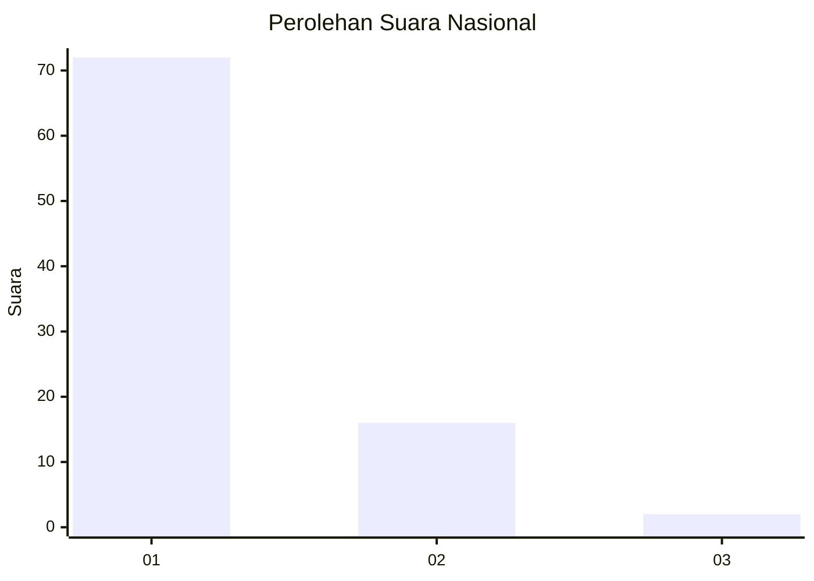
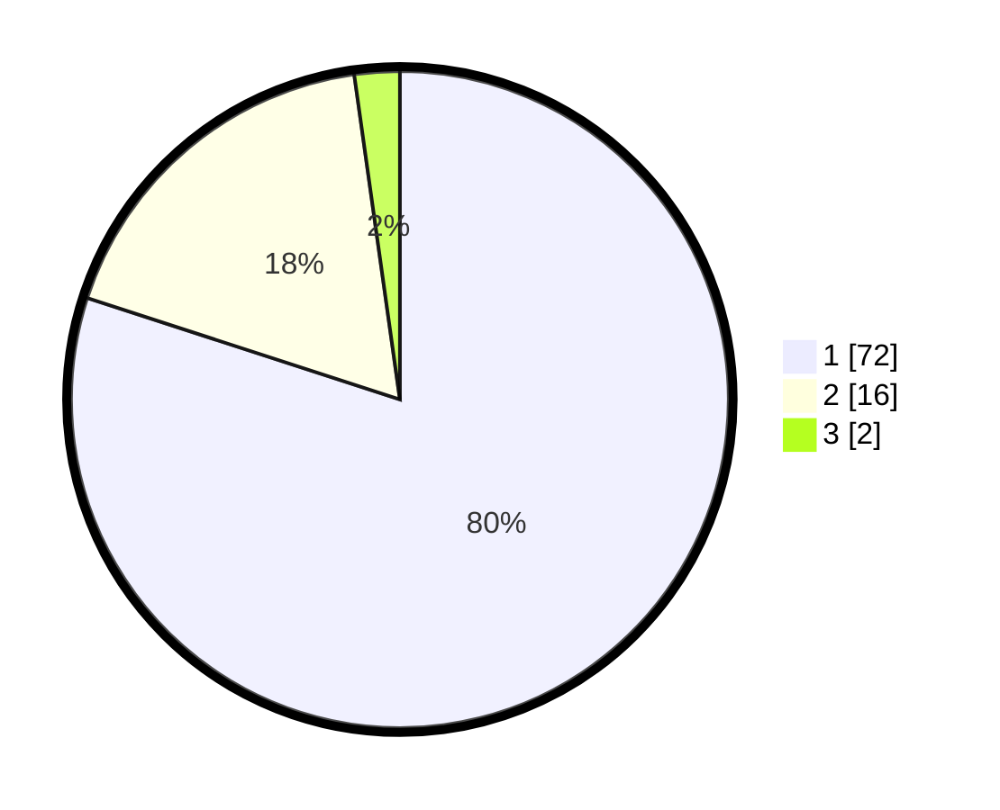

# Hasil

## Grafik

## Tabel

| No. | Nama Paslon    | Suara | Suara (raw) | Persentase |
|:--- |:-------------- | -----:| -----------:| ----------:|
| 1   | ANIES MUHAIMIN | 72    | [72][p-1]   | 80,00      |
| 2   | PRABOWO GIBRAN | 16    | [16][p-2]   | 17,78      |
| 3   | GANJAR MAHFUD  | 2     | [2][p-3]    | 2,22       |

[p-1]: https://github.com/gigit-pemilu/pemilu-2024/blob/main/pilpres/hitung-suara/sub/13-sumatera-barat/sub/06-agam/sub/14-candung/sub/2002-lasi/sub/022-tps/sub/paslon-1.txt
[p-2]: https://github.com/gigit-pemilu/pemilu-2024/blob/main/pilpres/hitung-suara/sub/13-sumatera-barat/sub/06-agam/sub/14-candung/sub/2002-lasi/sub/022-tps/sub/paslon-2.txt
[p-3]: https://github.com/gigit-pemilu/pemilu-2024/blob/main/pilpres/hitung-suara/sub/13-sumatera-barat/sub/06-agam/sub/14-candung/sub/2002-lasi/sub/022-tps/sub/paslon-3.txt

## Foto C Plano

https://sirekap-obj-formc.kpu.go.id/d85d/pemilu/ppwp/13/06/14/20/02/1306142002022-20240214-203255--e92d3bac-1a86-4549-a426-8c89e04dd80e.jpg

https://sirekap-obj-formc.kpu.go.id/d85d/pemilu/ppwp/13/06/14/20/02/1306142002022-20240214-203402--6cdab9ed-e6fa-41d5-a1df-07dce25a56a7.jpg

https://sirekap-obj-formc.kpu.go.id/d85d/pemilu/ppwp/13/06/14/20/02/1306142002022-20240214-203423--1b7a4e49-dfde-438e-9d0b-9bcc77f81128.jpg

## Metadata

| Key        | Value               |
| ---------- | ------------------- |
| Time Stamp | 2024-02-25 18:00:00 |

