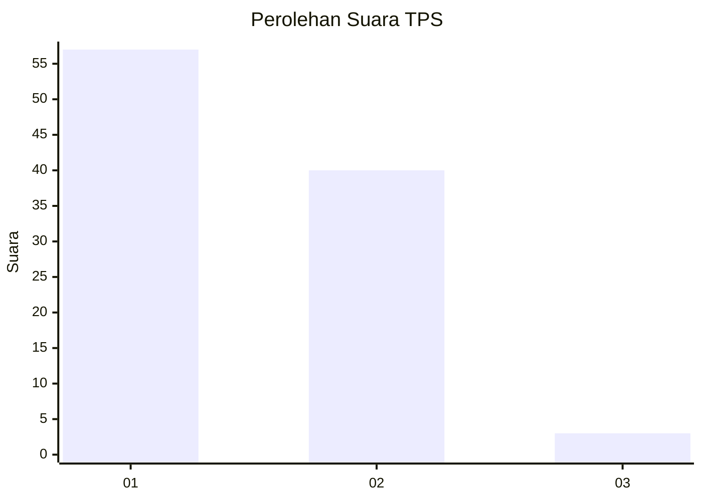
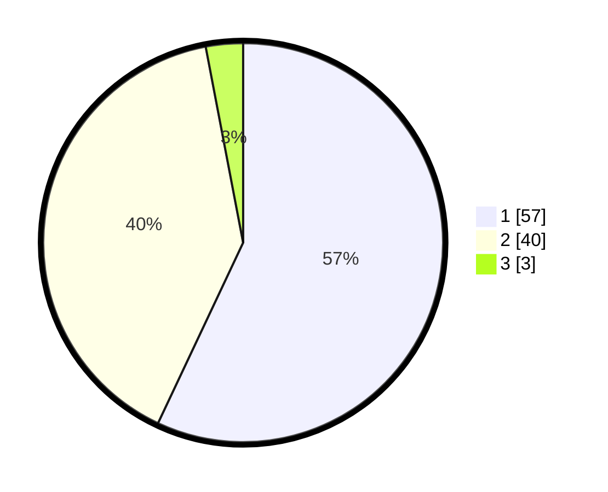

# Hasil

## Grafik

## Tabel

| No. | Nama Paslon    | Suara | Suara (raw) | Persentase |
|:--- |:-------------- | -----:| -----------:| ----------:|
| 1   | ANIES MUHAIMIN | 57    | [57][p-1]   | 57,00      |
| 2   | PRABOWO GIBRAN | 40    | [40][p-2]   | 40,00      |
| 3   | GANJAR MAHFUD  | 3     | [3][p-3]    | 3,00       |

[p-1]: https://github.com/gigit-pemilu/pemilu-2024-13-sumatera-barat/blob/main/pilpres/hitung-suara/sub/13-sumatera-barat/sub/06-agam/sub/14-candung/sub/2003-bukik-batabuah/sub/002-tps/sub/paslon-1.txt
[p-2]: https://github.com/gigit-pemilu/pemilu-2024-13-sumatera-barat/blob/main/pilpres/hitung-suara/sub/13-sumatera-barat/sub/06-agam/sub/14-candung/sub/2003-bukik-batabuah/sub/002-tps/sub/paslon-2.txt
[p-3]: https://github.com/gigit-pemilu/pemilu-2024-13-sumatera-barat/blob/main/pilpres/hitung-suara/sub/13-sumatera-barat/sub/06-agam/sub/14-candung/sub/2003-bukik-batabuah/sub/002-tps/sub/paslon-3.txt

## Foto C Plano

https://sirekap-obj-formc.kpu.go.id/ad9d/pemilu/ppwp/13/06/14/20/03/1306142003002-20240215-001719--58d90172-50bc-4ab6-a306-a699bcd5a301.jpg

https://sirekap-obj-formc.kpu.go.id/ad9d/pemilu/ppwp/13/06/14/20/03/1306142003002-20240215-001859--39f074ac-7c02-42ee-a29f-c78daa5d010c.jpg

https://sirekap-obj-formc.kpu.go.id/ad9d/pemilu/ppwp/13/06/14/20/03/1306142003002-20240215-002000--156756cb-b40e-4cf5-ae33-f0e889c6a799.jpg

## Metadata

| Key        | Value               |
| ---------- | ------------------- |
| Time Stamp | 2024-02-24 22:31:28 |

