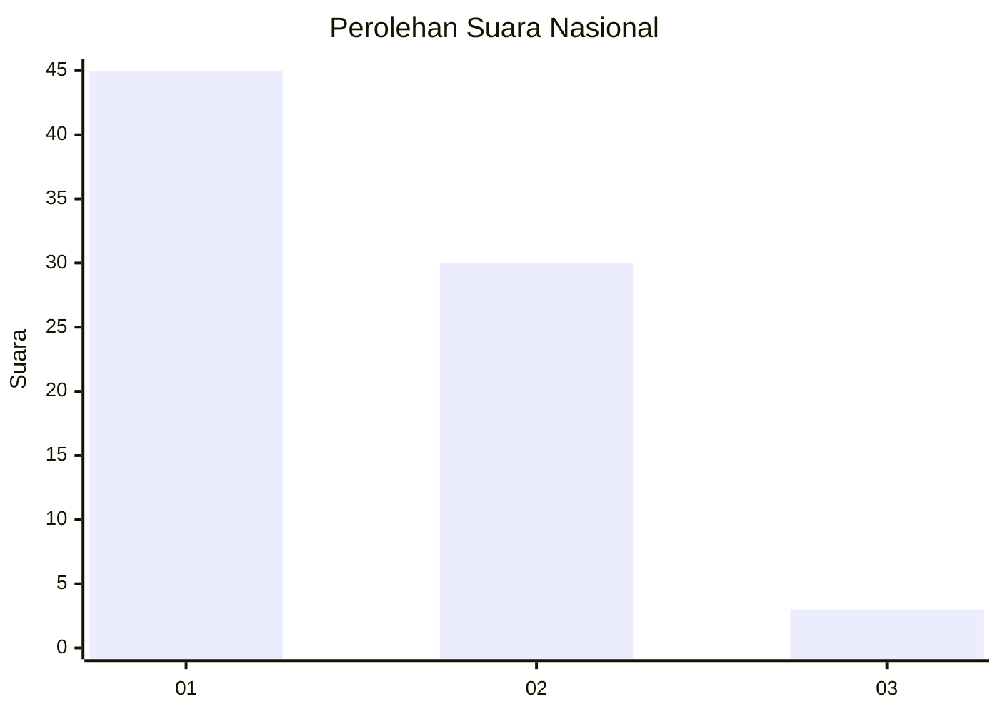
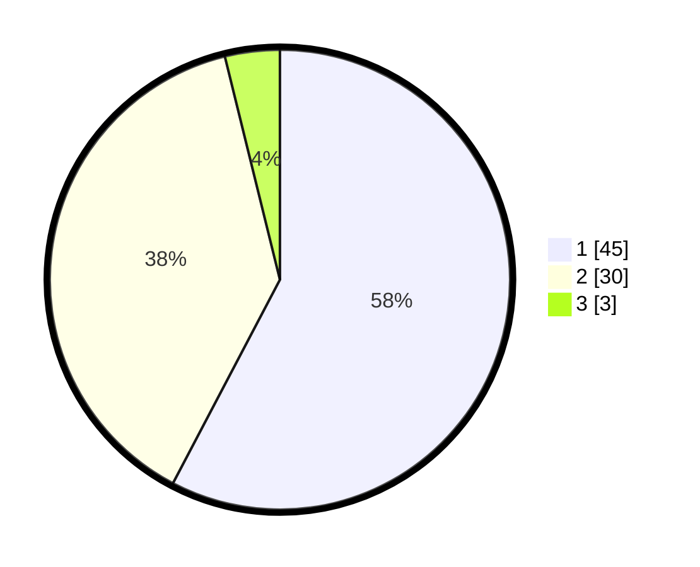

# Hasil

## Grafik

## Tabel

| No. | Nama Paslon    | Suara | Suara (raw) | Persentase |
|:--- |:-------------- | -----:| -----------:| ----------:|
| 1   | ANIES MUHAIMIN | 45    | [45][p-1]   | 57,69      |
| 2   | PRABOWO GIBRAN | 30    | [30][p-2]   | 38,46      |
| 3   | GANJAR MAHFUD  | 3     | [3][p-3]    | 3,85       |

[p-1]: https://github.com/gigit-pemilu/pemilu-2024/blob/main/pilpres/hitung-suara/sub/13-sumatera-barat/sub/06-agam/sub/14-candung/sub/2003-bukik-batabuah/sub/009-tps/sub/paslon-1.txt
[p-2]: https://github.com/gigit-pemilu/pemilu-2024/blob/main/pilpres/hitung-suara/sub/13-sumatera-barat/sub/06-agam/sub/14-candung/sub/2003-bukik-batabuah/sub/009-tps/sub/paslon-2.txt
[p-3]: https://github.com/gigit-pemilu/pemilu-2024/blob/main/pilpres/hitung-suara/sub/13-sumatera-barat/sub/06-agam/sub/14-candung/sub/2003-bukik-batabuah/sub/009-tps/sub/paslon-3.txt

## Foto C Plano

https://sirekap-obj-formc.kpu.go.id/3319/pemilu/ppwp/13/06/14/20/03/1306142003009-20240219-135818--4a12b3ca-bba7-473a-8974-4a709685d894.jpg

https://sirekap-obj-formc.kpu.go.id/3319/pemilu/ppwp/13/06/14/20/03/1306142003009-20240219-135943--729e0c63-a859-4e79-aded-2ee36cdd9788.jpg

https://sirekap-obj-formc.kpu.go.id/3319/pemilu/ppwp/13/06/14/20/03/1306142003009-20240219-140150--8e38c7c2-8737-4894-860c-6fa9c09ec8ac.jpg

## Metadata

| Key        | Value               |
| ---------- | ------------------- |
| Time Stamp | 2024-02-25 17:00:00 |

