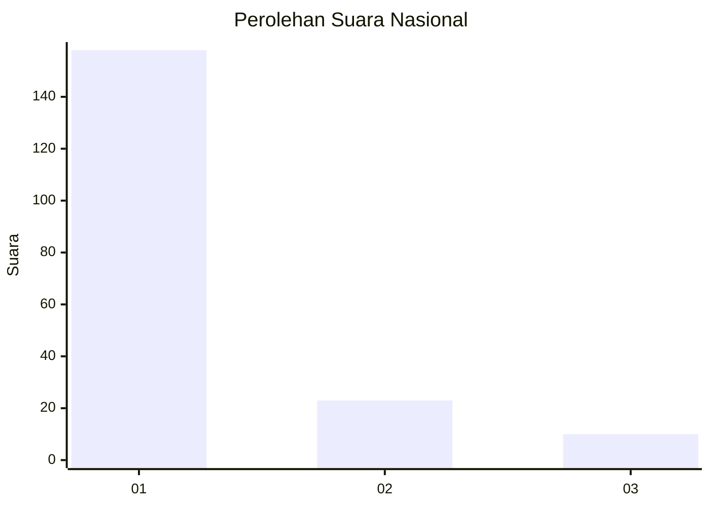
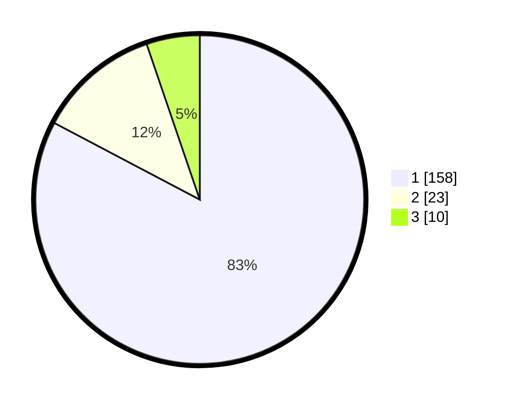

# Hasil

## Grafik

## Tabel

| No. | Nama Paslon    | Suara | Suara (raw) | Persentase |
|:--- |:-------------- | -----:| -----------:| ----------:|
| 1   | ANIES MUHAIMIN | 158   | [158][p-1]  | 82,72      |
| 2   | PRABOWO GIBRAN | 23    | [23][p-2]   | 12,04      |
| 3   | GANJAR MAHFUD  | 10    | [10][p-3]   | 5,24       |

[p-1]: https://github.com/gigit-pemilu/pemilu-2024/blob/main/pilpres/hitung-suara/sub/13-sumatera-barat/sub/06-agam/sub/14-candung/sub/2003-bukik-batabuah/sub/013-tps/sub/paslon-1.txt
[p-2]: https://github.com/gigit-pemilu/pemilu-2024/blob/main/pilpres/hitung-suara/sub/13-sumatera-barat/sub/06-agam/sub/14-candung/sub/2003-bukik-batabuah/sub/013-tps/sub/paslon-2.txt
[p-3]: https://github.com/gigit-pemilu/pemilu-2024/blob/main/pilpres/hitung-suara/sub/13-sumatera-barat/sub/06-agam/sub/14-candung/sub/2003-bukik-batabuah/sub/013-tps/sub/paslon-3.txt

## Foto C Plano

https://sirekap-obj-formc.kpu.go.id/f9aa/pemilu/ppwp/13/06/14/20/03/1306142003013-20240301-071559--db2fccf2-8918-49c6-985b-f23c0683ca8f.jpg

https://sirekap-obj-formc.kpu.go.id/f9aa/pemilu/ppwp/13/06/14/20/03/1306142003013-20240219-162610--01caf8bd-aacc-4a17-b3c3-a88de1b91d8a.jpg

https://sirekap-obj-formc.kpu.go.id/f9aa/pemilu/ppwp/13/06/14/20/03/1306142003013-20240219-162639--73160972-35ec-4198-b834-29d4fd345c0a.jpg

## Metadata

| Key        | Value               |
| ---------- | ------------------- |
| Time Stamp | 2024-03-01 08:00:00 |

