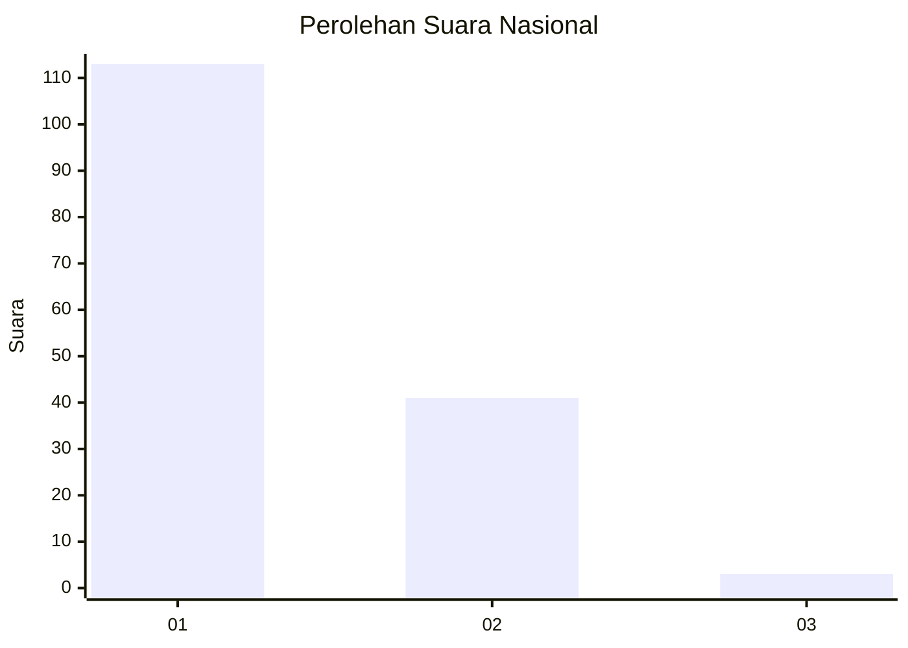
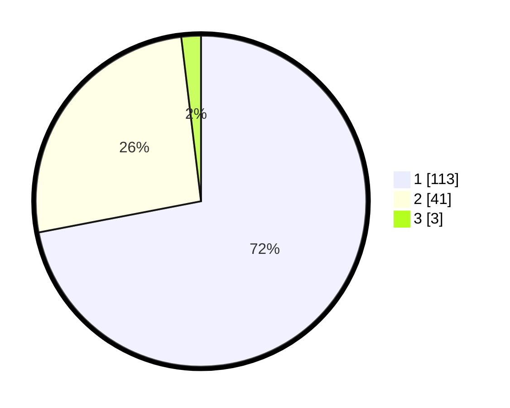

# Hasil

## Grafik

## Tabel

| No. | Nama Paslon    | Suara | Suara (raw) | Persentase |
|:--- |:-------------- | -----:| -----------:| ----------:|
| 1   | ANIES MUHAIMIN | 113   | [113][p-1]  | 71,97      |
| 2   | PRABOWO GIBRAN | 41    | [41][p-2]   | 26,11      |
| 3   | GANJAR MAHFUD  | 3     | [3][p-3]    | 1,91       |

[p-1]: https://github.com/gigit-pemilu/pemilu-2024/blob/main/pilpres/hitung-suara/sub/13-sumatera-barat/sub/06-agam/sub/14-candung/sub/2003-bukik-batabuah/sub/025-tps/sub/paslon-1.txt
[p-2]: https://github.com/gigit-pemilu/pemilu-2024/blob/main/pilpres/hitung-suara/sub/13-sumatera-barat/sub/06-agam/sub/14-candung/sub/2003-bukik-batabuah/sub/025-tps/sub/paslon-2.txt
[p-3]: https://github.com/gigit-pemilu/pemilu-2024/blob/main/pilpres/hitung-suara/sub/13-sumatera-barat/sub/06-agam/sub/14-candung/sub/2003-bukik-batabuah/sub/025-tps/sub/paslon-3.txt

## Foto C Plano

https://sirekap-obj-formc.kpu.go.id/cfd8/pemilu/ppwp/13/06/14/20/03/1306142003025-20240219-175749--953b7263-91b8-4cc3-8ad8-b2eff922d888.jpg

https://sirekap-obj-formc.kpu.go.id/cfd8/pemilu/ppwp/13/06/14/20/03/1306142003025-20240219-175845--171ff365-1cea-4e20-a5e1-ed85b7486523.jpg

https://sirekap-obj-formc.kpu.go.id/cfd8/pemilu/ppwp/13/06/14/20/03/1306142003025-20240219-175923--27e981a5-479a-406c-ba25-01d85cfddd7a.jpg

## Metadata

| Key        | Value               |
| ---------- | ------------------- |
| Time Stamp | 2024-02-26 13:00:00 |

