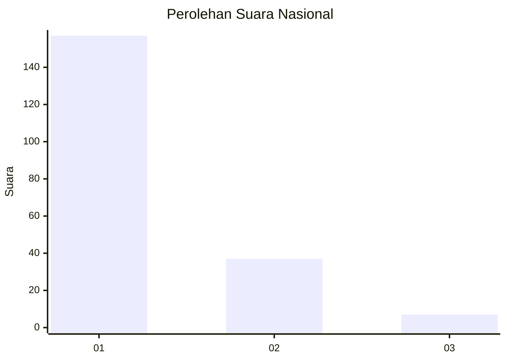
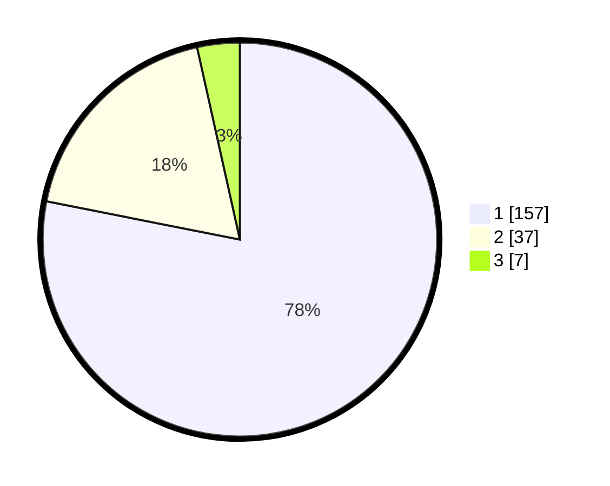

# Hasil

## Grafik

## Tabel

| No. | Nama Paslon    | Suara | Suara (raw) | Persentase |
|:--- |:-------------- | -----:| -----------:| ----------:|
| 1   | ANIES MUHAIMIN | 157   | [157][p-1]  | 78,11      |
| 2   | PRABOWO GIBRAN | 37    | [37][p-2]   | 18,41      |
| 3   | GANJAR MAHFUD  | 7     | [7][p-3]    | 3,48       |

[p-1]: https://github.com/gigit-pemilu/pemilu-2024/blob/main/pilpres/hitung-suara/sub/13-sumatera-barat/sub/06-agam/sub/14-candung/sub/2003-bukik-batabuah/sub/026-tps/sub/paslon-1.txt
[p-2]: https://github.com/gigit-pemilu/pemilu-2024/blob/main/pilpres/hitung-suara/sub/13-sumatera-barat/sub/06-agam/sub/14-candung/sub/2003-bukik-batabuah/sub/026-tps/sub/paslon-2.txt
[p-3]: https://github.com/gigit-pemilu/pemilu-2024/blob/main/pilpres/hitung-suara/sub/13-sumatera-barat/sub/06-agam/sub/14-candung/sub/2003-bukik-batabuah/sub/026-tps/sub/paslon-3.txt

## Foto C Plano

https://sirekap-obj-formc.kpu.go.id/5142/pemilu/ppwp/13/06/14/20/03/1306142003026-20240214-155208--7cf6477b-0c16-4e39-9c23-3adbc3f963b9.jpg

https://sirekap-obj-formc.kpu.go.id/5142/pemilu/ppwp/13/06/14/20/03/1306142003026-20240219-202337--f091cdc9-bd30-47fa-8c27-14772a5f00ae.jpg

https://sirekap-obj-formc.kpu.go.id/5142/pemilu/ppwp/13/06/14/20/03/1306142003026-20240214-155755--3eba7c7d-775a-4ecc-8eaf-332a0d0a078b.jpg

## Metadata

| Key        | Value               |
| ---------- | ------------------- |
| Time Stamp | 2024-02-25 11:00:00 |

