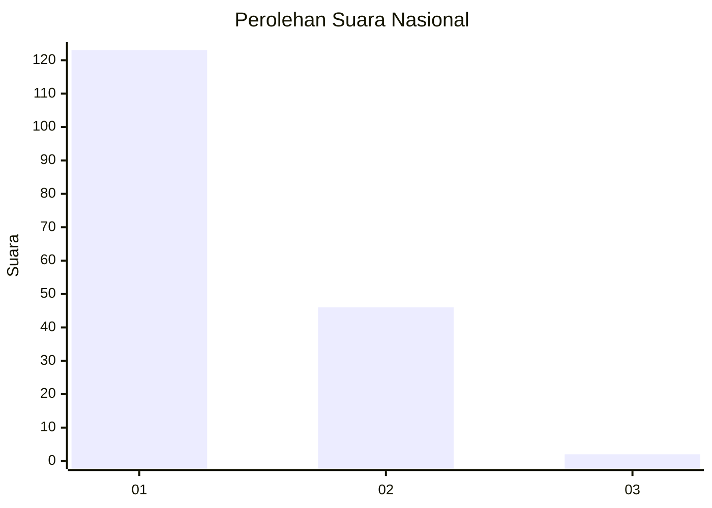
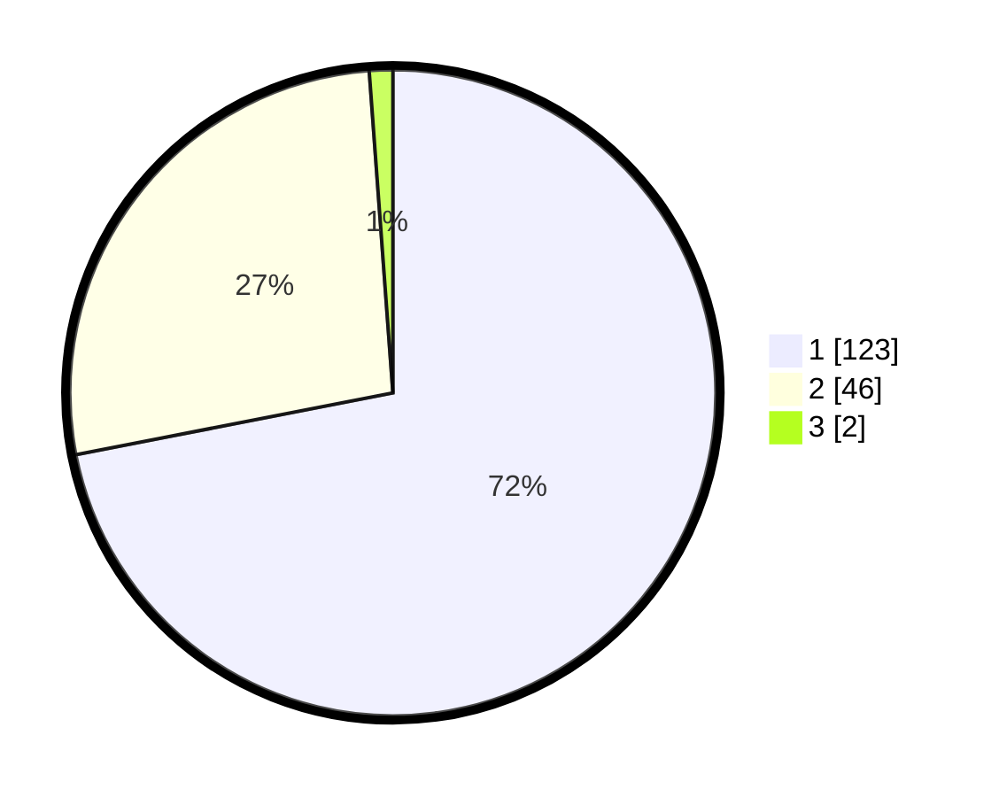

# Hasil

## Grafik

## Tabel

| No. | Nama Paslon    | Suara | Suara (raw) | Persentase |
|:--- |:-------------- | -----:| -----------:| ----------:|
| 1   | ANIES MUHAIMIN | 123   | [123][p-1]  | 71,93      |
| 2   | PRABOWO GIBRAN | 46    | [46][p-2]   | 26,90      |
| 3   | GANJAR MAHFUD  | 2     | [2][p-3]    | 1,17       |

[p-1]: https://github.com/gigit-pemilu/pemilu-2024/blob/main/pilpres/hitung-suara/sub/13-sumatera-barat/sub/06-agam/sub/16-malalak/sub/2001-malalak-utara/sub/001-tps/sub/paslon-1.txt
[p-2]: https://github.com/gigit-pemilu/pemilu-2024/blob/main/pilpres/hitung-suara/sub/13-sumatera-barat/sub/06-agam/sub/16-malalak/sub/2001-malalak-utara/sub/001-tps/sub/paslon-2.txt
[p-3]: https://github.com/gigit-pemilu/pemilu-2024/blob/main/pilpres/hitung-suara/sub/13-sumatera-barat/sub/06-agam/sub/16-malalak/sub/2001-malalak-utara/sub/001-tps/sub/paslon-3.txt

## Foto C Plano

https://sirekap-obj-formc.kpu.go.id/1cac/pemilu/ppwp/13/06/16/20/01/1306162001001-20240215-033342--cfd4fc2d-e8ef-43cf-950c-b78ea4858425.jpg

https://sirekap-obj-formc.kpu.go.id/1cac/pemilu/ppwp/13/06/16/20/01/1306162001001-20240216-132827--5d15c81e-5db8-4103-8871-9c26f50e5a84.jpg

https://sirekap-obj-formc.kpu.go.id/1cac/pemilu/ppwp/13/06/16/20/01/1306162001001-20240216-132826--59d9b860-c12e-494c-9536-23cc1bcc7e54.jpg

## Metadata

| Key        | Value               |
| ---------- | ------------------- |
| Time Stamp | 2024-02-17 18:30:00 |

