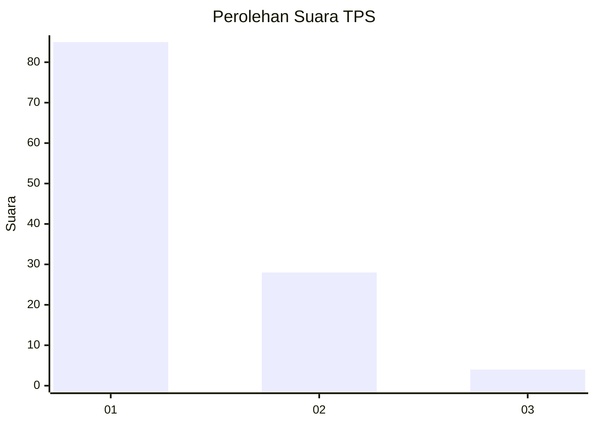
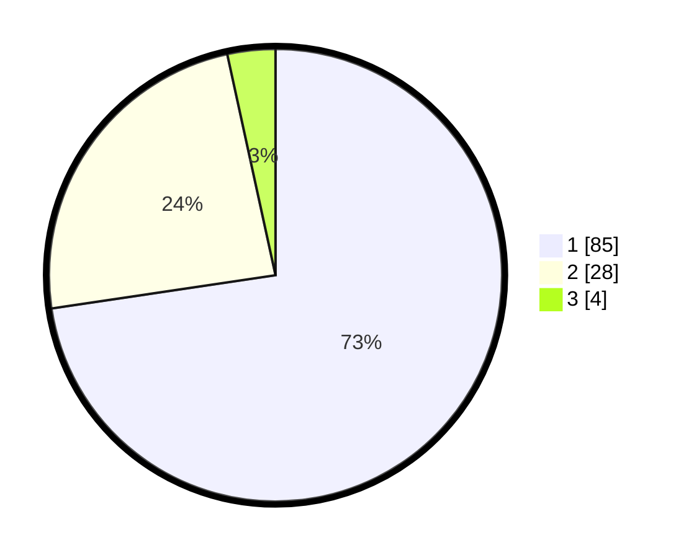

# Hasil

## Grafik

## Tabel

| No. | Nama Paslon    | Suara | Suara (raw) | Persentase |
|:--- |:-------------- | -----:| -----------:| ----------:|
| 1   | ANIES MUHAIMIN | 85    | [85][p-1]   | 72,65      |
| 2   | PRABOWO GIBRAN | 28    | [28][p-2]   | 23,93      |
| 3   | GANJAR MAHFUD  | 4     | [4][p-3]    | 3,42       |

[p-1]: https://github.com/gigit-pemilu/pemilu-2024-13-sumatera-barat/blob/main/pilpres/hitung-suara/sub/13-sumatera-barat/sub/06-agam/sub/16-malalak/sub/2001-malalak-utara/sub/006-tps/sub/paslon-1.txt
[p-2]: https://github.com/gigit-pemilu/pemilu-2024-13-sumatera-barat/blob/main/pilpres/hitung-suara/sub/13-sumatera-barat/sub/06-agam/sub/16-malalak/sub/2001-malalak-utara/sub/006-tps/sub/paslon-2.txt
[p-3]: https://github.com/gigit-pemilu/pemilu-2024-13-sumatera-barat/blob/main/pilpres/hitung-suara/sub/13-sumatera-barat/sub/06-agam/sub/16-malalak/sub/2001-malalak-utara/sub/006-tps/sub/paslon-3.txt

## Foto C Plano

https://sirekap-obj-formc.kpu.go.id/b65f/pemilu/ppwp/13/06/16/20/01/1306162001006-20240215-021254--fe34708b-7e74-4d16-a26c-88c291613f76.jpg

https://sirekap-obj-formc.kpu.go.id/b65f/pemilu/ppwp/13/06/16/20/01/1306162001006-20240215-084853--883bfda2-82ff-4690-a0f3-a6cc63f943e3.jpg

https://sirekap-obj-formc.kpu.go.id/b65f/pemilu/ppwp/13/06/16/20/01/1306162001006-20240215-091736--e164329f-31d4-40f1-b1bb-c9d007c60e0e.jpg

## Metadata

| Key        | Value               |
| ---------- | ------------------- |
| Time Stamp | 2024-02-22 11:00:00 |

