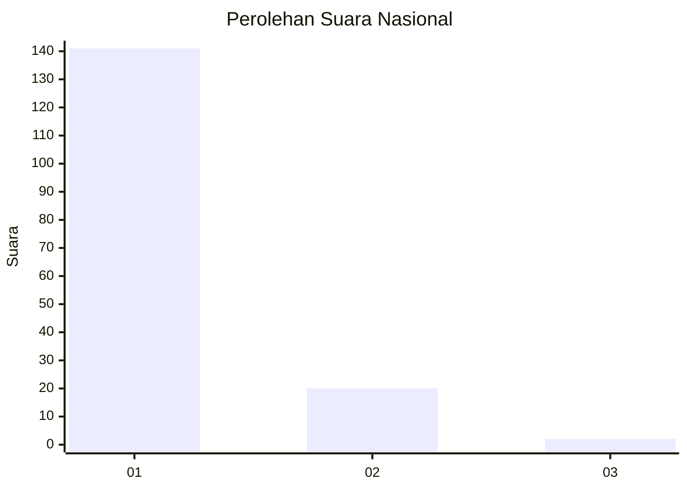
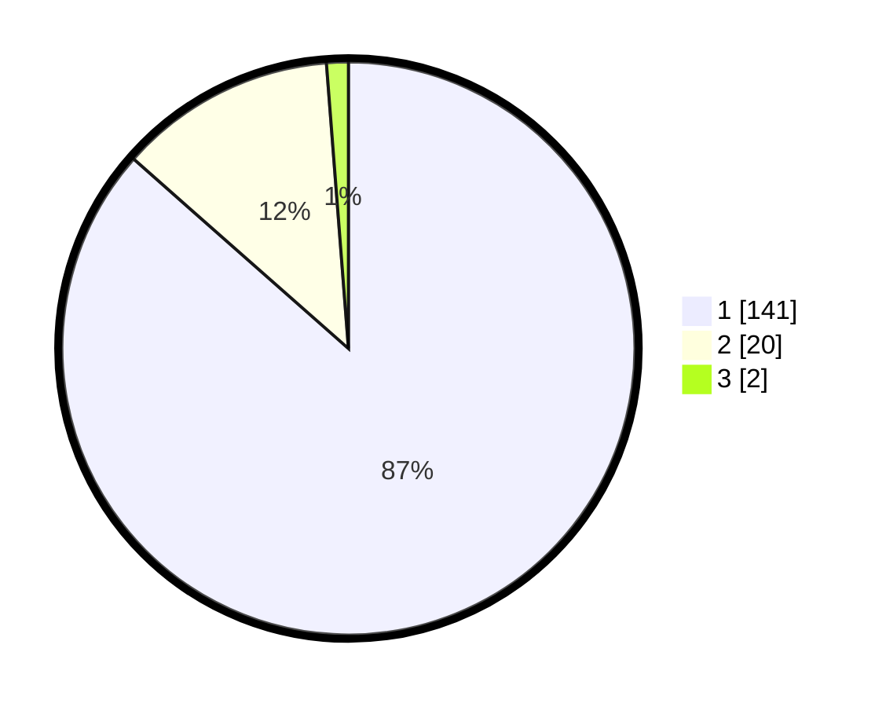

# Hasil

## Grafik

## Tabel

| No. | Nama Paslon    | Suara | Suara (raw) | Persentase |
|:--- |:-------------- | -----:| -----------:| ----------:|
| 1   | ANIES MUHAIMIN | 141   | [141][p-1]  | 86,50      |
| 2   | PRABOWO GIBRAN | 20    | [20][p-2]   | 12,27      |
| 3   | GANJAR MAHFUD  | 2     | [2][p-3]    | 1,23       |

[p-1]: https://github.com/gigit-pemilu/pemilu-2024/blob/main/pilpres/hitung-suara/sub/13-sumatera-barat/sub/06-agam/sub/16-malalak/sub/2002-malalak-timur/sub/001-tps/sub/paslon-1.txt
[p-2]: https://github.com/gigit-pemilu/pemilu-2024/blob/main/pilpres/hitung-suara/sub/13-sumatera-barat/sub/06-agam/sub/16-malalak/sub/2002-malalak-timur/sub/001-tps/sub/paslon-2.txt
[p-3]: https://github.com/gigit-pemilu/pemilu-2024/blob/main/pilpres/hitung-suara/sub/13-sumatera-barat/sub/06-agam/sub/16-malalak/sub/2002-malalak-timur/sub/001-tps/sub/paslon-3.txt

## Foto C Plano

https://sirekap-obj-formc.kpu.go.id/cc3a/pemilu/ppwp/13/06/16/20/02/1306162002001-20240215-060754--dd63d884-2fd7-4195-a91c-9994fef925cd.jpg

https://sirekap-obj-formc.kpu.go.id/cc3a/pemilu/ppwp/13/06/16/20/02/1306162002001-20240215-060809--2bb53256-d586-4156-857b-226633bd9728.jpg

https://sirekap-obj-formc.kpu.go.id/cc3a/pemilu/ppwp/13/06/16/20/02/1306162002001-20240215-060822--891fed65-4da7-4df7-af03-423e9720c8dd.jpg

## Metadata

| Key        | Value               |
| ---------- | ------------------- |
| Time Stamp | 2024-02-24 22:31:28 |

