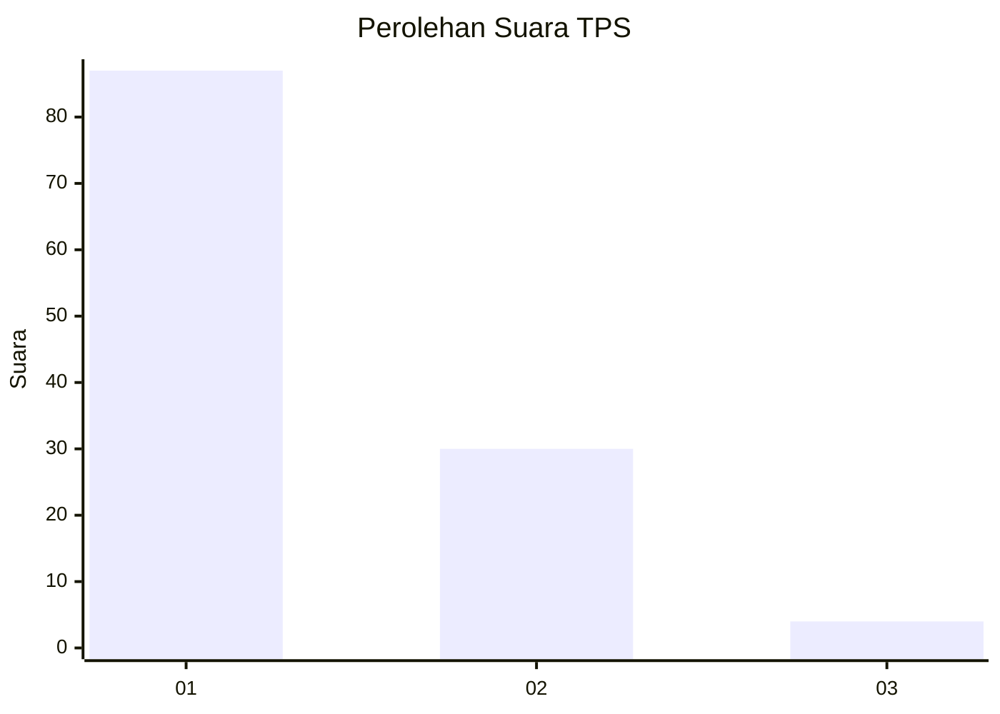
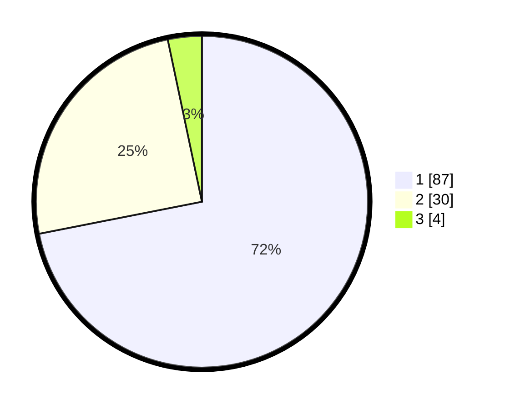

# Hasil

## Grafik

## Tabel

| No. | Nama Paslon    | Suara | Suara (raw) | Persentase |
|:--- |:-------------- | -----:| -----------:| ----------:|
| 1   | ANIES MUHAIMIN | 87    | [87][p-1]   | 71,90      |
| 2   | PRABOWO GIBRAN | 30    | [30][p-2]   | 24,79      |
| 3   | GANJAR MAHFUD  | 4     | [4][p-3]    | 3,31       |

[p-1]: https://github.com/gigit-pemilu/pemilu-2024-13-sumatera-barat/blob/main/pilpres/hitung-suara/sub/13-sumatera-barat/sub/06-agam/sub/16-malalak/sub/2002-malalak-timur/sub/003-tps/sub/paslon-1.txt
[p-2]: https://github.com/gigit-pemilu/pemilu-2024-13-sumatera-barat/blob/main/pilpres/hitung-suara/sub/13-sumatera-barat/sub/06-agam/sub/16-malalak/sub/2002-malalak-timur/sub/003-tps/sub/paslon-2.txt
[p-3]: https://github.com/gigit-pemilu/pemilu-2024-13-sumatera-barat/blob/main/pilpres/hitung-suara/sub/13-sumatera-barat/sub/06-agam/sub/16-malalak/sub/2002-malalak-timur/sub/003-tps/sub/paslon-3.txt

## Foto C Plano

https://sirekap-obj-formc.kpu.go.id/1bf0/pemilu/ppwp/13/06/16/20/02/1306162002003-20240215-052300--a6394d39-2ad6-4795-bc85-4ebc6e728e96.jpg

https://sirekap-obj-formc.kpu.go.id/1bf0/pemilu/ppwp/13/06/16/20/02/1306162002003-20240215-052641--1d49b44c-aa9d-4847-97e7-a38f7a3ca652.jpg

https://sirekap-obj-formc.kpu.go.id/1bf0/pemilu/ppwp/13/06/16/20/02/1306162002003-20240215-052922--d2749e72-ef94-43aa-9299-f3fd8355c072.jpg

## Metadata

| Key        | Value               |
| ---------- | ------------------- |
| Time Stamp | 2024-02-25 21:00:00 |

