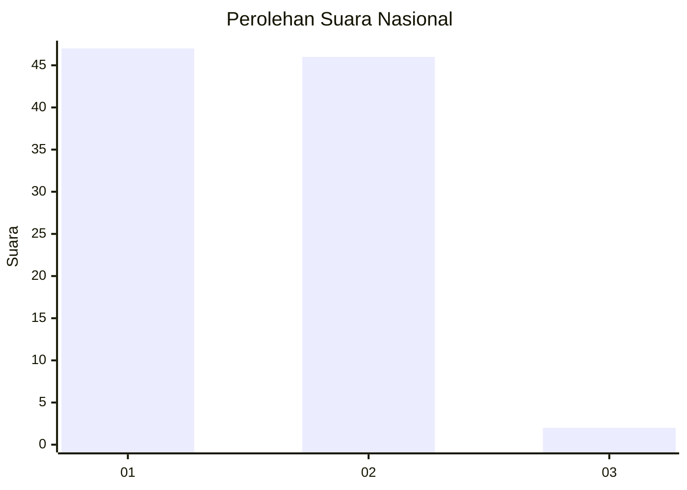
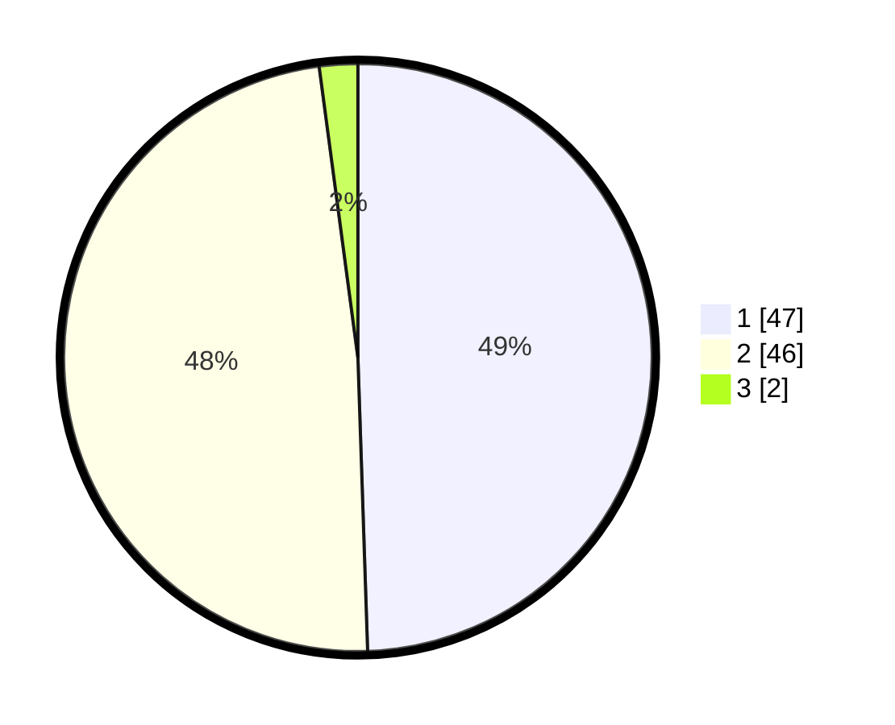

# Hasil

## Grafik

## Tabel

| No. | Nama Paslon    | Suara | Suara (raw) | Persentase |
|:--- |:-------------- | -----:| -----------:| ----------:|
| 1   | ANIES MUHAIMIN | 47    | [47][p-1]   | 49,47      |
| 2   | PRABOWO GIBRAN | 46    | [46][p-2]   | 48,42      |
| 3   | GANJAR MAHFUD  | 2     | [2][p-3]    | 2,11       |

[p-1]: https://github.com/gigit-pemilu/pemilu-2024/blob/main/pilpres/hitung-suara/sub/13-sumatera-barat/sub/06-agam/sub/16-malalak/sub/2003-malalak-selatan/sub/001-tps/sub/paslon-1.txt
[p-2]: https://github.com/gigit-pemilu/pemilu-2024/blob/main/pilpres/hitung-suara/sub/13-sumatera-barat/sub/06-agam/sub/16-malalak/sub/2003-malalak-selatan/sub/001-tps/sub/paslon-2.txt
[p-3]: https://github.com/gigit-pemilu/pemilu-2024/blob/main/pilpres/hitung-suara/sub/13-sumatera-barat/sub/06-agam/sub/16-malalak/sub/2003-malalak-selatan/sub/001-tps/sub/paslon-3.txt

## Foto C Plano

https://sirekap-obj-formc.kpu.go.id/4739/pemilu/ppwp/13/06/16/20/03/1306162003001-20240215-071321--28ef2c57-5c4a-49e1-8bc1-9d91d9f81e55.jpg

https://sirekap-obj-formc.kpu.go.id/4739/pemilu/ppwp/13/06/16/20/03/1306162003001-20240215-075205--d7a4564b-b8a8-49ec-ae49-3e0caaf1d428.jpg

https://sirekap-obj-formc.kpu.go.id/4739/pemilu/ppwp/13/06/16/20/03/1306162003001-20240215-072243--027fb1ad-7e3b-4934-bf51-9d441a56c5c5.jpg

## Metadata

| Key        | Value               |
| ---------- | ------------------- |
| Time Stamp | 2024-02-24 22:31:28 |

