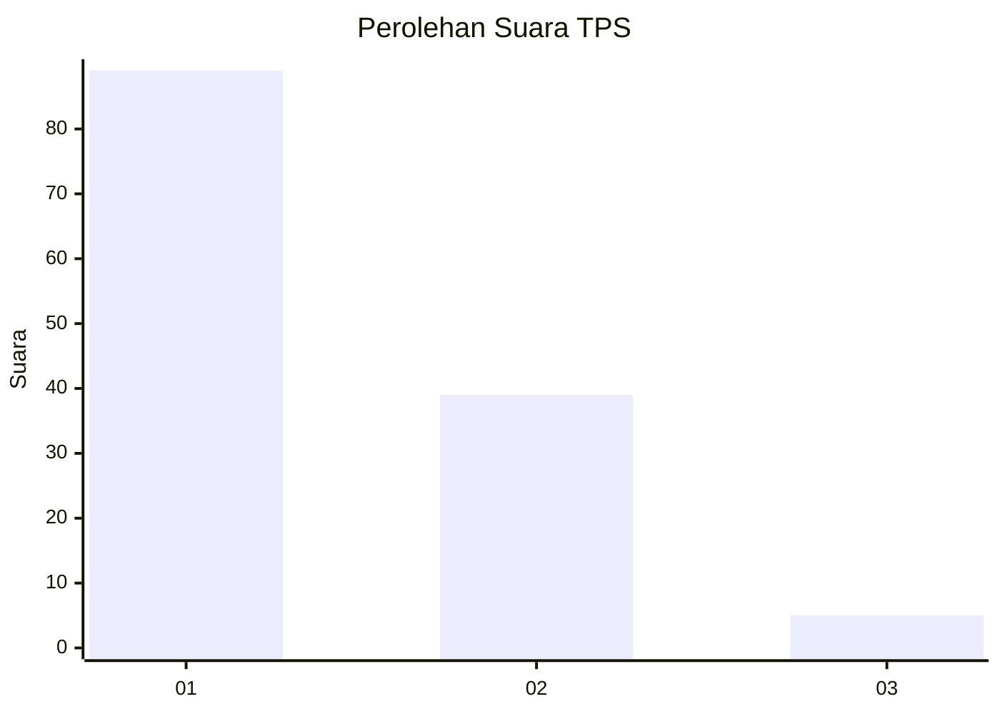
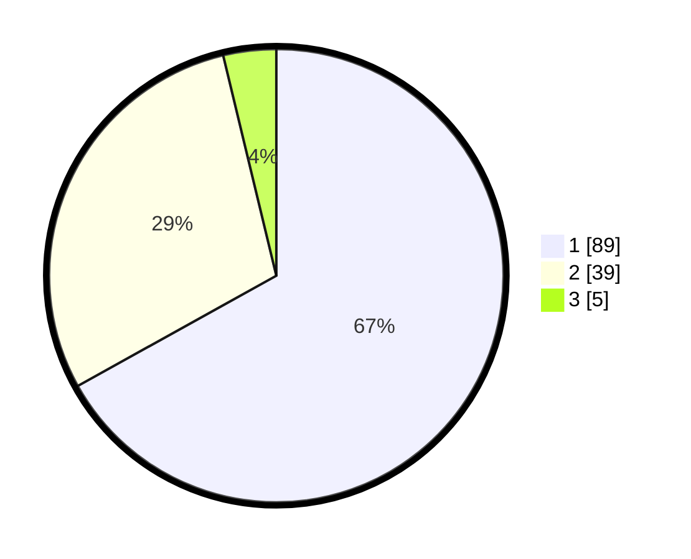

# Hasil

## Grafik

## Tabel

| No. | Nama Paslon    | Suara | Suara (raw) | Persentase |
|:--- |:-------------- | -----:| -----------:| ----------:|
| 1   | ANIES MUHAIMIN | 89    | [89][p-1]   | 66,92      |
| 2   | PRABOWO GIBRAN | 39    | [39][p-2]   | 29,32      |
| 3   | GANJAR MAHFUD  | 5     | [5][p-3]    | 3,76       |

[p-1]: https://github.com/gigit-pemilu/pemilu-2024-13-sumatera-barat/blob/main/pilpres/hitung-suara/sub/13-sumatera-barat/sub/07-lima-puluh-kota/sub/01-suliki/sub/2005-limbanang/sub/011-tps/sub/paslon-1.txt
[p-2]: https://github.com/gigit-pemilu/pemilu-2024-13-sumatera-barat/blob/main/pilpres/hitung-suara/sub/13-sumatera-barat/sub/07-lima-puluh-kota/sub/01-suliki/sub/2005-limbanang/sub/011-tps/sub/paslon-2.txt
[p-3]: https://github.com/gigit-pemilu/pemilu-2024-13-sumatera-barat/blob/main/pilpres/hitung-suara/sub/13-sumatera-barat/sub/07-lima-puluh-kota/sub/01-suliki/sub/2005-limbanang/sub/011-tps/sub/paslon-3.txt

## Foto C Plano

https://sirekap-obj-formc.kpu.go.id/850e/pemilu/ppwp/13/07/01/20/05/1307012005011-20240222-120824--a6393e28-7025-4012-a26e-dfdafeacdcbc.jpg

https://sirekap-obj-formc.kpu.go.id/850e/pemilu/ppwp/13/07/01/20/05/1307012005011-20240222-121007--c6214958-692a-4119-86b3-d8b93f331a95.jpg

https://sirekap-obj-formc.kpu.go.id/850e/pemilu/ppwp/13/07/01/20/05/1307012005011-20240222-121110--260bfac8-d6e4-42f7-8744-3c5a3a7bcd15.jpg

## Metadata

| Key        | Value               |
| ---------- | ------------------- |
| Time Stamp | 2024-02-22 13:00:00 |

## DATA PEMILIH TETAP

Jumlah pemilih dalam DPT: **210**.
 * L: **107**.
 * P: **103**.

## DATA PENGGUNA HAK PILIH

Jumlah pengguna hak pilih dalam DPT: **133**.
 * L: **557**.
 * P: **576**.

Jumlah pengguna hak pilih dalam DPTb: **2**.
 * L: **301**.
 * P: **331**.

Jumlah pengguna hak pilih dalam DPK: **20**.
 * L: **332**.
 * P: **555**.

Jumlah pengguna hak pilih: **135**.
 * L: **358**.
 * P: **377**.

## JUMLAH SUARA SAH DAN TIDAK SAH

JUMLAH SELURUH SUARA SAH: **133**.

JUMLAH SUARA TIDAK SAH: **302**.

JUMLAH SELURUH SUARA SAH DAN SUARA TIDAK SAH: **135**.

