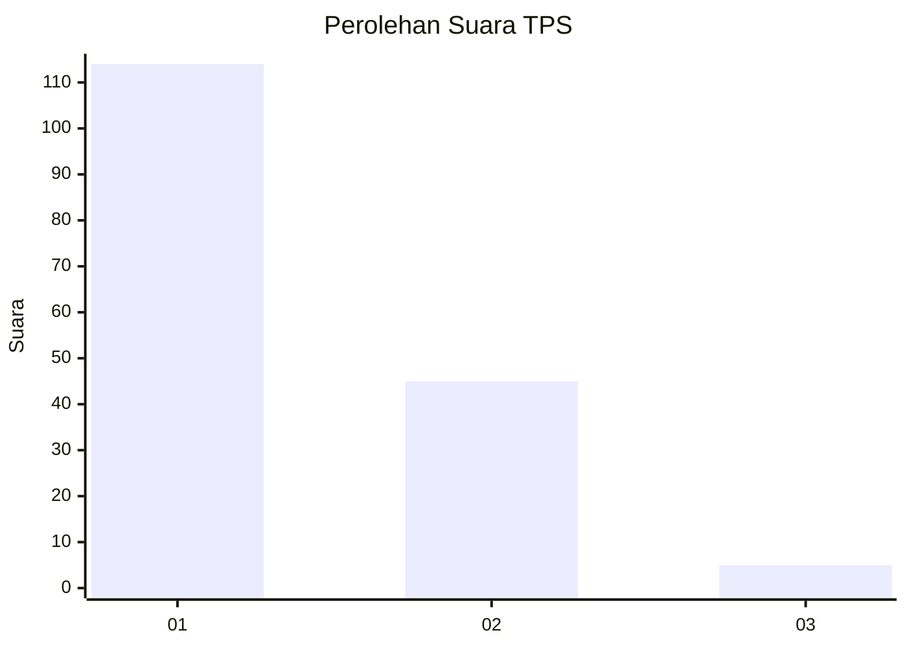
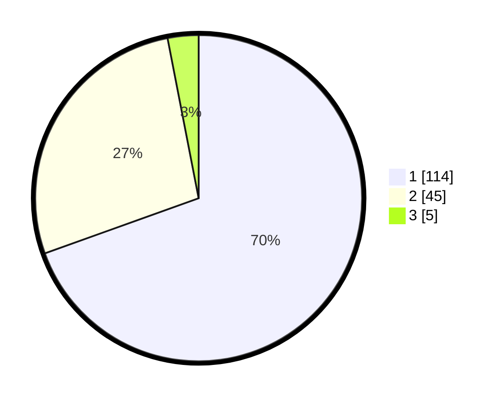

# Hasil

## Grafik

## Tabel

| No. | Nama Paslon    | Suara | Suara (raw) | Persentase |
|:--- |:-------------- | -----:| -----------:| ----------:|
| 1   | ANIES MUHAIMIN | 114   | [114][p-1]  | 69,51      |
| 2   | PRABOWO GIBRAN | 45    | [45][p-2]   | 27,44      |
| 3   | GANJAR MAHFUD  | 5     | [5][p-3]    | 3,05       |

[p-1]: https://github.com/gigit-pemilu/pemilu-2024-13-sumatera-barat/blob/main/pilpres/hitung-suara/sub/13-sumatera-barat/sub/07-lima-puluh-kota/sub/01-suliki/sub/2006-andiang/sub/007-tps/sub/paslon-1.txt
[p-2]: https://github.com/gigit-pemilu/pemilu-2024-13-sumatera-barat/blob/main/pilpres/hitung-suara/sub/13-sumatera-barat/sub/07-lima-puluh-kota/sub/01-suliki/sub/2006-andiang/sub/007-tps/sub/paslon-2.txt
[p-3]: https://github.com/gigit-pemilu/pemilu-2024-13-sumatera-barat/blob/main/pilpres/hitung-suara/sub/13-sumatera-barat/sub/07-lima-puluh-kota/sub/01-suliki/sub/2006-andiang/sub/007-tps/sub/paslon-3.txt

## Foto C Plano

https://sirekap-obj-formc.kpu.go.id/db8e/pemilu/ppwp/13/07/01/20/06/1307012006007-20240227-113829--14c95145-a74f-4d20-bb95-94d3649b3699.jpg

https://sirekap-obj-formc.kpu.go.id/db8e/pemilu/ppwp/13/07/01/20/06/1307012006007-20240221-175328--bb5f0f01-5bb5-4f7c-940d-7cc229f68307.jpg

https://sirekap-obj-formc.kpu.go.id/db8e/pemilu/ppwp/13/07/01/20/06/1307012006007-20240221-175142--d52687bc-00fa-4290-bd6d-30df8deaaf1b.jpg

## Metadata

| Key        | Value               |
| ---------- | ------------------- |
| Time Stamp | 2024-02-27 12:00:00 |

## DATA PEMILIH TETAP

Jumlah pemilih dalam DPT: **834**.
 * L: **788**.
 * P: **288**.

## DATA PENGGUNA HAK PILIH

Jumlah pengguna hak pilih dalam DPT: **888**.
 * L: **788**.
 * P: **838**.

Jumlah pengguna hak pilih dalam DPTb: **868**.
 * L: **482**.
 * P: **384**.

Jumlah pengguna hak pilih dalam DPK: **888**.
 * L: **888**.
 * P: **884**.

Jumlah pengguna hak pilih: **488**.
 * L: **838**.
 * P: **838**.

## JUMLAH SUARA SAH DAN TIDAK SAH

JUMLAH SELURUH SUARA SAH: **156**.

JUMLAH SUARA TIDAK SAH: **1**.

JUMLAH SELURUH SUARA SAH DAN SUARA TIDAK SAH: **107**.

