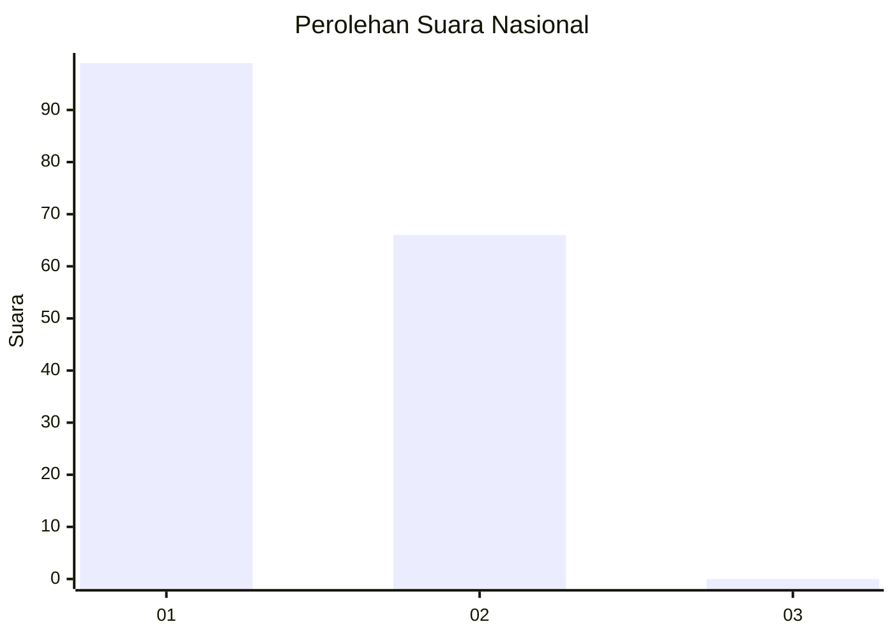
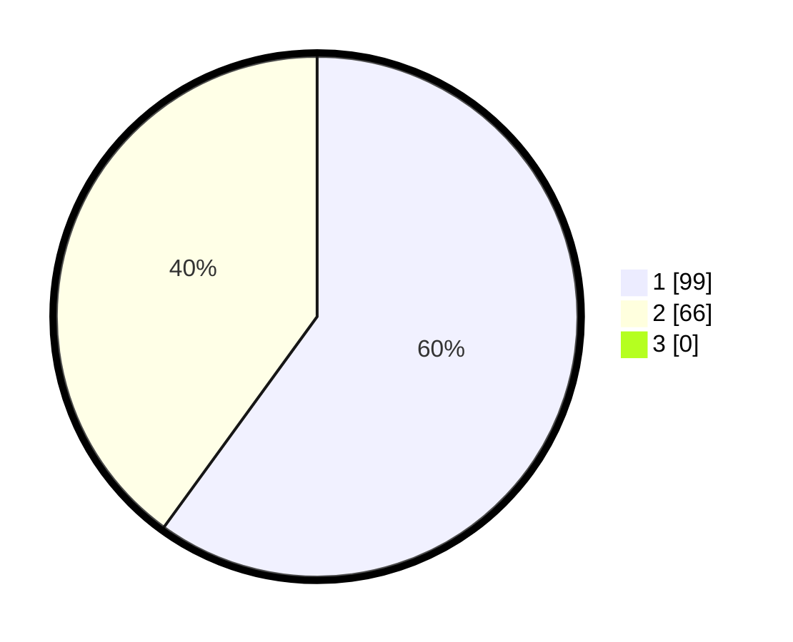

# Hasil

## Grafik

## Tabel

| No. | Nama Paslon    | Suara | Suara (raw) | Persentase |
|:--- |:-------------- | -----:| -----------:| ----------:|
| 1   | ANIES MUHAIMIN | 99    | [99][p-1]   | 60,00      |
| 2   | PRABOWO GIBRAN | 66    | [66][p-2]   | 40,00      |
| 3   | GANJAR MAHFUD  | 0     | [0][p-3]    | 0,00       |

[p-1]: https://github.com/gigit-pemilu/pemilu-2024/blob/main/pilpres/hitung-suara/sub/13-sumatera-barat/sub/07-lima-puluh-kota/sub/03-payakumbuh/sub/2001-koto-baru-simalanggang/sub/001-tps/sub/paslon-1.txt
[p-2]: https://github.com/gigit-pemilu/pemilu-2024/blob/main/pilpres/hitung-suara/sub/13-sumatera-barat/sub/07-lima-puluh-kota/sub/03-payakumbuh/sub/2001-koto-baru-simalanggang/sub/001-tps/sub/paslon-2.txt
[p-3]: https://github.com/gigit-pemilu/pemilu-2024/blob/main/pilpres/hitung-suara/sub/13-sumatera-barat/sub/07-lima-puluh-kota/sub/03-payakumbuh/sub/2001-koto-baru-simalanggang/sub/001-tps/sub/paslon-3.txt

## Foto C Plano

https://sirekap-obj-formc.kpu.go.id/0be7/pemilu/ppwp/13/07/03/20/01/1307032001001-20240226-124032--6d435db6-28da-44a0-939c-3c3e28c1c567.jpg

https://sirekap-obj-formc.kpu.go.id/0be7/pemilu/ppwp/13/07/03/20/01/1307032001001-20240226-124319--b089d833-2aa3-43bf-ace6-4028d86aeb0a.jpg

https://sirekap-obj-formc.kpu.go.id/0be7/pemilu/ppwp/13/07/03/20/01/1307032001001-20240226-124503--157408c5-88ad-4083-b449-9e98191c5be8.jpg

## Metadata

| Key        | Value               |
| ---------- | ------------------- |
| Time Stamp | 2024-02-26 15:00:00 |

