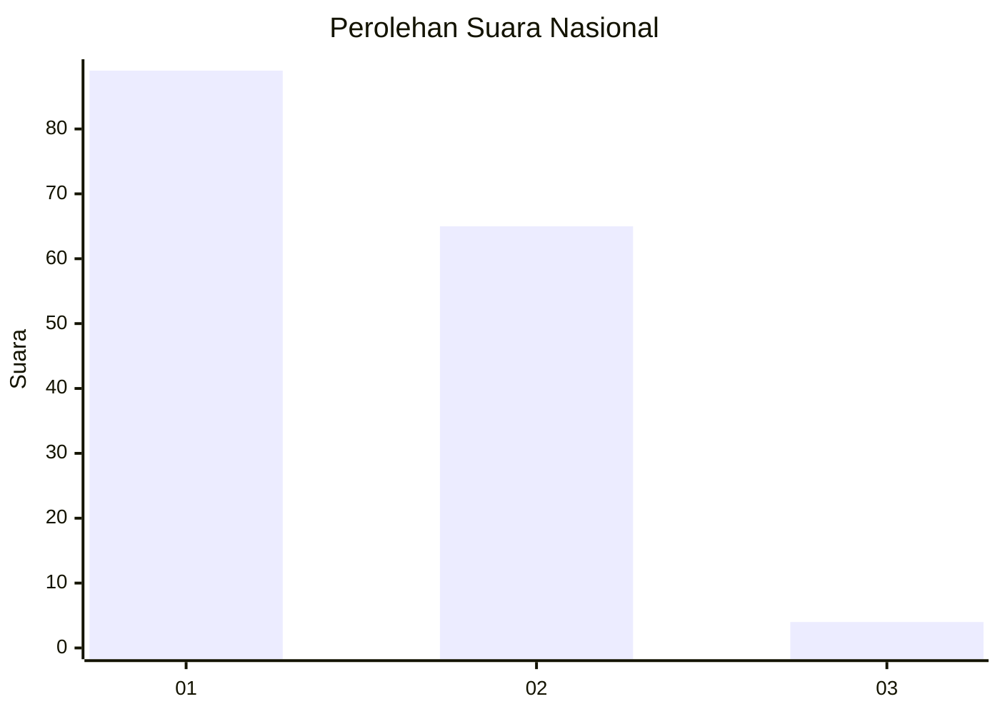
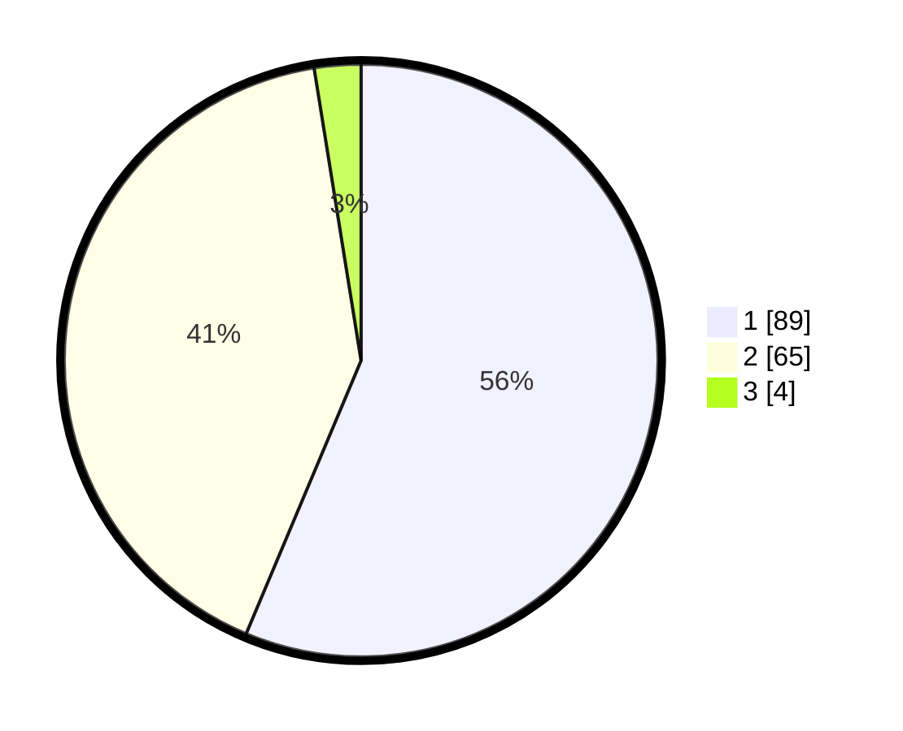

# Hasil

## Grafik

## Tabel

| No. | Nama Paslon    | Suara | Suara (raw) | Persentase |
|:--- |:-------------- | -----:| -----------:| ----------:|
| 1   | ANIES MUHAIMIN | 89    | [89][p-1]   | 56,33      |
| 2   | PRABOWO GIBRAN | 65    | [65][p-2]   | 41,14      |
| 3   | GANJAR MAHFUD  | 4     | [4][p-3]    | 2,53       |

[p-1]: https://github.com/gigit-pemilu/pemilu-2024/blob/main/pilpres/hitung-suara/sub/13-sumatera-barat/sub/07-lima-puluh-kota/sub/03-payakumbuh/sub/2001-koto-baru-simalanggang/sub/003-tps/sub/paslon-1.txt
[p-2]: https://github.com/gigit-pemilu/pemilu-2024/blob/main/pilpres/hitung-suara/sub/13-sumatera-barat/sub/07-lima-puluh-kota/sub/03-payakumbuh/sub/2001-koto-baru-simalanggang/sub/003-tps/sub/paslon-2.txt
[p-3]: https://github.com/gigit-pemilu/pemilu-2024/blob/main/pilpres/hitung-suara/sub/13-sumatera-barat/sub/07-lima-puluh-kota/sub/03-payakumbuh/sub/2001-koto-baru-simalanggang/sub/003-tps/sub/paslon-3.txt

## Foto C Plano

https://sirekap-obj-formc.kpu.go.id/3a1c/pemilu/ppwp/13/07/03/20/01/1307032001003-20240227-120435--b6b501a3-1cec-4f28-96f7-fbbde6a6ce90.jpg

https://sirekap-obj-formc.kpu.go.id/3a1c/pemilu/ppwp/13/07/03/20/01/1307032001003-20240227-120527--311820e0-1dab-4ab6-908a-c1e986bd5c65.jpg

https://sirekap-obj-formc.kpu.go.id/3a1c/pemilu/ppwp/13/07/03/20/01/1307032001003-20240227-120611--8a9b14de-05fa-49db-a2e6-86edd0501b0a.jpg

## Metadata

| Key        | Value               |
| ---------- | ------------------- |
| Time Stamp | 2024-02-28 19:00:00 |

