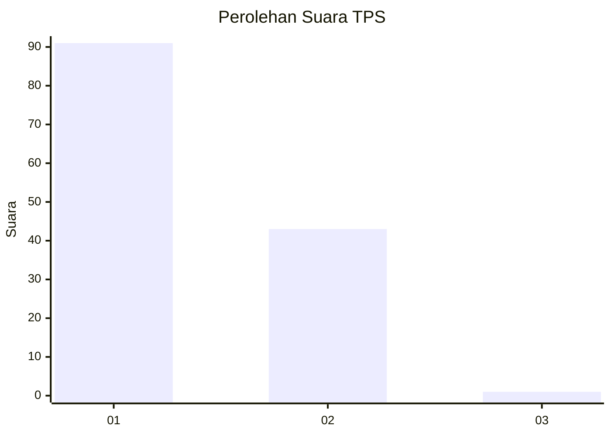
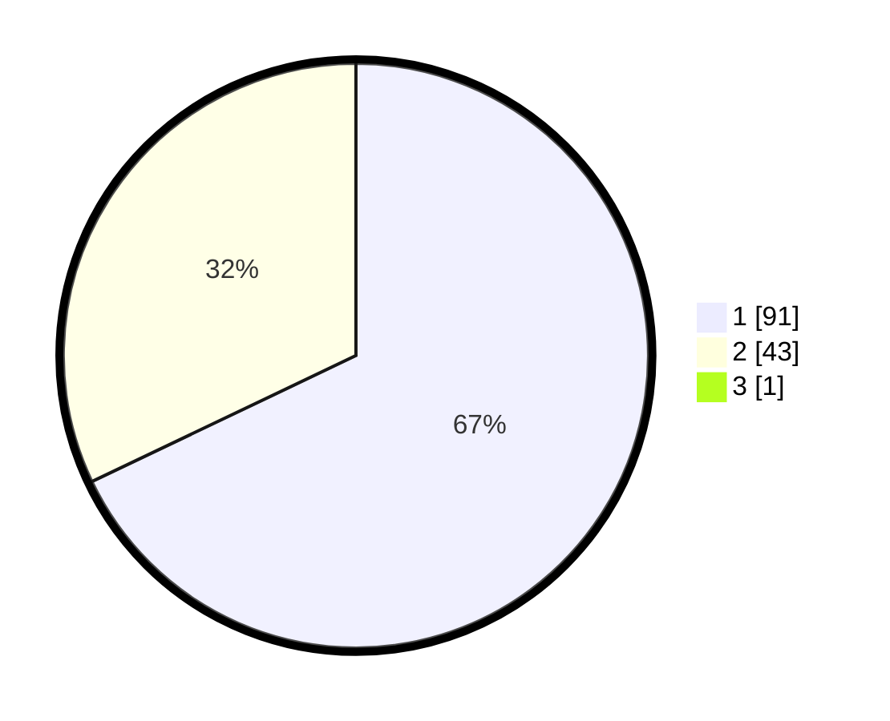

# Hasil

## Grafik

## Tabel

| No. | Nama Paslon    | Suara | Suara (raw) | Persentase |
|:--- |:-------------- | -----:| -----------:| ----------:|
| 1   | ANIES MUHAIMIN | 91    | [91][p-1]   | 67,41      |
| 2   | PRABOWO GIBRAN | 43    | [43][p-2]   | 31,85      |
| 3   | GANJAR MAHFUD  | 1     | [1][p-3]    | 0,74       |

[p-1]: https://github.com/gigit-pemilu/pemilu-2024-13-sumatera-barat/blob/main/pilpres/hitung-suara/sub/13-sumatera-barat/sub/07-lima-puluh-kota/sub/03-payakumbuh/sub/2001-koto-baru-simalanggang/sub/004-tps/sub/paslon-1.txt
[p-2]: https://github.com/gigit-pemilu/pemilu-2024-13-sumatera-barat/blob/main/pilpres/hitung-suara/sub/13-sumatera-barat/sub/07-lima-puluh-kota/sub/03-payakumbuh/sub/2001-koto-baru-simalanggang/sub/004-tps/sub/paslon-2.txt
[p-3]: https://github.com/gigit-pemilu/pemilu-2024-13-sumatera-barat/blob/main/pilpres/hitung-suara/sub/13-sumatera-barat/sub/07-lima-puluh-kota/sub/03-payakumbuh/sub/2001-koto-baru-simalanggang/sub/004-tps/sub/paslon-3.txt

## Foto C Plano

https://sirekap-obj-formc.kpu.go.id/3dc0/pemilu/ppwp/13/07/03/20/01/1307032001004-20240227-154939--c86bfc06-7f53-4746-a3c5-b0d7f9bfd210.jpg

https://sirekap-obj-formc.kpu.go.id/3dc0/pemilu/ppwp/13/07/03/20/01/1307032001004-20240227-155130--784fd6fb-9ed6-4196-9e13-fbe1e9e8472b.jpg

https://sirekap-obj-formc.kpu.go.id/3dc0/pemilu/ppwp/13/07/03/20/01/1307032001004-20240227-155304--0ae82105-f421-4553-a311-5bbc19a0ab55.jpg

## Metadata

| Key        | Value               |
| ---------- | ------------------- |
| Time Stamp | 2024-02-28 19:00:00 |

