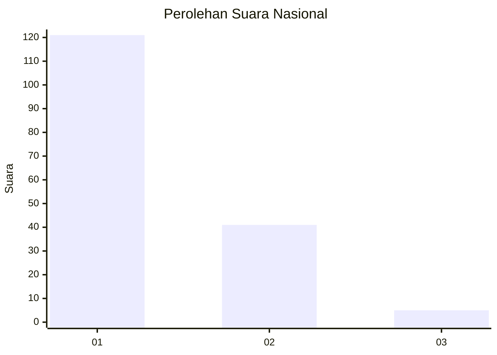
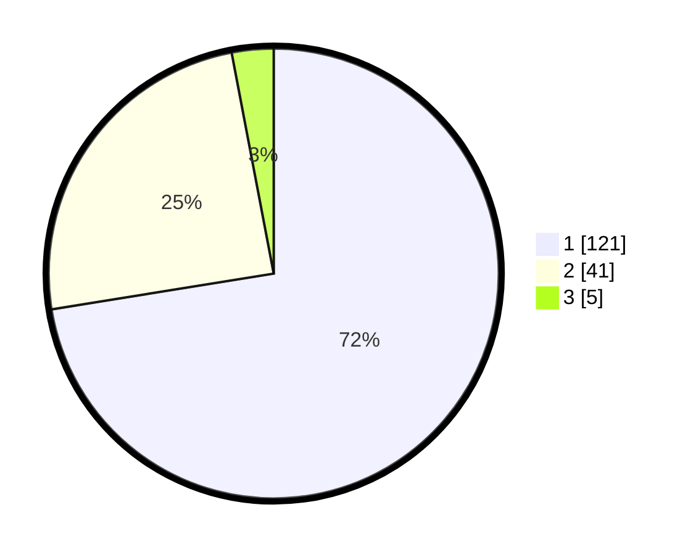

# Hasil

## Grafik

## Tabel

| No. | Nama Paslon    | Suara | Suara (raw) | Persentase |
|:--- |:-------------- | -----:| -----------:| ----------:|
| 1   | ANIES MUHAIMIN | 121   | [121][p-1]  | 72,46      |
| 2   | PRABOWO GIBRAN | 41    | [41][p-2]   | 24,55      |
| 3   | GANJAR MAHFUD  | 5     | [5][p-3]    | 2,99       |

[p-1]: https://github.com/gigit-pemilu/pemilu-2024/blob/main/pilpres/hitung-suara/sub/13-sumatera-barat/sub/07-lima-puluh-kota/sub/03-payakumbuh/sub/2001-koto-baru-simalanggang/sub/005-tps/sub/paslon-1.txt
[p-2]: https://github.com/gigit-pemilu/pemilu-2024/blob/main/pilpres/hitung-suara/sub/13-sumatera-barat/sub/07-lima-puluh-kota/sub/03-payakumbuh/sub/2001-koto-baru-simalanggang/sub/005-tps/sub/paslon-2.txt
[p-3]: https://github.com/gigit-pemilu/pemilu-2024/blob/main/pilpres/hitung-suara/sub/13-sumatera-barat/sub/07-lima-puluh-kota/sub/03-payakumbuh/sub/2001-koto-baru-simalanggang/sub/005-tps/sub/paslon-3.txt

## Foto C Plano

https://sirekap-obj-formc.kpu.go.id/be6c/pemilu/ppwp/13/07/03/20/01/1307032001005-20240227-171904--b389e6fc-31b6-4416-b20e-da8d546a7fab.jpg

https://sirekap-obj-formc.kpu.go.id/be6c/pemilu/ppwp/13/07/03/20/01/1307032001005-20240227-171957--edbd75c3-22f5-4601-aa2c-b22568506dcf.jpg

https://sirekap-obj-formc.kpu.go.id/be6c/pemilu/ppwp/13/07/03/20/01/1307032001005-20240227-172143--01028ee7-4db5-4a64-84d5-e71c87ef036c.jpg

## Metadata

| Key        | Value               |
| ---------- | ------------------- |
| Time Stamp | 2024-02-28 19:00:00 |

