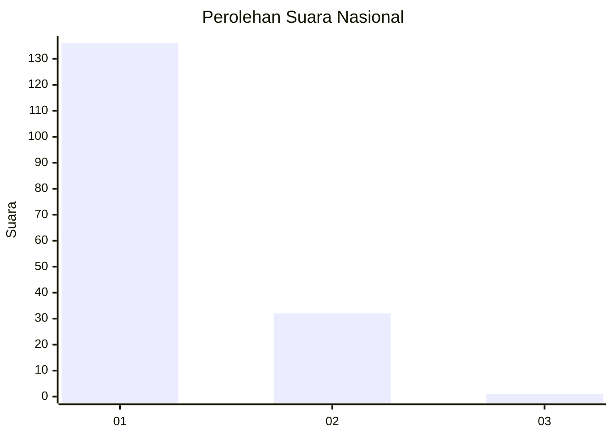
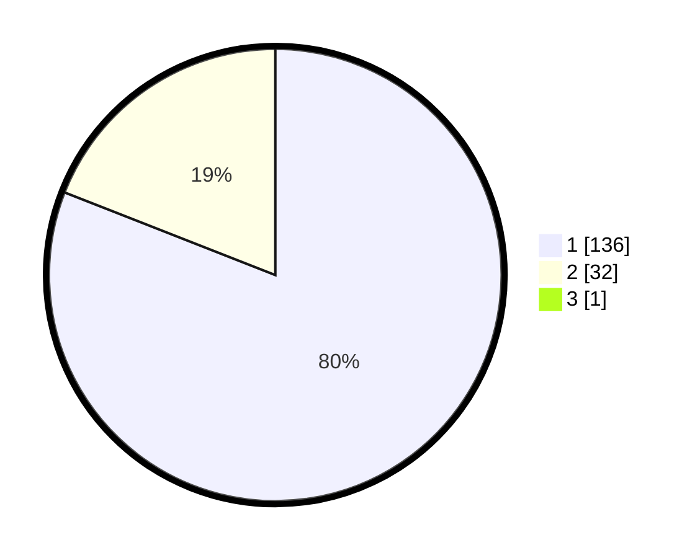

# Hasil

## Grafik

## Tabel

| No. | Nama Paslon    | Suara | Suara (raw) | Persentase |
|:--- |:-------------- | -----:| -----------:| ----------:|
| 1   | ANIES MUHAIMIN | 136   | [136][p-1]  | 80,47      |
| 2   | PRABOWO GIBRAN | 32    | [32][p-2]   | 18,93      |
| 3   | GANJAR MAHFUD  | 1     | [1][p-3]    | 0,59       |

[p-1]: https://github.com/gigit-pemilu/pemilu-2024/blob/main/pilpres/hitung-suara/sub/13-sumatera-barat/sub/07-lima-puluh-kota/sub/03-payakumbuh/sub/2002-taeh-bukik/sub/001-tps/sub/paslon-1.txt
[p-2]: https://github.com/gigit-pemilu/pemilu-2024/blob/main/pilpres/hitung-suara/sub/13-sumatera-barat/sub/07-lima-puluh-kota/sub/03-payakumbuh/sub/2002-taeh-bukik/sub/001-tps/sub/paslon-2.txt
[p-3]: https://github.com/gigit-pemilu/pemilu-2024/blob/main/pilpres/hitung-suara/sub/13-sumatera-barat/sub/07-lima-puluh-kota/sub/03-payakumbuh/sub/2002-taeh-bukik/sub/001-tps/sub/paslon-3.txt

## Foto C Plano

https://sirekap-obj-formc.kpu.go.id/35c4/pemilu/ppwp/13/07/03/20/02/1307032002001-20240226-174150--406fc8c0-2eb6-44bd-9628-48ce3e27427d.jpg

https://sirekap-obj-formc.kpu.go.id/35c4/pemilu/ppwp/13/07/03/20/02/1307032002001-20240226-174228--d1961aac-76a7-4ba7-933e-f8eb9c295454.jpg

https://sirekap-obj-formc.kpu.go.id/35c4/pemilu/ppwp/13/07/03/20/02/1307032002001-20240226-174255--9cc78805-6bee-4786-a212-7bff5871cec9.jpg

## Metadata

| Key        | Value               |
| ---------- | ------------------- |
| Time Stamp | 2024-03-02 10:00:00 |

