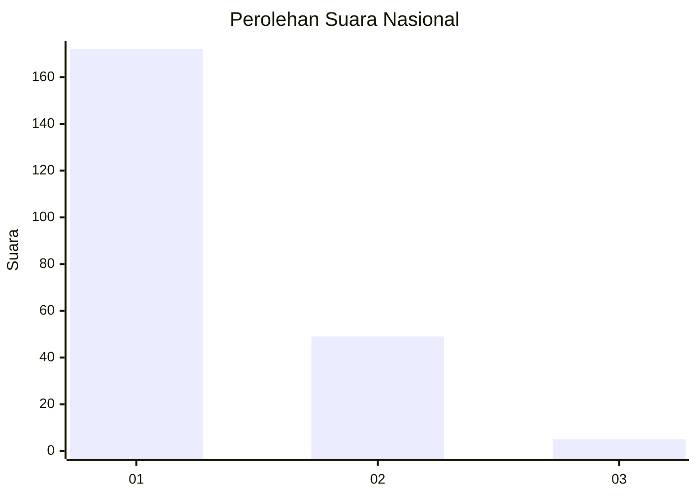
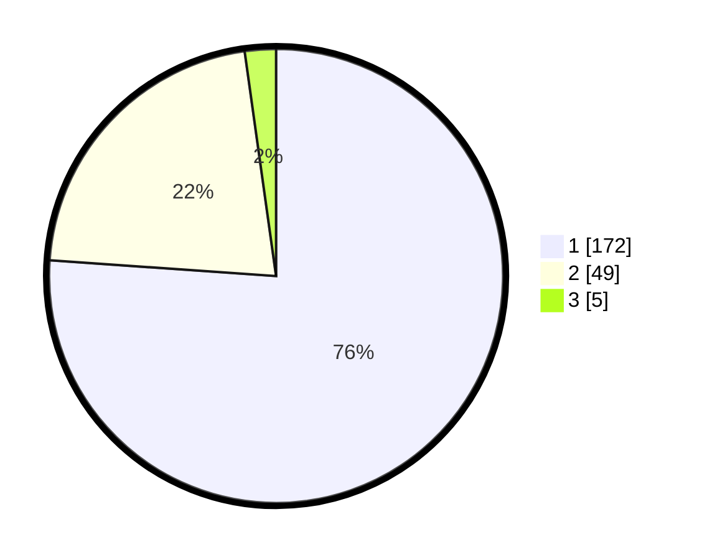

# Hasil

## Grafik

## Tabel

| No. | Nama Paslon    | Suara | Suara (raw) | Persentase |
|:--- |:-------------- | -----:| -----------:| ----------:|
| 1   | ANIES MUHAIMIN | 172   | [172][p-1]  | 76,11      |
| 2   | PRABOWO GIBRAN | 49    | [49][p-2]   | 21,68      |
| 3   | GANJAR MAHFUD  | 5     | [5][p-3]    | 2,21       |

[p-1]: https://github.com/gigit-pemilu/pemilu-2024/blob/main/pilpres/hitung-suara/sub/13-sumatera-barat/sub/07-lima-puluh-kota/sub/03-payakumbuh/sub/2002-taeh-bukik/sub/008-tps/sub/paslon-1.txt
[p-2]: https://github.com/gigit-pemilu/pemilu-2024/blob/main/pilpres/hitung-suara/sub/13-sumatera-barat/sub/07-lima-puluh-kota/sub/03-payakumbuh/sub/2002-taeh-bukik/sub/008-tps/sub/paslon-2.txt
[p-3]: https://github.com/gigit-pemilu/pemilu-2024/blob/main/pilpres/hitung-suara/sub/13-sumatera-barat/sub/07-lima-puluh-kota/sub/03-payakumbuh/sub/2002-taeh-bukik/sub/008-tps/sub/paslon-3.txt

## Foto C Plano

https://sirekap-obj-formc.kpu.go.id/1e70/pemilu/ppwp/13/07/03/20/02/1307032002008-20240227-211450--d4d0b81b-3597-4b98-a886-9427fcdd704d.jpg

https://sirekap-obj-formc.kpu.go.id/1e70/pemilu/ppwp/13/07/03/20/02/1307032002008-20240227-211533--496ec29c-b360-404d-a279-4a12395b5e3c.jpg

https://sirekap-obj-formc.kpu.go.id/1e70/pemilu/ppwp/13/07/03/20/02/1307032002008-20240227-211620--d6e5440d-b294-4b88-a929-1e7902629fbf.jpg

## Metadata

| Key        | Value               |
| ---------- | ------------------- |
| Time Stamp | 2024-02-28 19:00:00 |

